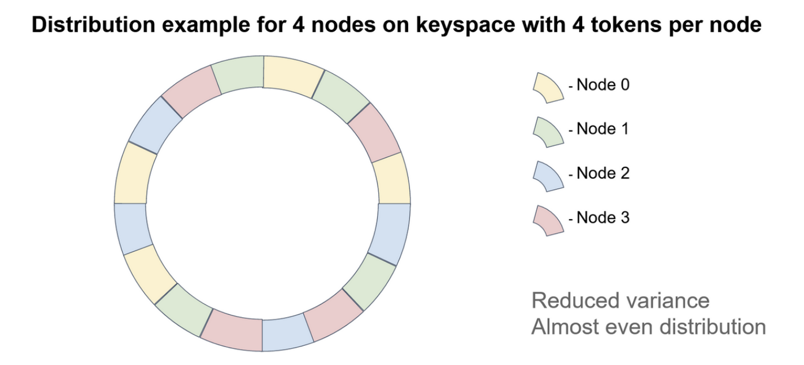
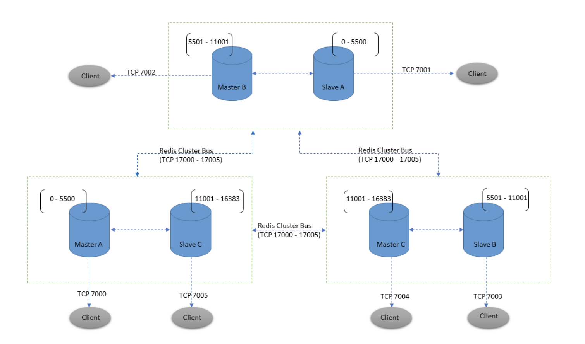

# Database Engineering

# Database

## 1. Database From novice to expert

### 1.1 Why Do We Have Different Data Types?

- Allow DB store data more efficiently
- DB queries data faster (numeric is faster than word)

### 1.2 Different data types:

Text data type:

- CHAR: padding character to get enough length
- VARCHAR2: define maximum length
- NCHAR: for unicode character, similar to CHAR
- NVARCHAR2
- RAW: not recommend using it

Numeric data type:

- NUMBER(Precision, Scale)
- INTEGER = NUMBER(38) 
- FLOAT = DECIMAL = NUMBER
- BINARY_FLOAT (32 bit)
- BINARY_DOUBLE (64 bit)

Date data type:

- DATE
- TIMESTAMP
- INTERVAL

Other data type:

- BLOB: use for storing binary object (image, audio), max 4GB
- CLOB: use for storing character objects

### 1.3 CRUD data

#### 1.3.1 INSERT

`INSERT INTO sales_meeting (id, employee_id, company, meeting_date) VALUES
(1, 5, 'ABC Construction', DATE 'Aug 10 2018');`

#### 1.3.2 UPDATE

`UPDATE sales_meeting
SET meeting_date = DATE '2018-08-25'
WHERE id = 2;`

...

### 1.4 JOIN

#### 1.4.1 Inner Join

`SELECT id, employee_id, company, meeting_date, last_name  
FROM customer_meeting  
JOIN employee ON customer_meeting.employee_id = employee.id;`

#### 1.4.2 Outer Join

For a **LEFT OUTER JOIN**, all of the records in the left table are shown. If there is a match from the right table, it is shown; otherwise, a NULL value is shown.

`SELECT  
s.id,  
s.employee_id,  
s.company,  
s.meeting_date,  
e.last_name  
FROM customer_meeting s  
LEFT JOIN employee e ON s.employee_id = e.id;`

The right outer join:

`SELECT  
e.id,  
e.last_name,  
e.salary,  
s.id,  
s.company,  
s.meeting_date  
FROM customer_meeting s  
RIGHT JOIN employee e ON e.id = s.employee_id;`

The natural join:

Join base on matching column name.

The cross join:

Cartesian product of two table

### 1.5 Function

The DUAL table is a table built in to the Oracle database. It contains one row and one  
column. Its primary purpose is to allow you to run queries that use values or functions  
that don’t need any table data.

`SELECT *  FROM dual;`

### 1.6 Indexes

Disadvantage of indexes:

- Require addtional data space

- Decrease performance with INSERT, DELETE, UPDATE

### 1.7 Misc

```sql
/** 
    2. Type
*/

-- Table Type
SET SERVEROUTPUT ON
declare
    TYPE BRANCH_TABLE IS TABLE OF CLIENT.BRANCH%TYPE
    INDEX BY BINARY_INTEGER;
    T_NAME                                BRANCH_TABLE;
    N_NAME                                binary_integer;
begin
  T_NAME(1)  := 'DOE, JOHN';
  dbms_output.put_line(T_NAME(1)); -- 'DOE, JOHN'
  dbms_output.put_line(T_NAME.count()); -- 1
end;


-- Record Type
SET SERVEROUTPUT ON
DECLARE
    TYPE CLIENT_REC IS RECORD (NAME CLIENT.CLIENT_NAME%TYPE, 
                               REG CLIENT.REG_NUMBER%TYPE);
    REC CLIENT_REC;
BEGIN
   REC.NAME := 'TEST';
   REC.REG := '1000020020';
END;


/**
    3. Single Row Processing        
*/
/**
    4. Multirow Processing
*/
-- Cursors
SET SERVEROUTPUT ON
DECLARE 
    CURSOR CursorClient (NAME IN VARCHAR) IS 
    SELECT CLIENT_NAME FROM CLIENT ORDER BY ID;
    CURSOR CursorClientID IS 
    SELECT REG_NUMBER FROM CLIENT ORDER BY ID;
    ClientNameRec VARCHAR(1000);
BEGIN
    OPEN CursorClient('api');
    LOOP FETCH CursorClient INTO ClientNameRec;
        IF CursorClient%NOTFOUND THEN
            CLOSE CursorCLient;
            EXIT;
        END IF;
        DBMS_OUTPUT.PUT_LINE('ClientNameRec ' || ClientNameRec);
    END LOOP;

    FOR R_CURSOR in CursorClientID LOOP
        DBMS_OUTPUT.PUT_LINE('CursorClientID ' || R_CURSOR.REG_NUMBER);
    END LOOP;

END;


-- Bulk Collect
/**
    In this context, BULK COLLECT is about reducing the number of transitions 
    between the PL/SQL engine and SQL engine in order to improve efficiency 
    and speed of your PL/SQL program.
*/
SET SERVEROUTPUT ON
DECLARE 

    TYPE REG_TABLE_TYPE is TABLE OF CLIENT.REG_NUMBER%TYPE
    INDEX BY BINARY_INTEGER;

    REC_TABLE REG_TABLE_TYPE;

    CURSOR CursorRec IS 
    SELECT REG_NUMBER 
    BULK COLLECT 
    INTO REC_TABLE 
    FROM CLIENT 
    ORDER BY ID;

BEGIN
    FOR R_CURSOR in CursorRec LOOP
        DBMS_OUTPUT.PUT_LINE('CursorClientID ' || R_CURSOR.REG_NUMBER);
    END LOOP;
END;


-- FORALL
/** 

    The problem I have with FORALL is that the data for a collection usually comes 
    from a table in the database in the first place. If that’s the case, then a 
    complex SQL statement can do everything a FORALL statement can do, with one 
    context switch, just like FORALL, but using less memory.
*/
```

## 2. Database transaction and locking

### 2.1 Background knowledge

**<u>Locking</u>**

The following points sum up Oracle’s locking policy:

- Oracle lock data on row level

- There is no read lock

- Writer do not block reader, writer only block another writer

**<u>Multiversioning</u>**

It is the mechanism by which Oracle provides for the following:  

- Read-consistent queries: Queries that produce consistent results with  
  respect to a point in time.  

- Nonblocking queries: Queries are never blocked by writers of data, as  
  they are in other databases.

Note Bear in mind that Oracle does not “pre-answer” the query. it does not copy  
the data anywhere when you open a cursor—imagine how long it would take to  
open a cursor on a one-billion-row table if it did. the cursor opens instantly and it  
answers the query as it goes along. in other words, the cursor just reads data from  
the table as you fetch from it

We had not touched a single  
block of data in that table during the open, but the answer was already fixed in stone. We  
have no way of knowing what the answer will be until we fetch the data; however, the  
result is immutable from our cursor’s perspective. It is not that Oracle copied all of the  
preceding data to some other location when we opened the cursor; it was actually the  
DELETE command that preserved our data for us by placing it (the before image copies  
of rows as they existed before the DELETE) into a data area called an undo or rollback  
segment (more on this shortly).

**<u>Transactions</u>**

A transaction comprises a unit of database work. Transactions are a core feature of  database technology. They are part of what distinguishes a database from a file system.

Transactions take the database from one consistent state to the next consistent state.  
When you issue a COMMIT, you are assured that all your changes have been successfully  
saved and that any data integrity checks and rules have been validated. Oracle’s  
transactional control architecture ensures that consistent data is provided every time,  
under highly concurrent data access conditions.

**<u>Redo and Undo</u>**

Key to Oracle’s durability (recovery) mechanism is redo, and core to multiversioning (read consistency) is undo.

### 2.2 Locking and Blocking

**<u>What Are Locks?</u>**

Locks are mechanisms used to regulate concurrent access to a shared resource. Note  
how I used the term “shared resource” and not “database row.” It is true that Oracle  
locks table data at the row level, but it also uses locks at many other levels to provide  
concurrent access to various resources. For example, while a stored procedure is  
executing, the procedure itself is locked in a mode that allows others to execute it, but it  
will not permit another user to alter that instance of that stored procedure in any way.

The moral to this story is twofold. <mark>First, all databases are fundamentally different.</mark>  

Second, when designing an application for a new database platform, you must make no assumptions about how that database works.

You must approach each new database as if you had never used a database before. Things you would do in one database are either not necessary or simply won’t work in another database

Issus with concurrency:

<u>**Lost Updates**</u>

A lost update is a classic database problem. Actually, it is a problem in all multiuser computer environments. Simply put, a lost update occurs when the following events occur, in the order presented here:

1. A transaction in Session1 retrieves (queries) a row of data into local memory and displays it to an end user, User1.  

2. Another transaction in Session2 retrieves that same row, but displays the data to a different end user, User2.  

3. User1, using the application, modifies that row and has the application update the database and commit. Session1’s transaction is now complete. 

4. User2 modifies that row also and has the application update the database and commit. Session2’s transaction is now complete.

    This process is referred to as a lost update because all of the changes made in Step 3 will be lost.

**<u>Pessimistic Locking</u>**

The pessimistic locking method would be put into action the instant before a user modifies a value on the screen. For example, `a row lock would be placed as soon as the user indicates his intention to perform an update on a specific row that he has selected and has visible on the screen (by clicking a button on the screen, say)`. That row lock would persist until the application applied the user’s modifications to the row in the database and committed

What happen during locking:

- If the underlying data has not changed, we will get our MILLER row  
  back, and this row will be locked from updates (but not reads) by  
  others.

- If another user is in the process of modifying that row, we will get an  
  ORA-00054 resource busy error. We must wait for the other user to  
  finish with it.

- If, in the time between selecting the data and indicating our intention  
  to update, someone has already changed the row, then we will get  
  zero rows back. That implies the data on our screen is stale. To avoid  
  the lost update scenario previously described, the application needs  
  to requery and lock the data before allowing the end user to modify  
  it. With pessimistic locking in place, when User2 attempts to update  
  the telephone field, the application would now recognize that the  
  address field had been changed and would requery the data. Thus,  
  User2 would not overwrite User1’s change with the old data in that  
  field.

**<u>Optimistic Locking</u>**

This locking method works in all environments, but it does increase the probability  
that a user performing an update will lose. That is, when that user goes to update her  
row, she finds that the data has been modified, and she has to start over.

`Update table  
Set column1 = :new_column1, column2 = :new_column2, ....  
Where primary_key = :primary_key  
And decode( column1, :old_column1, 1 ) = 1  
And decode( column2, :old_column2, 1 ) = 1  `

**Using timestamp version:**

`SQL> update dept  
set dname = initcap(:dname),  
last_mod = systimestamp  
where deptno = :deptno  
and last_mod = to_timestamp_tz(:last_mod, 'DD-MON-YYYY HH.MI.SSXFF  
AM TZR' );`

**<u>Blocking</u>**

Blocking occurs when one session holds a lock on a resource that another session is  
requesting. As a result, the requesting session will be blocked—it will hang until the  
holding session gives up the locked resource. In almost every case, blocking is avoidable.  
In fact, if you do find that your session is blocked in an interactive application, then you  
have probably been suffering from the lost update bug as well, perhaps without realizing it.  
That is, your application logic is flawed and that is the cause of the blocking.

The five common DML statements that will block in the database are INSERT, UPDATE,  
DELETE, MERGE, and SELECT FOR UPDATE. The solution to a blocked SELECT FOR UPDATE is  
trivial: simply add the NOWAIT clause and it will no longer block. Instead, your application  
will report a message back to the end user that the row is already locked.

**<u>Blocked Inserts</u>**

There are few times when an INSERT will block. The most common scenario is when  
you have a table with a primary key or unique constraint placed on it and two sessions  
attempt to insert a row with the same value. One of the sessions will block until the other  
session either commits (in which case the blocked session will receive an error about a  
duplicate value) or rolls back (in which case the blocked session succeeds).

Blocked INSERTs typically happen with applications that allow the end user to  
generate the primary key/unique column value. This situation is most easily avoided  
<mark>by using a sequence or the SYS_GUID() built-in function to generate the primary key</mark>/  
unique column value.

**<u>Deadlocks</u>**:

Deadlocks occur when you have two sessions, each of which is holding a resource that the other wants

or example, if I have two tables, A and B, in my database, and each has a single row in it, I can demonstrate a deadlock easily. 

All I need to do is open two sessions (e.g., two SQL*Plus sessions). In session A, I update table A. In session B, I update table B. Now, if I attempt to update table A in session B, I will become blocked.  

Session A has this row locked already. This is not a deadlock; it is just blocking. I have  not yet deadlocked because there is a chance that session A will commit or roll back, and session B will simply continue at that point.

### 2.3 Locks, Latches and Mutexes

The three general classes of locks in Oracle are as follows:

- DML locks: DML stands for Data Manipulation Language. In general, this means SELECT, INSERT, UPDATE, MERGE, and DELETE statements.

- DDL locks: DDL stands for Data Definition Language (CREATE and ALTER statements, and so on). DDL locks protect the definition of the structure of objects.

- Internal locks and latches: Oracle uses these locks to protect its internal data structures. For example, when Oracle parses a query and generates an optimized query plan, it will latch the library cache to put that plan in there for other sessions to use.

**<u>DML Locks</u>**

- TX Locks: A TX lock is acquired when a transaction initiates its first change. The transaction is  automatically initiated at this point (you don’t explicitly start a transaction in Oracle). The  
  lock is held until the transaction performs a COMMIT or ROLLBACK.

- TM (DML Enqueue) Locks: TM locks are used to ensure that the structure of a table is not altered while you are modifying its contents.

### 2.4 Concurrency and multiversioning

Concurrency controls are the collection of functions that the database provides to allow many  people to access and modify data simultaneously.

Oracle uses a variety of locks, including the following:

- TX locks: lock is aquired for the duration of a data-modifying transaction.

- TM and DDL locks: These locks ensure that the structure of an object is not altered while you are modifying its contents.

- Latches and mutexes.

**<u>Note</u>** There is a short period of time during the processing of a distributed Two-Phase Commit where Oracle will prevent read access to information. As this processing is somewhat rare and exceptional.

Transaction Isolation Levels:

- Dirty read

- Read commited

- Repeatable read

- Serialize

## 3. Adhoc

### 3.1 Materialized views

Materialized Views in Oracle

A materialized view, or snapshot as they were previously known, is a table segment whose contents are periodically refreshed based on a query, either against a local or remote table.

Materialized views, is actual data of queries at specific refresh rate.

### Global Temporary Tables

Applications often use some form of temporary data store for processes that are to complicated to complete in a single pass. Often, these temporary stores are defined as database tables or PL/SQL tables. From Oracle 8i onward, the maintenance and management of temporary tables can be delegated to the server by using Global Temporary

## 4. Design Schema

- Star schema is a design technique of schema that from one table that include:
	- Numeric data column
	- Foreign key data column

- For each foreign key it create a new dimentional table to support the main table.


- Star schema's dimension tables do not contain any foreign keys.
- Constast to **SnowFlake** schema database in which dimentional table have its own support table that nest more table.


- Pros:
	-  Easy to design
	-  Suitable for OLAP
- Cons:
	- Data redundancy
	- Slow query

## 5. Database Isolation levels

- There are four levels of Isolation in DB:
	- **Read uncommited**
	- **Read commited**: solve **dirty reads & lost update**, but not unrepeatable reads, and phantom reads.
	- **Repeatable read**: value of one query retrieval inside a transaction is not differ when we read it twice. The number of row can be change however, it will not prevent **phantom read** (INSERT & DELETE allow).
	- **Serialized**: prevent phantom read but it will block all record from INSERT UPATE or DELETE.


## 6. Database Optimization  

- There are two metrics:
	- Execute plan, number of logical & physical read, scan count.
	- Statistic IO

```sql
set statistic io time on

# Expensive query
SELECT * 
FROM STUDENT AS S
WHERE DOB IN (
		SELECT MAX(DOB) 
		FROM STUDENT SOB
		WHERE YEAR(S.DOB) = YEAR(SOB.DOB)
		GROUP BY SOB.DOB
	)
ORDER BY S.DOB;


# Optimize query

WITH CTE
AS (
	SELECT YEAR(DOB) AS DOB, MAX(DOB)
	FROM STUDENT S
	GROUP BY DOB
)

SELECT * FROM 
STUDENT INNER JOIN CTE
WHERE CTE.DOB = STUDENT.DBO

```

- Expensive operators:

	- Spooling: lazy spool is the problems (if found in execution plan), if there is duplicate aggregation in SQL query it will cause lazy spool, duplicate group by. A spool operation is simply a temporary storage of data. Data are read from a source table and stored inside a worktable in the Tempdb database.

	- Hash match: Unsorted data search, if there is index, DB will not perform hash match. Try to create an index.
	- Key looking missing data

	- When there is need to add more column to view, don't join it, but rather create a new view.
	- Partition elimination: query should match data type or else it will go through all partition.

## 2. Database data structure

**DATA_INTENSIVE**

- SStable:
    - SS table divided into fix number of segment, in each segment data is sorted.
    - SS Table utitlize sorted characteristic to find index: for an example: say you are looking for the key handiwork, but you dont know the exact offset of that key in the segment file. However, you do know the offsets for the keys handbag and handsome, and because of the sorting you know that handiwork must appear between those two. This means you can jump to the offset for handbag and scan from there until you find handiwork.
    - SS table use AVL or red black tree to keep the index sorted.
    - SS table use mem table for initial write and when it full flush it to the SS table.
    - SS table have one weakness of lost data in mem table when server crash, this can be fixed by using WAL.
    - SS table index is manage by a LSM-tree which is a spare index.

- B-Tree:
    - B-tree structure divide data into blocks, typically 4kb. Each block hold a reference to other block.
    - For example: We want to find index 120
        - 100 ref 200 ref 300 ref (100 < 300)
        - ref 130 ref 160 ref (130 < 160)
        - ref 120 
    - B-tree also use WAL for crash recovery.
    - Some B-tree use copy-on-write (versioning) to protect content of index.


## 1. Redis

### 1.1 Redis Sharding

- Redis Sharding data.
	- Redis Cluster does not use consistent hashing, but a different form of sharding where every key is conceptually part of what we call a hash slot.
	- Every node in a Redis Cluster is responsible for a subset of the hash slots, so, for example, you may have a cluster with 3 nodes, where:
		- Node A contains hash slots from 0 to 5500.
		- Node B contains hash slots from 5501 to 11000.
		- Node C contains hash slots from 11001 to 16383.
	- Master-Replica model:
		- For every master, there is a replica, when master fail, replica will be prompt to master.
		- Redis do not implement string consistency model, but we can write sync with the WAIT command.
		- Under complex situation, lost data always can happend for example: 
		- Take as an example our 6 nodes cluster composed of A, B, C, A1, B1, C1, with 3 masters and 3 replicas. There is also a client, that we will call Z1. After a partition occurs, it is possible that in one side of the partition we have A, C, A1, B1, C1, and in the other side we have B and Z1. 	
		- Z1 is still able to write to B, which will accept its writes. If the partition heals in a very short time, the cluster will continue normally. However, if the partition lasts enough time for B1 to be promoted to master on the majority side of the partition, the writes that Z1 has sent to B in the meantime will be lost.
		- **cluster-node-timeout <milliseconds>**: The maximum amount of time a Redis Cluster node can be unavailable, without it being considered as failing. If a master node is not reachable for more than the specified amount of time, it will be failed over by its replicas. 

	Note that the minimal cluster that works as expected must contain at least three master nodes. For deployment, we strongly recommend a six-node cluster, with three masters and three replicas.


- Consistency hashing:
	- Why the need of virtual node ?
		- If we do not use virtual node, when there is event of partitioning, all the data from one node will move to 1 other node, create a heavy traffic to it. Otherwise if we use virtual node which are randomly distributed across the n physical nodes, when partition happend all other node will be distributed data more evenly.
		- The disadvantage of consistency hashing is range select query.



		 	

- Redis consistency vs hash slot ?
	- Redis use hash slot to assign data, from 0 -> 16383 slot divide evenly into n slot.
	- We can use {} to specify the content which is hash in order to ensure two key will be in the same slot.
	- Redis use CRC-16 hash algorithm as hash function



- Some command use in **redis cluster**:

```sh

SELECT # can not be use in redis cluster, since redis cluster always have index 0

CLUSTER KEYSLOT mykey{node2} # return slot value for key

redis-cli --cluster create 192.168.40.170:6001 
	192.168.40.180:6001 
	192.168.40.190:6001 
	192.168.40.210:6001 
	192.168.40.221:6001 
	192.168.40.222:6001 
	--cluster-replicas 1
```

### 1.2 Redis data type

- Redis data type:
	- SET
	- SORTED SET
	- STRING
	- LIST
	- HASHES
	- STREAMS:  
		- A Redis stream is a data structure that acts like an append-only log. You can use streams to record and simultaneously syndicate events in real time. Examples of Redis stream use cases include:
			- Event sourcing (e.g., tracking user actions, clicks, etc.)
			- Sensor monitoring (e.g., readings from devices in the field)
			- Notifications (e.g., storing a record of each user's notifications in a separate stream)
		- Command: XADD O(1), XRANGE, XREAD, XLEN
		- Stream as listener: XREAD BLOCK 0 STREAMS mystream $
	- REDIS GEOSPATIAL:
		- GEO ADD O(log(N)), by implementation, redis geo use sorted set, where score will be the geohash value of lat and long, when there is need to find cloest position it will use ZRANGE (find by score). 
		- GEO SEARCH O(N + log(M)) where N is total number of coor found and M is total number of coor in all database: GEOSEARCH FROMLONLAT long lat BYRADIUS 1 KM WITHDIST WITHCOORD
	- HYPERLOGLOG: 
		- HyperLogLog is a data structure that estimates the cardinality of a set. As a probabilistic data structure, HyperLogLog trades perfect accuracy for efficient space utilization.
		- The Redis HyperLogLog implementation uses up to 12 KB and provides a standard error of 0.81%. Add and Read is O(1).
		- HyperLogLog solve the problems of **count distinct** value without actually have to store the data.
	- BITMAP
	- BITFIELDS


### 1.3 Add more shard to redis

- Using command:

```sh
$ redis-cli --cluster add-node 
	192.168.11.134:6379 
	192.168.11.131:6379 # add redis4
	
$ redis-cli --cluster add-node 
	192.168.11.135:6379 
	192.168.11.131:6379 # add redis5
```

- By default only current master will be rebalance, we need it using special flag to force them to rebalance:

```sh

redis-cli --cluster 
	rebalance 192.168.11.135:6379 
	--cluster-use-empty-masters
	
>>> Performing Cluster Check (using node 192.168.11.135:6379)

```

- Remove node from cluster

```sh
redis-cli --cluster reshard 192.168.11.131:6379 
	--cluster-from 6ac62aa8dbb80f982ab1b0fa0623fc54d2bbd77b 
	--cluster-to  9026f2af5a683123abfdd7494da2c73a61803dd3 
	--cluster-slots 3276 
	--cluster-yes
```

### 1.4 Client Side Caching

	Client 1 -> Server: CLIENT TRACKING ON
	Client 1 -> Server: GET foo
	(The server remembers that Client 1 may have the key "foo" cached)
	(Client 1 may remember the value of "foo" inside its local memory)
	Client 2 -> Server: SET foo SomeOtherValue
	Server -> Client 1: INVALIDATE "foo"

- Redis maintain a global table for cache validation by tracking which data have been called, if this table is exceed limit, all oldest value will be evict, when there is invalidation message, redis check the table and also evict data.

### 1.5 Pipeline 

	To be explicit, with pipelining the order of operations of our very first example will be the following:
	
	Client: INCR X
	Client: INCR X
	Client: INCR X
	Client: INCR X
	Server: 1
	Server: 2
	Server: 3
	Server: 4

### 1.6 Pub/sub

### 1.7 Transaction

- All the commands in a transaction are serialized and executed sequentially. A request sent by another client will never be served in the middle of the execution of a Redis Transaction. This guarantees that the commands are executed as a single isolated operation.

```sh
> MULTI
OK
> INCR foo
QUEUED
> INCR bar
QUEUED
> EXEC
1) (integer) 1
2) (integer) 1

```
- Redis does not support rollbacks of transactions since supporting rollbacks would have a significant impact on the simplicity and performance of Redis.

- Optimistic locking with WATCH

```sh
WATCH mykey
val = GET mykey
val = val + 1
MULTI
SET mykey $val
EXEC
```
- We just have to repeat the operation hoping this time we'll not get a new race. This form of locking is called optimistic locking. In many use cases, multiple clients will be accessing different keys, so collisions are unlikely – usually there's no need to repeat the operation.

- WATCH tell redis that only execute transaction if key under WATCH is non modified.

### 1.8 Redis pattern

- Distributed locking:
	- Lock property:
		- **Mutual exclusion**: at any given moment, only one client can hold a lock. 
		- **Fault tolerance**: As long as the majority of Redis nodes are up, clients are able to acquire and release locks.
		- **Deadlock free**
	- Distributed locking with redis using SETNX command: **SETNX lock.foo current Unix time + lock timeout + 1**. If SETNX returns 1 the client acquired the lock, setting the lock.foo key to the Unix time at which the lock should no longer be considered valid. The client will later use DEL lock.foo in order to release the lock.
	- If **SETNX** returns 0 the key is already locked by some other client. We can either return to the caller if it's a non blocking lock, or enter a loop retrying to hold the lock until we succeed or some kind of timeout expires.

	- If there is one client fail and did not release the lock, the follwing algorithm will be proposed:
		- C1 send **SETNX** try to acquire the lock, if other client is hold the lock and did not release 0 will return 
		- C1 try **GET** lock to check if the lock is expire, if the lock is not expire than sleep some time and retry. Otherwise use **GETSET** key to get the old timestamp if the it expire than the lock can acquire with **SETNX**, if other client is faster then return data will not expire than we have to try again.


## 2. Cassandra


- Cassandra is a column-wide, distributed database system, data is put on different machine, so that there will be not a single point of failure.
- Architect and replication factor:
    - Cassandra are divided into node, where each node communicate with each other via gossip protocols.
    - Entity in cassandra: node < data center < cluster
    - Commit log in cassandra is stored for DR
    - SStable and Memtable: every write is writen into memTable, when memTable reach certain threshold, data is flushed to an SSTable disk file.
- Replication strategy:
    - Replication factor: number of copy put in different node. One Replication factor means that there is only a single copy of data while three replication factor means that there are three copies of the data on three different nodes.
    - There are two strategy: simple and topology, simple strategy suitable for cassandra in one data center.
- Write operation:
    - Coordinatoor send write operation to cluster, depend on consistency level that determines how many nodes will respond back with the success acknowledgment.
    - Process of write:
        - Coordinatoor send write request to nodes
        - Node write data to mem-table and commit log
        - Mem-table is full, data is flushed to the SSTable data file.
- Read Operation:
    - There are three type of request:
        - Direct request
        - Digest request
        - Repair request
    - The coordinator sends direct request to one of the replicas. After that, the coordinator sends the digest request to the number of replicas specified by the consistency level and checks whether the returned data is an updated data.

- Cassandra entity:
    - Keyspace: is similar to database in RDBMS.

- What is the use of Cassandra and why to use Cassandra?
    - For bigdata, distributed data system with no singple point of failure
    - Optimize for write heavy application
    - Flexible schema design

- Cassandra data model:
    - Cluster
    - Keyspace
    - Column 

- Component in cassandra:
    - Node < Data center < Cluster
    - SS-table, Mem-table, commit log, bloom filter

- In each columne there are value, timestamps and columne name.

- When to use Cassandra:
    - Large data set.
    - Availability.
    - Data change constantly
    - Eventual consistency

- Cassandra data model:
    - Cluster:
        - Keyspace (like schema): 
            - Table:
                - Row 1: Primary key | Column 1 - Value 1 | Column 2 - Value 2
                - Row 2: Primary key | Column 1 - Value 1 

- When not to use cassandra:
    - Cassandra have no:
        - Join operator
        - Complex query
        - Foreign keys

```
insert into employee (emp_id,emp_name,emp_age) values(20,'john',35);
Select * from employee;
Select * from employee where emp_id=20 ;
Select * from employee where emp_name='john' ; // Only primary key or secondary index can be query
```

- Primary key in Cassandra compose of:
    - Partition key: determine which node to put data inside
    - Clustering key: sort data inside a node, we can have multiple clustering key

- If query do not contain partition key, Cassandra have to query all node, which is very inefficient.
- When we want to query by other column than partition key, it need to use secondary index.
- Cassandra data type:
    - Numeric: int, smallint, bigint, ...
    - Textual: text
    - Collection: Set, List, Map
    - Other data type: blob, time, ...

- Architecture:
    - Replication: we have to tune strategy and factor.
        - For simple strategy: the next n (n is replica factor) node will be contain copy data.
        - For network topology strategy: we can define number of replicas at specific data center.

```
    create keyspace MY_KEYSPACE 
        with replication = {
                    'class': 'SimpleStrategy', 
                    'replication_factor': '1' 
                };
    create keyspace DC_KEYSPACE 
        with replication = {
                    'class': 'NetworkTopologyStrategy', 
                    'USA': '2',
                    'Asian': '3' 
                };

```


   - Write consistency: the number of replica that need to acknowledged before return success to client.
        - Level of consistency:
            - One
            - All
            - Quorum
            - Local quorum
    - Read consistency: the number of replica that need to read before return success to client.
        - Level of consistency:
            - One: only get data from the fastest node. But a daemon task will check data from other node if data is inconsitent it will send a repair request
            - All
            - Quorum: send request to n number of quorum and checking for hash of data.
            - Local quorum
    - Gossip protocols
    - Write steps:
        - Write to commit log
        - Write to MemTable
        - When MemTable full, data to flush to SS Table (immutable file)
    - Read step:
        - Read the row cache
        - Read the key cache for data file location
        - Bloom filter checking
        - Read the partion key file index for data file location
    - Compaction:
        - Keep data with the lastest timestamps.
        - Data with mark as tombstone will be deleted out from compaction.
        - Old SS tables will be deleted.


## 3. Time series database (TSDB)

- Data encoding and compression in time series database. Instead of save time series as 10000 -> 10005 -> 100010, it will save as 10000 + ( 10000 + 5) ...  

- Downsampling

## 4. Intensive Data Application

### 4.1 Definition of scale, reliable and maintainable 

+ Scale: when application grow, there are ways to scale that
+ Reliability: the application work correctly even in the face of adversity
+ Maintainability: the system able to add on feature without massive change.


## 5. How to indexing the right way 

## 6. Database isolation level

- Database concurrency issue:
  - Dirty reads
  - Non-repeatable read
  - Phantom reads
  - Lost updates
  

- Isolation level:
  - SERIALIZE: Put a read-write and range locks in selected data, prevent problems:
    - Dirty read
    - Non-repeatable read
    - Phantom read
  - REPEATABLE READ: In this isolation level, a lock-based concurrency control DBMS implementation keeps read and write locks (acquired on selected data) until the end of the transaction. However, range-locks are not managed, so phantom reads can occur, prevent problems:
    - Dirty read
    - Non-repeatable read
  - READ COMMITED: read commited put a write locks, but read lock is reease as soon as a SELECT command call, range-lock are not managed in this level, prevent problems:
    - Dirty reads
  - READ UNCOMMITED


- Example:

- Dirty Reads:
  - Transaction 1 starts and reads a row from a table.
  - Transaction 2 modifies the same row but has not yet committed the changes.
  - Transaction 1 reads the same row again and obtains the uncommitted changes made by Transaction 2. This is a dirty read.

- Non-repeatable Reads:
  - Transaction 1 starts and reads a row from a table.
  - Transaction 2 modifies the same row and commits the changes.
  - Transaction 1 reads the same row again, but this time it retrieves different data due to the committed changes made by Transaction 2. This is a non-repeatable read

- Phantom Reads:
  - Transaction 1 starts and performs a query that retrieves a set of rows based on certain criteria.
  - Transaction 2 inserts a new row that satisfies the criteria used by Transaction 1.
  - Transaction 1 re-executes the query, but this time it retrieves an additional row that was inserted by Transaction 2. This is a phantom read.
~