# SW Framework

- **I/O bound**: choosing as async model such as VertX, Reactor
- **CPU bound**: (fibonacci, bitcoin mining, or cryptography): choosing traditional spring


## 1. Spring

- Inversion control
- Dependency inject: IoC, ServiceLocator
- Dependency inversion

- Spring bean in manage under **ApplicationContext**
- Spring bean life cycle:
	1. Instantiate 
	2. Populate data
	3. set Application context
	4. post init hooks
	5. after IoC shutdown -> run predestroy
	6. Destroy

- Type of DI:
	- Constructor:
		- Pros: immutalbe object, ensure mandatory
		- Cons: circurlar dependency.	
	- Setter:
		- Pros: no circurlar dependency, can reinject
		- Cons: override dependency. 
	- Annotation
		- Pros: readability.
		- Cons: no ensure bean inject, harder to test.

- Scope:
	- **Singleton** for general class, exist entire application life cycle, use for stateless bean.
	- **Prototype** for stateful bean, for example, websocket communication.
	- **Request** exist for each request.

  - Spring MVC have these core component:
  	- Dispatch Servlet: act as the front controller of Spring MVC throughout life cycle of request and response.
  	- Handler Mapping
  	- Controller
  	- ViewResolver
  	- View

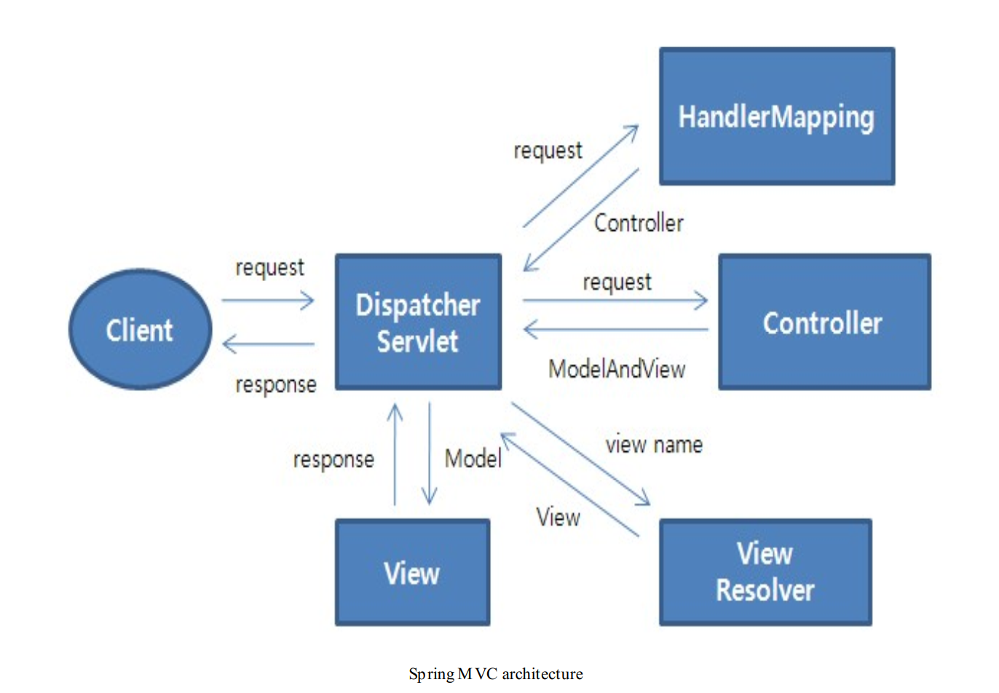

- Thread life cycle:
	- New
	- Runnable
	- Running
	- Wait
	- Terminate
  
What are the benefits of using constructor injection over field injection? Select all that apply.

   a.) Prevents using reflection

   b.) Forces the object to be created with the injected parameter

   c.) Lets to do the injection without using @Autowired annotation

   d.) Lets the injected field to be defines as final so that the it favours immutability


## 2. Reactor

- Reactor in its core use pub/sub model.
- There are two interface of Reactor:

```java
Flux<T>
Mono<T>
```

- How backpressure handle in **spring webflux**:
	- **Consumer pull**: specified number of events
	- **Prefetch**: fetch a batch number of events to be process
	- **Cancel**: cancel incoming request when consumer can not handle

- In order to use Webflux, wrap whole call stack from controller to service to do using Mono or Flux

- How to wrap sync call in Web flux

```java
Mono blockingWrapper = Mono.fromCallable(() -> { 
    return /* make a remote synchronous call */ 
});
blockingWrapper = blockingWrapper.subscribeOn(Schedulers.boundedElastic());
```


## 3. Quarkus

- GraalVM:
	- Ahead-of-time compilation (AOT compilation) is the act of compiling a higher-level programming language, or an intermediate representation such as Java bytecode, into a native machine code so that the resulting binary file can execute natively.
	- GraalVM build native image from java bytecode. 

- GraalVM usage:
	- Native image: for serverless and CLI
	- AOT
	- JIT

- Integrate quarkus:
	- Configure maven
```xml
<profiles>
    <profile>
        <id>native</id>
        <properties>
            <quarkus.package.type>native</quarkus.package.type>
        </properties>
    </profile>
</profiles>
``` 
	- Run build native image

```sh
./mvnw install -Dnative
```

 

- Response time much faster with Quarkus
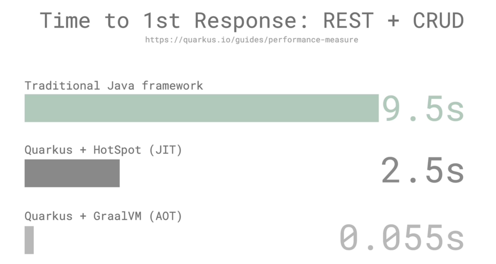 

- Problems solve with **Quarkus**:
	- Smaller footprint for cloud
	- Smaller startup time


## 4. GraphQL


### 4.1 Schema

- Scalar and object type

```javascript

type Book {
  title: String
  author: Author
}

type Author {
  name: String! # Can't return null
  books: [Book]
}

```

- **Query** is a special object that define top level query object.

```javascript

type Query {
  books: [Book]
  authors: [Author]
}

```

- Query example:

```
query GetBooksAndAuthors {
  books {
    title
  }

  authors {
    name
  }
}
```

- **Mutation** defines entry points for write operations.

```
type Mutation {
  addBook(title: String, author: String): Book
}
```

### 4.2 Resolvers

- A **resolver** is a function that's responsible for populating the data for a single field in your schema.

```typescript

const resolvers = {
  Query: {
    numberSix() {
      return 6;
    },
    numberSeven() {
      return 7;
    },
  },
};

```


## 5. Node/JS

### 5.1. ES6

- Block scoping
- String literal
- Class
- Promise
	- async-await
	- Promise.resolve: resolve one promise
	- Promise.all: resolve all promise
	- Promise.race: get the fastest one

```javascript

promise
  .then((result) => { ··· })
  .catch((error) => { ··· })
  .finally(() => { // logic independent of success/error })
  
``` 	

- Destructuring  
- Spread
- Arrow
- Generator: able to stop and resume function

```javascript
function* generatorFunc() {
    yield 0
    console.log('something')
    yield 1
}

const generator = generatorFunc()
console.log(generator.next())  // { value: 0, done: false }
console.log(generator.next())  // something 
                                                                        // { value: 1, done: false }
console.log(generator.next())  // { value: undefined, done: true }
```


### 5.2. Internal work of JS

- V8 engine comprise of two component:
	- Host env
	- V8 Engine

- Host env:
	- Host env comprise of multiple component:
		1. Call Stack
		2. Event Loop
		3. Heap
		4. Web API
		5. Call Back queue 

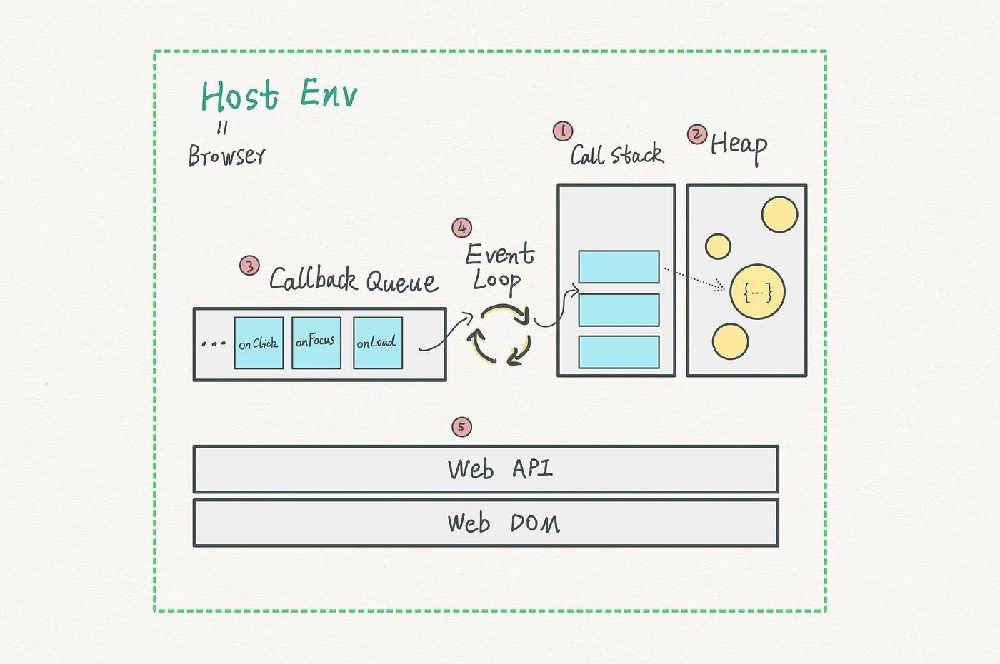


- How it works:
	- When new event start, for example **fetch data from backend**, it push event to call stack first.
	- **Event Loop** pick up this event and start process it.
	- The fetch data event will process end send another request to **Web API**, and it will be pop out from the call stack. This make process do not stuck at point.
	- Web API make call to BE server and wait for return.
	- BE return data, Web API push it to **Callback Queue**.
	- Event Loop pick up that data from call back queue and process it.

- V8 Engine have these component:
	- Javascript Core
	- GC
	- Coroutine

 
### 5.3. JS concept

**Closures and Higher-order Functions:**

- **Closure**: When we create a function inside another function in JavaScript, the inner function has access to the scope of the outer function as well as its own.

- **Higher-order Functions**: function that return other function is higher-order function.

```javascript

function throttle(fn, milliseconds) {
  let lastCallTime;

  return function() {
    let nowTime = Date.now();

    if(!lastCallTime || lastCallTime < nowTime - milliseconds) {
      lastCallTime = nowTime;
      fn();
    }
  };
}

let helloToptalThrottled = throttle(helloToptal, 1000);
setInterval(helloToptalThrottled, 10);

```

- **The Rest and Spread Operators**

```javascript

// Spread operator

function myFun(a, b, ...manyMoreArgs) {
  console.log("a", a);
  console.log("b", b);
  console.log("manyMoreArgs", manyMoreArgs);
}

myFun("one", "two", "three", "four", "five", "six");

// a, "one"
// b, "two"
// manyMoreArgs, ["three", "four", "five", "six"] <-- an array

Math.max(...[1,3,5]) // output: 5

```

- **let, var & const**:
	- var declare are **global scope**, it mean that, var can be re-declare in other scope and change it value
	- let declare are **block scope**

```javascript

var varX = 'XYZ'

function test() {
	varX = 'ABC'
}

console.log(varX); // return ABC

let letX = 'XYZ'

function test() {
	letX = 'ABC'
}

console.log(letX); // return XYZ

```

- **JavaScript Hoisting**:
	- In JavaScript, a variable can be declared after it has been used.
	- In other words; a variable can be used before it has been declared. 
	- For **var** variable, all declaration are moved to the top

```javascript
x = 5; // Assign 5 to x

elem = document.getElementById("demo"); // Find an element 
elem.innerHTML = x;           // Display 5 in the element

var x; // Declare x
```

- **let** and **const** are hoist to the top of the scope but not initialize

```javascript
try {
  carName = "Saab";
  let carName = "Volvo";
}
catch(err) {
  document.getElementById("demo").innerHTML = err;
}
```

- **Higher Order Functions**:
	- In javascript function can be pass around like object.
	- The other characteristic of a higher order function is “a function that returns a function”.

- **Immediately-Invoked Functions (IIFE)**:
	- Use-case:
		- Creating Private Variables and Functions:

```javascript
(function () {
    function generateMagicNumber() {
        return Math.floor(Math.random() * 100) + 900;
    }

    console.log("This is your magic number: " + generateMagicNumber());

    var favoriteNumber = 5;
    console.log("Twice your favorite number is " + favoriteNumber * 2);
})();
```  

- **Pure and impure function**:
	- Pure function do not modify the state of external variable, in constrast impure function modify the outside variable:

```javascript

// Impure 
function calculateTotal() {
  cart.forEach(item => total += item.price);
}

// Pure function
function calculateTotal(data) {
  return data.reduce((prev, next) => prev + next.price, 0);
}
``` 

- **this keyword in javascript**:
	- this keyword refer to the current object that contain this keyword.

```javascript

const drink = {
  name: 'Lemonade',
  price: 299,
  getName() {
    return this.name;
  }
};

drink.getName(); // print Lemonade

``` 
- If there is object contain this keyword, it assume to be called by window object

```javascript
function initialize() {
  console.log(this); // Window and globalThis in NodsJS
}

initialize();
```
- use strict will prevent such problems

```javascript

function initialize() {
  'use strict';
  console.log(this); // undefined
}

initialize();

```

- call and apply can also be used, the difference between call and apply is just a syntax.

```javascript

const drink = {
  name: 'Coffee'
};

const food = {
  name: 'Bagel'
};

function getName() {
  return this.name;
}

getName.apply(drink); // 'Coffee'
getName.apply(food); // 'Bagel'

```


- **Prototype**:
	- Eevery object in javascript inherit prototype of Object, at the end of the prototype chain is Object.prototype. All objects inherit the properties and methods of Object. Any attempt to search beyond the end of the chain results in null. 
	- We can use **Object.getPrototypeOf(arr)** to access prototype of an object.
	- JavaScript is a **prototype-based language**, meaning object properties and methods can be shared through generalized objects that have the ability to be cloned and extended.

### 5.4. Node JS Internal

- Node JS Platform uses “Single Threaded Event Loop” architecture to handle multiple concurrent clients constrast to other framework who use multi-thread model.
- Drawbacks of multi-thread model:
	- Handling more and more concurrent client’s request is bit tough.
	- Waste time blocking IO
	- Threads increase will increase size of memory

### 5.5 Express 
#### 5.5.1 Core feature of express:

- Middleware:
	- Logging
	- Authentication
	- Authorization
	- JSON parser 
- Routing
- Subapplication: using router
- Conveniences

#### 5.5.2 Middleware

- Express middleware:
	- Rate limit
	- Helmet
	- Cookie-parser
	- Response-time

#### 5.5.3 Routing

- URL param **/test/:who request.params**
- URL query **https://stackabuse.com/?page=2&limit=3 req.query**
- Router can be use to split up application

```typescript
// Main route
app.use('/api', MainRouter);

```

#### 5.5.4 HTTPs

```sh
openssl genrsa -out privatekey.pem 1024
openssl req -new -key privatekey.pem -out request.pem
```

```javascript

var express = require("express");
var https = require("https");
var fs = require("fs");
var app = express();

// ... define your app ...

var httpsOptions = {
	key: fs.readFileSync("path/to/private/key.pem"),
	cert: fs.readFileSync("path/to/certificate.pem")
};

http.createServer(app)
	.listen(80);

https.createServer(httpsOptions, app)
	.listen(443);

```

#### 5.5.5 API version

```javascript

var express = require("express");
var apiVersion1 = require("./api1.js");
var app = express();

app.use("/v1", apiVersion1);

app.listen(3000, function() {
    console.log("App started on port 3000");
});

```


## 6. Oauth

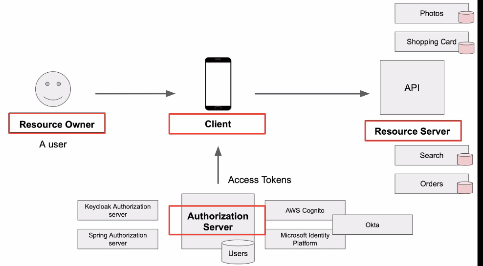

- Client type:
	- Public client: app, browser
	- Confidential client: internal services
  
- Access token type:
  - Identify type
  - Self containt authorized 
  
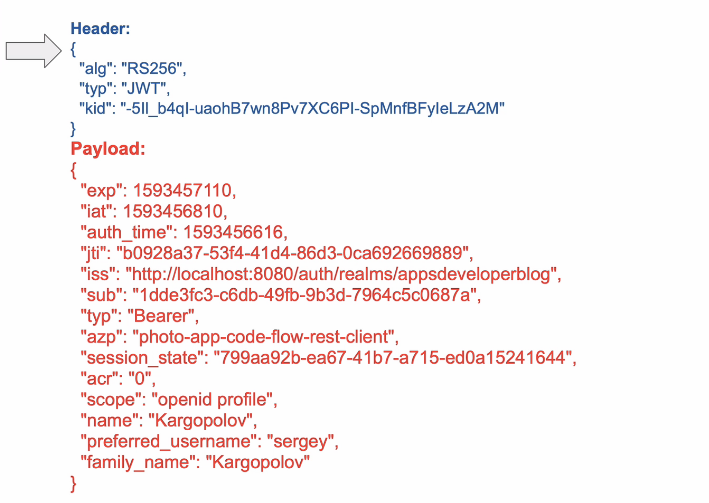

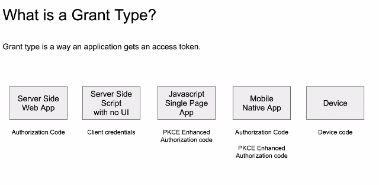

- **Authorization code grant type**: use for SPA, native app:

- Request for authorization code:
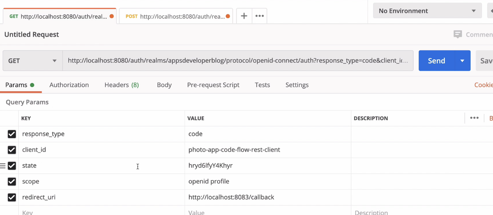

- Request for access token:
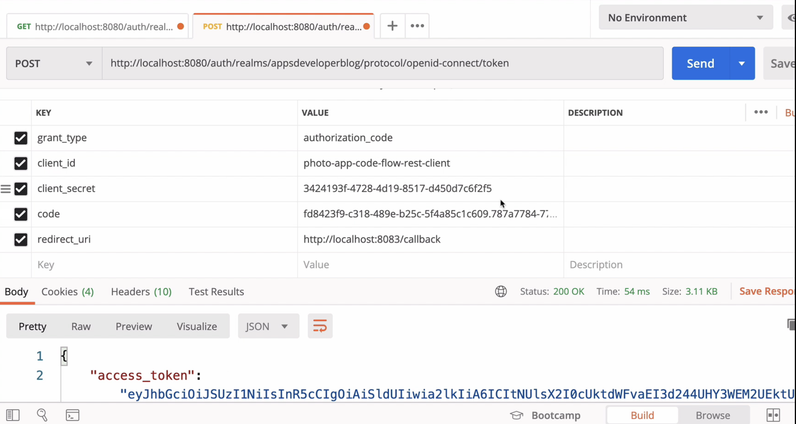

- PCKE authorization code (proof key code exchange):
	- PCKE add two new field:
    	- code_challenge: derive from code_verifier 
    	- code_challenge_method: can be s256 or plain
  	- In the second request for access token it require both: auth_code and code_verifier
  	- Generate mechanism: 
    	- code_verifier: base64 encode a random string
    	- code_challenge: can be the same or sha256 of base64(cover_verifier)

**What is the difference between state cand code_challenge, code_challenge_method in Oauth PCKE ?**

```
In the context of OAuth 2.0 and OpenID Connect, code_challenge and code_challenge_method are used to protect against authorization code interception attacks, while state is used to prevent CSRF attacks.

code_challenge is a randomly generated value that is derived from the code_verifier value. The code_verifier is a random string that is generated by the client application and used to prove possession of the authorization code. The code_challenge value is sent in the authorization request to the authorization server, and the authorization server uses it to verify that the client application has the correct code_verifier.

code_challenge_method specifies the method used to generate the code_challenge value. The two supported methods are S256 and plain. The S256 method uses the SHA-256 hash function to generate the code_challenge value, while the plain method simply uses the code_verifier value as the code_challenge value.

state is a random value that is generated by the client application and included in the authorization request. The authorization server includes this value in the authorization response, and the client application verifies that the value returned by the authorization server matches the value it originally sent. This helps prevent CSRF attacks by ensuring that the authorization response is only accepted if it is in response to a legitimate request made by the client application.

In summary, code_challenge and code_challenge_method are used to protect against authorization code interception attacks, while state is used to prevent CSRF attacks.
```

- **Client grant type**: use for backend service, machine to machine:

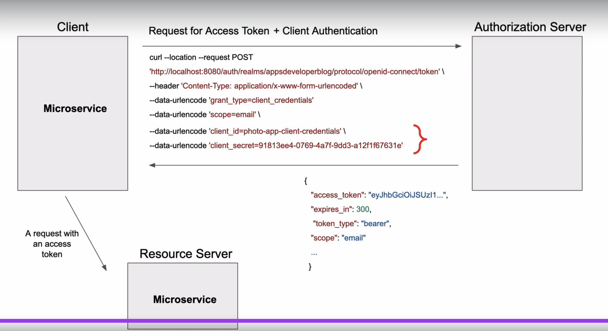

- **Refresh token**: expire much longer.

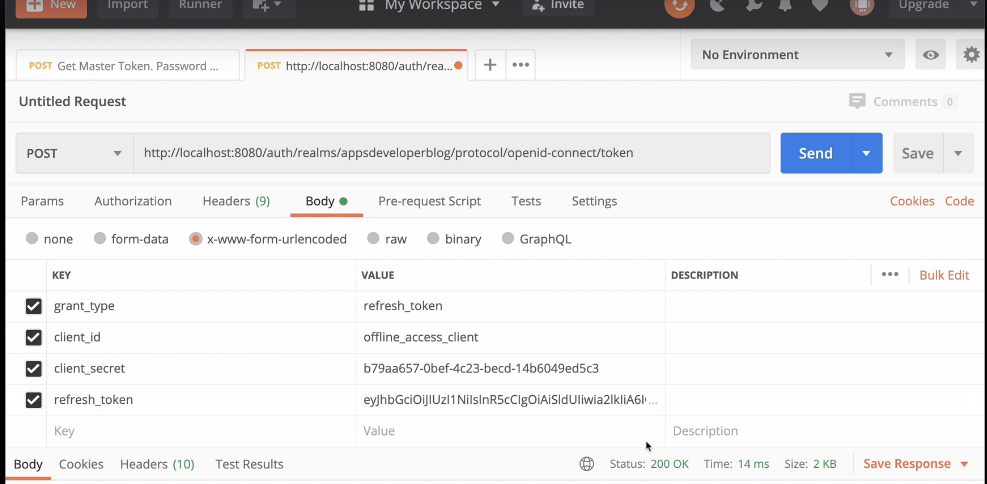

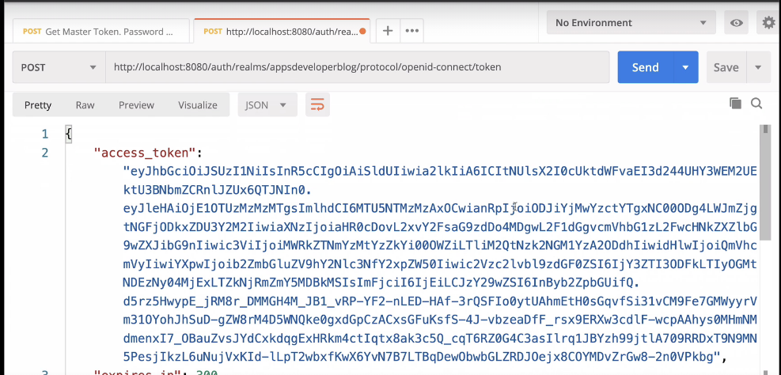

- **Realms**: space for manage user.

Some URL:

```

Console for admin:

http://0.0.0.0:8080/admin/master/console/#/analytic-platform/realm-settings/localization

Console for user:
http://localhost:8080/realms/analytic-platform/account/#/applications

Get Auth Code:

http://localhost:8080/realms/analytic-platform/protocol/openid-connect/auth?client_id=puller-service&response_type=code&scope=openid&state=1245175f&client_secret=o498FZnbuSW88q3mrBfCMcgz4EzR6pCT&redirect_uri=http://localhost:9000/call-back

Return:

http://localhost:9000/call-back?

- state=1245175f
- session_state=2abf5bc1-109e-4ff1-86f4-cd0041e299eb
- code=f56173e3-cfbe-46ad-84c0-012230571fa7.2abf5bc1-109e-4ff1-86f4-cd0041e299eb.514acbd0-3b3d-404a-8049-fadb915633dd

Get Token:

http://localhost:8080/realms/analytic-platform/protocol/openid-connect/token

```

- Scope of Oauth:
  - Scope is a mechanism in OAuth 2.0 to limit an application's access to a user's account. An application can request one or more scopes, this information is then presented to the user in the consent screen, and the access token issued to the application will be limited to the scopes granted.
