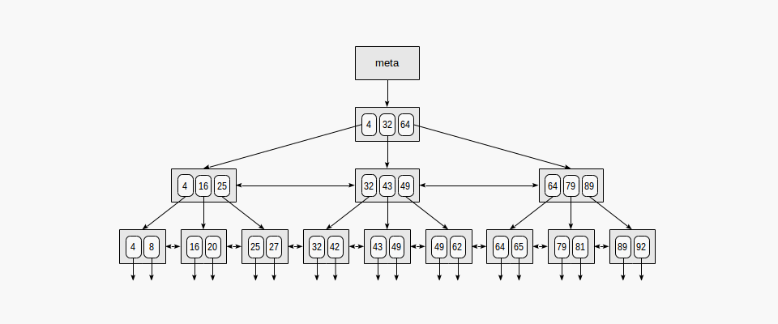
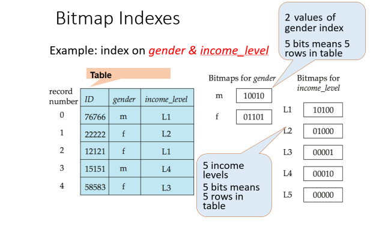
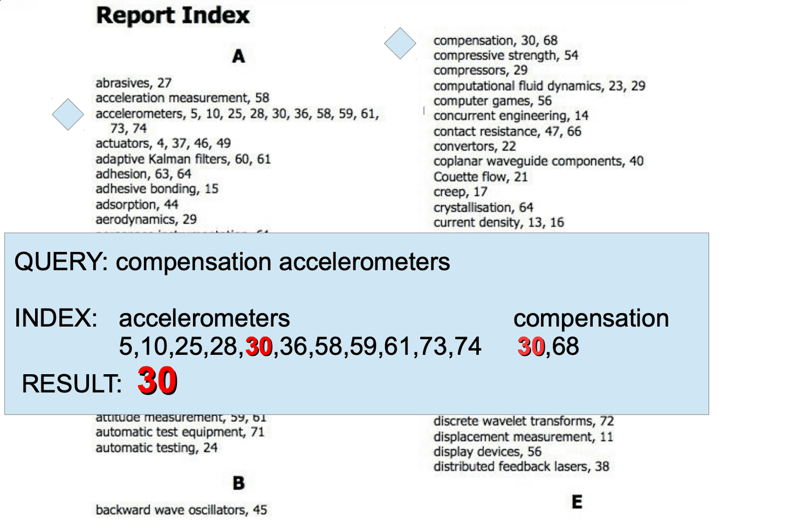

# Interview retro spec

## 1. Noveo

### 1.1 Generic

- Q: What is the difference of 

```java

List<? extends Number> list1 = new ArrayList<>();

List<Number> list2 = new ArrayList<>();

```

- A: 
  - Use list1 when we want to constraint specific type to list1
  - Use list2 when we want multiple data type can be add to list2 


### 1.2 Stream in depth


- Q: what is wrong with this code and fix this:

```java
Stream<Integer> stream = Stream.of(1, 2, 3, 4, 5);
List<Integer> list1 = stream.filter(i -> i > 3)
  .collect(Collectors.toList());
List<Integer> list2 = stream.filter(i -> i < 3)
  .collect(Collectors.toList());
```

- A: Stream has already been linked or consumed
```java
Stream<Integer> stream = Stream.of(1, 2, 3, 4, 5);
List<Integer> list1 = stream.filter(i -> i > 3).collect(Collectors.toList());
// Stream has already been linked or consumed
List<Integer> list2 = stream.filter(i -> i < 3).collect(Collectors.toList());


// FIX:

Stream<Integer> stream = Stream.of(1, 2, 3, 4, 5);
Map<Boolean, List<Integer>> partitions = stream.collect(Collectors.partitioningBy(n -> (n > 3)));
List<Integer> list1 = new ArrayList<>(partitions.get(true));
List<Integer> list2 = new ArrayList<>(partitions.get(false));

System.out.println(list1); // [4, 5]
System.out.println(list2); // [1, 2, 3]

```

### 1.3 Atomic vs block vs volatile

- Block: 
  - Provides mutual exclusion
  - Provides visibility guaranteed - updated values of variables modified inside synchronized context will be visible to all thread
- Volatile:
  - Volatile keyword ensure about the visibility of variables across threads. But not ensure race condition.
- Atomic variables:
  - Using CAS operation

Limit of Atomic operation:
  - Limited functionality: Atomic operations are typically limited to basic operations such as compare-and-swap, fetch-and-add, etc. Complex operations that require multiple steps or synchronization between threads may not be possible using atomic operations alone.

Limit of blocking: 
  - Locking contention

```c
function cas(p: pointer to int, old: int, new: int) is
    if *p ≠ old
        return false
    *p ← new
    return true

function add(p: pointer to int, a: int) returns int
    done ← false
    while not done
        value ← *p  
        // Even this operation doesn't need to be atomic.
        done ← cas(p, value, value + a)
    return value + a
```

## 2. V net

- **Prometheus**: 
  - Pull metrics from exporter
  - Find target from servcice discovery
  - Push alert to alert manager
  - Configure Prometheus to find metrics:
    
```yaml
scrape_configs:
  - job_name: 'spring-boot-app'
    static_configs:
      - targets: ['localhost:8080']
```
  - Prometheus store in its own custom data layer, but store index in LevelDB
  - Fine tune Prometheus:
    - Reduce scrape interval 
    - Configure appropriate retention policies
    - Utilize federation and remote write
    - Optimize memory usage: storage.local.target-heap-size
    - Chunk encoding is used default in Prometheus, Prometheus use delta-delta encoding.
    - Crash recovery: storage.local.checkpoint-interval
    - Using prometheus federation (pull metrics from other path)


- **Kafka**:
  - Partitions: represent the unit of parallelism in Kafka

- Design, Configuration, Tuning of Apache Kafka Event Streaming Platform for high volume, and secure target architecture

- Spark, Hadoop

## 2. Prepare Noveo

- Using star format:
  - Situation
  - Task
  - Action
  - Result

- **Intro:**
What did you not like about the project (usually about which you told)
  - It is important to describe what you did not like without falling into negativity and harsh criticism of the project.
  - After describing what you didn’t like, they will definitely ask what you did to fix it, if you didn’t do anything, then why. Therefore, if there is a choice, it is better to talk about something for which you did something in order to fix it.

- In my control:
  - My initiative
- Out of my control:
  - Scope creep
  - Change their app developer

- Tell us what you dislike in Spring?
  - Verbose: class name, AbstractTransactionalJUnit4SpringContextTests
  - Context differ: We should note that singleton beans will not create only one instance of a class, but one bean per bean identifier in a container.
  - Used to have a lot of XML.
  - Complex: spring security.

- Why did you decide to change your job?
- Most challenging parts:
  - Maintainable system in code and schema design.
  - How to design large scale:
    - Example: a payment system

- Tell us about some technology/framework/library that you have studied lately. Why did you decide to study it? What do you remember about it? What are the advantages/disadvantages compared to competing technologies? 
  - Google Guice, VertX

- **Logical task:**
  - 1.	At what points of the earth can someone walk a kilometer to the south, a kilometer to the east, a kilometer to the north, and get to the same point from which he left. North pole
  - 2. Person A distributes 50 black and 50 white balls into 2 boxes. How to distribute them in such a way that person B, who qdid not see how they are distributed, took a black ball at random with the highest possible probability (person B takes exactly 1 random ball from a randomly selected box). 
    - **ANS:**
    - Box 1: 1 black ball
    - Box 2: 49 black ball and 50 white ball
  - 3. There are 100 identical coins. You need to put them in 2 socks so that in one sock there are exactly 2 times more coins than in the other. 
    - **ANS:** Put 50 coin to sock A, 50 coin to sock B, then put sock A to sock B.
  - 4.	There is a cyclic train of unknown length, without windows. All carriages are exactly the same. In each carriage, you can turn on and off the light. At the initial moment of time, the lights in all carriages are turned on or off randomly, and you are in a random carriage. It is necessary to propose an algorithm to find out the number of carriages. This task can be given as a live coding task, where the train will be represented by a doubly linked list. 
  - 5. There are 2 ropes. Each of them burns out in exactly one hour. However, they do not burn evenly. How to use these ropes to measure 45 minutes?
    - **ANS:**
    To measure 45 minutes using the two ropes that burn out unevenly but in exactly one hour, you can follow these steps:

    Light both ends of the first rope simultaneously.
    Light one end of the second rope.
    Wait for the first rope to burn out completely, which will take 30 minutes (as it burns at both ends simultaneously).
    At this point, exactly 30 minutes have passed.
    Immediately light the other end of the second rope (which was already burning from step 2).
    The second rope will now burn for an additional 15 minutes until it completely burns out, marking a total of 45 minutes since the beginning.

    By utilizing the different burn rates of the two ropes, you can measure 45 minutes accurately.

- **Theoretical task:**


  - 1. How does server process many requests in parallel?
    - Thread-per-Request/Thread Pool
    - Asynchronous IO/ Event driven
    

  - 2.	What kinds of indexes are there in Postgres (b-tree, hash, gin)? How are they arranged? When is the best index to use? Why does gin perform better than b-tree for text search? 
    - Hash index: suitable for '=' operator, concern before postgrel 10, hash index is not write into WAL, so they cannot be maintained in replicas, and they are not automatically available after a crash, so you need to manually rebuild them. 
      - Hash index size is smaller, because it does not have to store the value of index col, just the hash and id.
      - Operation is O(1)
      - Suitable for equal operation

    - B-Tree index: B-Tree indexes are inherently ordered. 
      - B-tree index implement a self balance tree so, insert, update, delete will take OlogN
      - Choose **text_pattern_ops** for indexing text
```sql
CREATE INDEX first_name_idx on test_index(first_name text_pattern_ops);

EXPLAIN ANALYZE SELECT * FROM test_index WHERE first_name = 'Joshua';
```
  - B-Tree index type:
      - Partial index suitable for indexing only a sub set of data
      - **Index scan only**: some data can be tag along with index, so that when query, only one access to index is enough, there is no need to secondary access

```sql
create unique index bookings_pkey2 on bookings(book_ref) INCLUDE (book_date);
```

  - B-tree structure:
    - B-tree comprise of page (8kb) that contain a lot of ID, non decreasing order (for binary search), the tree depth is not very large, at most 4-5



- Bitmap index:
  - Bitmap index can be used on column with low cardanity
  - Bitmap index can also be used when we want to merge multiple columns


```sql
CREATE BITMAP INDEX <indexname> ON <table> (x, y);
```
  - Bitmap index is bad for write intensive application, because it needs to lock whole table.

- GIN index:
  - GIN index = Generalized Inverted index.
  - They describe a GIN index like the table of contents in a book, where the heap pointers (to the actual table) are the page numbers. Multiple entries can be combined to yield a specific result, like the search for “compensation accelerometers” in this example:


  - Downside of GIN:
    - Expensive update, PostgrelSQL keep a pending list for queueing update operation than dump the change to database.

- VACCUM:
  - VACUUM is a database maintenance operation commonly used in relational database management systems (RDBMS) like PostgreSQL to reclaim storage space and improve performance.  
  - When to forece VACCUM:
    - Storage space reclamation
    - Performance optimization

- What is the difference between first and second level cache in Hibernate?
  - 1st level: session-level caches, short-lived.
  - 2nd level: second-level cache is an optional cache that operates at the session factory level. It is shared among multiple sessions and provides a mechanism to cache data across different sessions and transactions.

- Which problems appear when you use hibernate? What problems appear when you use caches. How to fix them? (cache invalidation, parallel updates, pessimistic/optimistic locks)
  - Eager fetching
  - Dont use DTO projection
  - Use cascade REMOVE
  - Use Set instead of List

# 3. How concurreny hash map work ?

- Most important config of ConcurrentHashMap:
  - Concurrency-Level: Defines the number which is an estimated number of concurrently updating threads. The implementation performs internal sizing to try to accommodate this many threads.
  - It divide hash map into segment, each lock will manage each segment
  - Write and delete will lock segment, read will not lock.
