# Query Tunning

## 1. Introduce, why optimize ? 

- Optimizing OLTP and OLAP: 
    - OLTP: database support applications
    - OLAP: database support BI and reporting
    - In the majority of cases, in OLTP systems we are optimizing short queries and in OLAP systems both short and long queries.

- Database design:
    - Example:  in this database, we need to store user accounts, and we
need to store each account holder’s phone number(s). Two possible designs are shown:
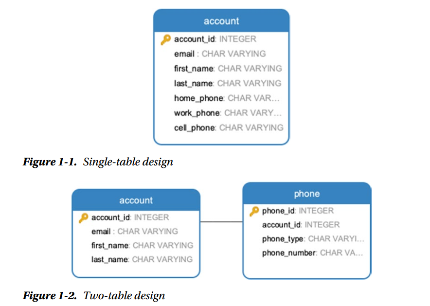
    - Which is a better solution:
    - When phone number will not is used as search criteria, When customer support screen show phone as a part of account then one single table is more preferable. 
    - However, if we want to search by phone number regardless of type, having all phones in a separate table will make the search more performant.
    - Additionally, when people want to choose one phone as primary, or add multiple phone number type, like virtual phone ... 2 table approachs is better.

## 2. Theory
- Step by step of execute PostGrel SQL:
    - Compile and transform a SQL statement into an expression consisting of high-level logical operations, known as a logical plan.
    - Optimize the logical plan and convert it into an execution plan.
    - Execute (interpret) the plan and return results.

- Logical plan vs execute plan:
```sql
SELECT o.order_id, c.customer_name
FROM orders o
JOIN customers c ON o.customer_id = c.customer_id;
```
- Logical Plan: The logical plan for this query would involve the basic steps of joining the orders and customers tables based on the customer_id column and projecting the order_id and customer_name columns.

- Execution Plan: The execution plan, on the other hand, would consider factors like available indexes, data distribution, and resource utilization. It might decide to use an index on the customer_id column to speed up the join operation. It might also choose the most suitable join algorithm (e.g., nested loop join, hash join, merge join) based on the size of the tables and the available memory.


- Type of logical operation:
    - Projection
    - Product
    - Filter

## 3. Algorithms
Instead, an optimizer uses internal metrics based on the amount of computing
resources needed to execute a query or a single physical operation within a plan. The
most important resources are those that affect execution time, namely: 
-   CPU cycles 
-   I/O accesses (read/write disk blocks). 

The efficiency of such operations depends on the ratio of rows that are retained to
the total rows in the stored table. This ratio is called **selectivity**. The choice of algorithm for a given read operation depends on the selectivity of filters that can be simultaneously applied.

Structure of storage block:
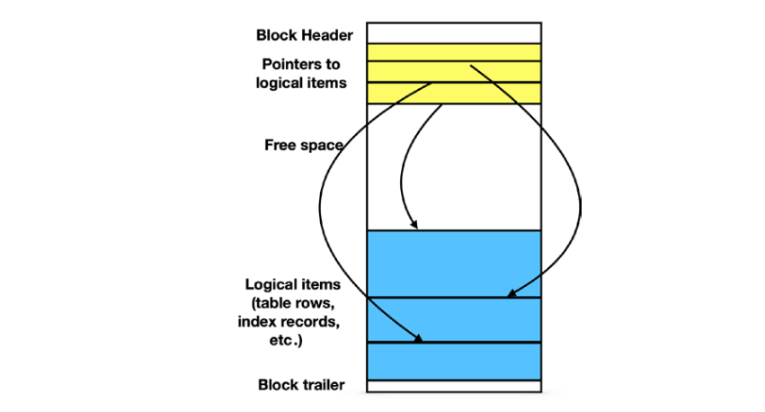

**Full scan**:
We can estimate the cost of a full scan as c1 * BR + c2 * TR + c3 * S* TR

**Index-Based Table Access**:

- There are two separate physical operations used by PostgreSQL to retrieve rows via indexes:
index scan and bitmap heap scan. 

- The cost model of this algorithm is much more complex. Informally, it can be described this way: for small values of selectivity, most likely, all rows satisfying the filtering conditions will be located in different blocks and, consequently, the cost is proportional to the number of result rows.

- For larger values of selectivity, the number of processed blocks approaches the total number of blocks. In the latter case, the cost becomes higher than the cost of a full scan because resources are needed to access the index.

**Index-Only Scan**:
- Sometime, query do not need to return the whole column, they just need to return some column (which are tag along of index)

- Similar to index-based table scan, For small values of selectivity, the cost is approximately proportional to the number of returned rows.

- Example:

```sql
SELECT flight_no, departure_airport, arrival_airport
FROM flight
WHERE scheduled_departure BETWEEN
'2020-05-15' AND '2020-08-31'; -- Optimizer choose to make a full scan 


SELECT flight_no, departure_airport, arrival_airport
FROM flight
WHERE scheduled_departure BETWEEN
'2020-08-12' AND '2020-08-13'; -- Optimizer choose to make a index-based table scan
```

**Index Structures**
- What is index: data structure is called an index if it is:
    - a redundant data structure
    - invisible to the application
    - designed to speed up data selection based on certain criteria

- Example structure:

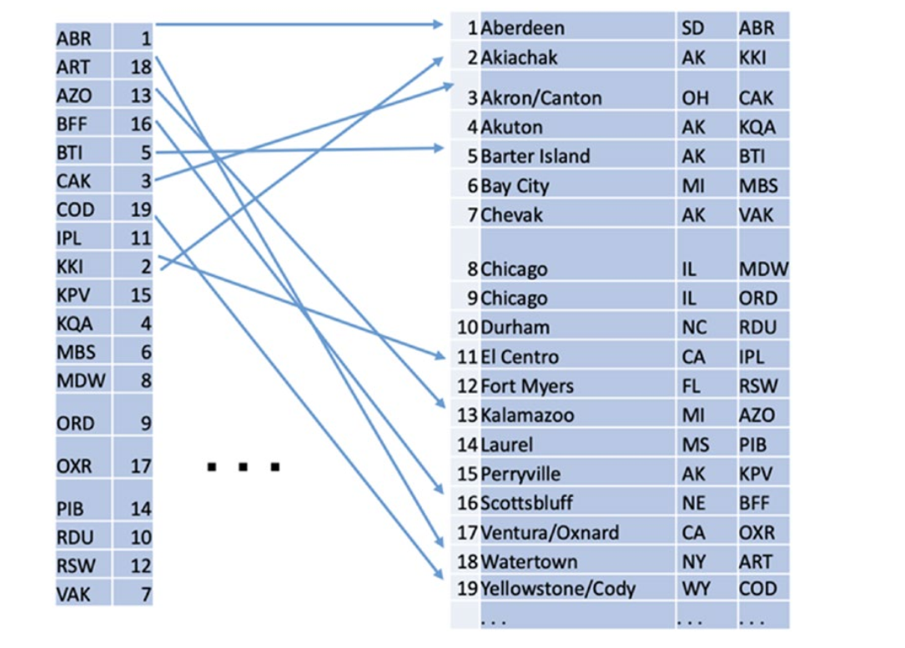

**B-Tree Indexes**
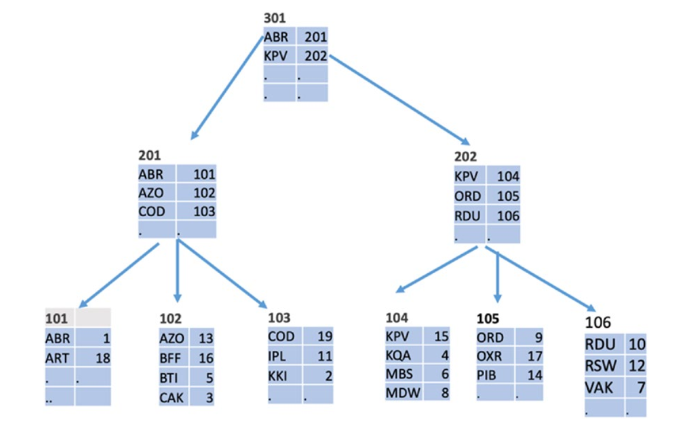

- B-trees also support range search (expressed as a between operation in SQL)

- As soon as the lower end of the range is located, all index keys in the range are obtained with a sequential scan of leaf nodes until the upper end of the range is reached.

- Why B-Tree is used:
    - Normal tree is good for search Log(N), but update is force to restructure whole index. 
    - B-Tree is update only one specific block. 

**Bitmaps**
- Bitmaps are used to compactly represent properties of table data.

- Usually a bitmap contains one bit for each block (8192 bytes). The value of the bit is 1 if the block has a property and 0 if it hasn’t.

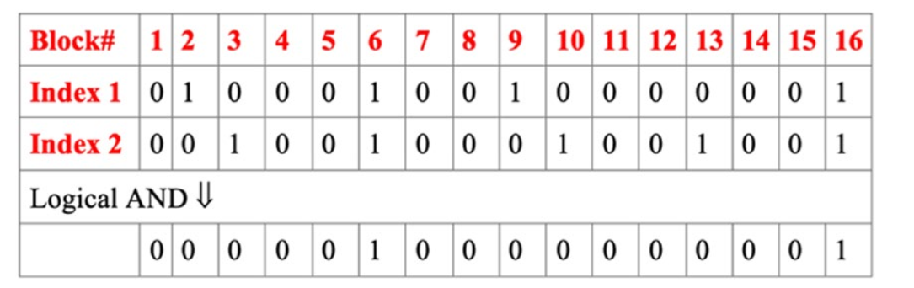

**Other Kinds of Indexes**

- Hash index: better for equal condition, but useless for range operation.

-  R-tree index: use for spatial data.

**Combining Relations**
- There are three simple operation:
    - Projection
    - Filtering
    - Product
- Algorithm for logical operation:
    - Nested loop
    - Hash base algorithm
    - Sort and merge

## 4. Execution Plans

**How an Optimizer Builds an Execution Plan:**
- To build a plan, the optimizer uses transformation rules, heuristics, and cost-based optimization algorithms.

- A plan contains estimations of costs, expected number of rows in the output, and expected average width of the output rows. All these values are calculated from the database statistics.

```sql
SELECT 
  f.flight_no, 
  f.actual_departure, 
  count(passenger_id) passengers 
FROM 
  flight f 
  JOIN booking_leg bl ON bl.flight_id = f.flight_id 
  JOIN passenger p ON p.booking_id = bl.booking_id 
WHERE 
  f.departure_airport = 'JFK' 
  AND f.arrival_airport = 'ORD' 
  AND f.actual_departure BETWEEN '2020-08-14' 
  and '2020-08-15' 
GROUP BY 
  f.flight_id, 
  f.actual_departure;
```

- Hash inner join: construct a hash table than scan
- Bitmap heap scan: scan using bitmap

**Understanding Execution Plans**

The cost of each execution plan depends on
- Cost formulas of algorithms used in the plan
- Statistical data on tables and indexes, including **distribution of values**
- System settings (parameters and preferences), such as join_
collapse_limit or cpu_index_tuple_cost.

- Some query even look the same, but have vastly differenet execution plan, for example these two query only different from filter condition:

```sql
SELECT 
  flight_id, 
  scheduled_departure 
FROM 
  flight f 
  JOIN airport a ON departure_airport = airport_code 
  AND iso_country = 'US'
```
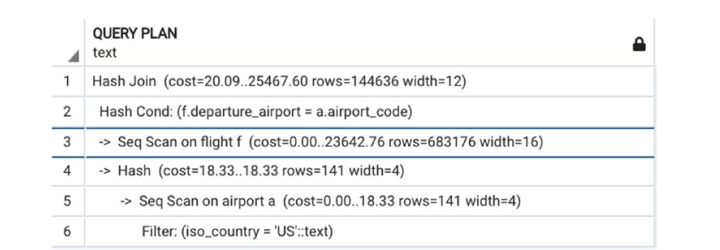


```sql
SELECT 
  flight_id, 
  scheduled_departure 
FROM 
  flight f 
  JOIN airport a ON departure_airport = airport_code 
  AND iso_country = 'CZ'

```

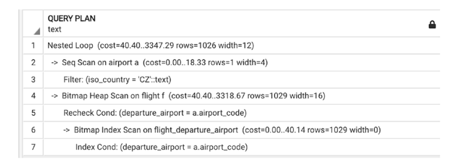

- This happen because the distribution of "US" value in country, which select a significant portion of airports, using index with not give an performance advatange than sequencial scan.

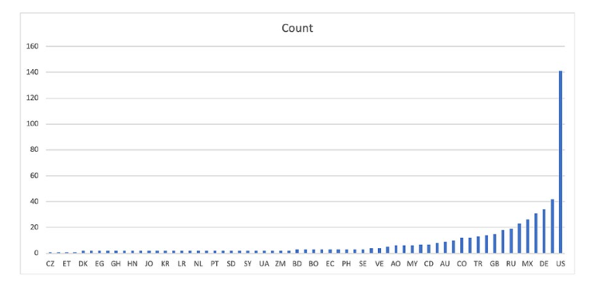


## 5. Short Queries and Indexes
- What is a short query:

`
A query is short when the number of rows needed to compute its output is small (less than 10% of total row in table), no matter how large the involved tables are. Short queries may read every row from small tables but read only a small percentage of rows from large tables.
`

- Our taxonomy of queries is similar to the commonly accepted distinction between **OLTP** and **OLAP** queries. All **OLTP queries are short**. However, many modern applications require queries that return hundreds of rows but still are short.

**Index Selectivity**:
- Generally, we want to make index with low selectivity, such as timestamp.

- Index selectivity example: in this example, **status = 'Delayed'** have the highest selectivity value.
```sql
SELECT * FROM flight
WHERE departure_airport='LAX'
AND update_ts BETWEEN '2020-08-16' AND '2020-08-18'
AND status='Delayed'
AND scheduled_departure BETWEEN '2020-08-16' AND '2020-08-18'
```

- The better (lower) the selectivity of an index, the faster the search. Thus, the most efficient indexes are **unique indexes**.

- Primary key have to be unique and not null.

- An index should only be created if the number of distinct values
is large enough. Remember, indexes with high selectivity are unlikely to be useful

**Indexes and Column Transformations**:
- Index can be a transform of column:

```sql
CREATE INDEX account_last_name
ON account (last_name);

-- …the following search won’t be able to take advantage of the index:

SELECT * FROM account WHERE lower(last_name)='daniels';
```

- Let’s examine another example where column transformation often remains unnoticed. Example:

```sql

SELECT * FROM flight
WHERE coalesce(actual_departure, scheduled_departure)
BETWEEN '2020-08-17' AND '2020-08-18'

-- Will not used index on actual_departure and scheduled_departure

SELECT 
  * 
FROM 
  flight 
WHERE 
  (
    actual_departure BETWEEN '2020-08-17' 
    AND '2020-08-18'
  ) 
  OR (
    actual_departure IS NULL 
    AND scheduled_departure BETWEEN '2020-08-17' 
    AND '2020-08-18'
  )
-- This will use both index of actual_departure and scheduled_departure

```
**Indexes and the like Operator**
-  Pattern search index:

```sql
CREATE INDEX account_last_name_lower_pattern ON account (
  lower(last_name) text_pattern_ops
);

```

**Using Multiple Indexes**

```sql
SELECT 
  scheduled_departure, 
  scheduled_arrival 
FROM 
  flight 
WHERE departure_airport = 'ORD' 
  AND arrival_airport = 'JFK' 
  AND scheduled_departure 
  BETWEEN '2020-07-03' AND '2020-07-04';

```

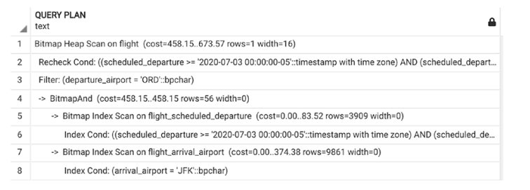

- In this example, optimizer will
    - Filter out scheduled_departure '2020-07-03' AND '2020-07-04'
    - From that subset create bit map of departure_airport = 'ORD' 
    - Create bit map of arrival_airport = 'JFK' 
    - Combine the result.

**Compound Indexes**
- How Do Compound Indexes Work? In above query, another option is to built a compound index:

```sql
CREATE INDEX flight_depart_arr_sched_dep ON flight(
  departure_airport, 
  arrival_airport, 
  scheduled_departure
)
```
- With this type of index, the execute plan is:

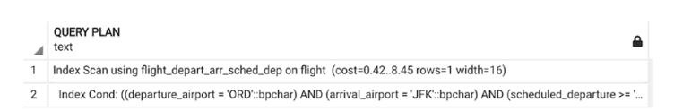

- However if the query is: then the index will be useless
```sql
SELECT 
  departure_airport, 
  scheduled_arrival, 
  scheduled_departure 
FROM 
  flight 
WHERE arrival_airport = 'JFK' 
  AND scheduled_departure 
  BETWEEN '2020-07-03' AND '2020-07-04

```

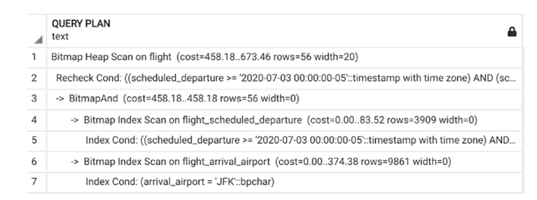

- However if the query is: then the index will be used

```sql
SELECT 
  scheduled_departure, 
  scheduled_arrival 
FROM 
  flight 
WHERE departure_airport = 'ORD' 
  AND arrival_airport = 'JFK' 
  AND scheduled_arrival BETWEEN '2020-07-03' 
  AND '2020-07-04';
```

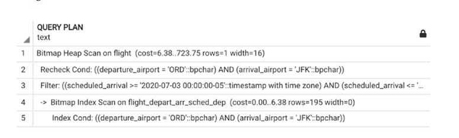

**Using Indexes for Data Retrieval**

- When all the columns from a SELECT statement are included in a compound index, they may be retrieved without accessing the table. This is called the index-only-scan data retrieval method.

```sql
CREATE INDEX flight_depart_arr_sched_dep_sched_arr ON flight (
  departure_airport, 
  arrival_airport, 
  scheduled_departure, 
  scheduled_arrival
);

SELECT 
    departure_airport,
    scheduled_departure ,
    scheduled_arrival
FROM flight
WHERE arrival_airport='JFK'
AND scheduled_departure 
    BETWEEN '2020-07-03' AND '2020-07-04'
```

**Covering Indexes**

- Some column can be tag along with index

```sql
CREATE INDEX flight_depart_arr_sched_dep_inc_sched_arr ON flight (
  departure_airport, arrival_airport, 
  scheduled_departure
) INCLUDE (scheduled_arrival);

SELECT 
  departure_airport, 
  scheduled_departure, 
  scheduled_arrival 
FROM 
  flight 
WHERE 
  arrival_airport = 'JFK' 
  AND departure_airport = 'ORD' 
  AND scheduled_departure BETWEEN '2020-07-03' 
  AND '2020-07-04'

```
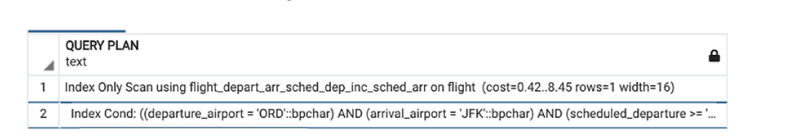

**Partial Indexes**

- A partial index is built on a subset of a table, defined by the WHERE clause of the CREATE INDEX operator.

```sql
CREATE INDEX flight_actual_departure_not_null
    ON flight(actual_departure)
    WHERE actual_departure IS NOT NULL
```

- The column status in the flight table has only three possible values: ‘On schedule’, ‘Delayed’, and ‘Canceled’. These values are unevenly distributed; there are significantly more flights with status ‘On schedule’ than the other two.

```sql
CREATE INDEX flight_canceled ON flight(flight_id)
WHERE status='Canceled';
```

- This index will be used in all queries where we select canceled flights, regardless of any other filtering conditions, for example:

```sql
SELECT * FROM flight 
WHERE scheduled_departure 
between '2020-08-15' AND '2020-08-18'
AND status='Canceled'
```

**When Are Indexes Not Used**

**How to Build the Right Index(es)?**
- To Build or Not to Build: 
    - We recommend creating partial and covering indexes whenever it makes sense.
    - Partial indexes are usually smaller than regular indexes and are more likely to fit in main memory
    -  Covering indexes save trips to the table, thus allowing the engine to perform most processing in main memory

**Which Indexes Are Not Needed?**

```sql
pg_stat_all_indexes -- show which index are not used
```

## 6. Long Queries and Full Scans

**Which Queries Are Considered Long?**

- A query is considered long when query selectivity is high for at least one of the large tables; that is, almost all rows contribute to the output, even when the output size is small.

- Improvements are made possible when two optimization strategies are applied:
  - Avoid full table scan
  - Reduce size of result at earliest possible stage

**Long Queries and Hash Joins**

- Nest loop time complexity = O(m*n)
- Hash join time complexity = O(m+n)

**Long Queries and the Order of Joins**

- Join order matter in long query: 

```
The most restrictive joins (i.e., joins that reduce the result set size the most) should be executed first
```

**Grouping: Filter First, Group Last**
- Average ticket price and total number of passengers per flight:

```sql
SELECT 
  bl.flight_id as flight_id, 
  departure_airport as dep_airport, 
  (avg(price)):: numeric (7, 2) AS avg_price, 
  count(DISTINCT passenger_id) AS num_passengers 
FROM 
  booking b 
  JOIN booking_leg bl USING (booking_id) 
  JOIN flight f USING (flight_id) 
  JOIN passenger p USING (booking_id) 
GROUP BY 
  flight_id, 
  dep_airport
```

- Calculate these number for just one flight:

```sql

-- This is not a efficient query

WITH AVERAGE_PRICE_AND_COUNT_PASSENGER 
AS (
  SELECT 
  bl.flight_id as flight_id, 
  departure_airport as dep_airport, 
  (avg(price)):: numeric (7, 2) AS avg_price, 
  count(DISTINCT passenger_id) AS num_passengers 
FROM 
  booking b 
  JOIN booking_leg bl USING (booking_id) 
  JOIN flight f USING (flight_id) 
  JOIN passenger p USING (booking_id) 
GROUP BY 
  flight_id, 
  dep_airport
) SELECT 
  * 
FROM AVERAGE_PRICE_AND_COUNT_PASSENGER
WHERE flight_id = 222183 

-- This is a efficient query
SELECT 
  bl.flight_id as flight_id, 
  departure_airport as dep_airport, 
  (avg(price)):: numeric (7, 2) AS avg_price, 
  count(DISTINCT passenger_id) AS num_passengers 
FROM 
  booking b 
  JOIN booking_leg bl USING (booking_id) 
  JOIN flight f USING (flight_id) 
  JOIN passenger p USING (booking_id)
WHERE flight_id=222183
GROUP BY 
  flight_id, 
  dep_airport

```

- Another example: calculates the same numbers (average
price and number of customers) for all flights departing from ORD.


```sql
-- Not optimize take 1.5 mins to run 
SELECT 
  flight_id, 
  avg_price, 
  num_passengers 
FROM 
  (
    SELECT 
      bl.flight_id, 
      departure_airport, 
      (
        avg(price)
      ):: numeric (7, 2) AS avg_price, 
      count(DISTINCT passenger_id) AS num_passengers 
    FROM 
      booking b 
      JOIN booking_leg bl USING (booking_id) 
      JOIN flight f USING (flight_id) 
      JOIN passenger p USING (booking_id) 
    GROUP BY 
      1, 
      2
  ) a 
WHERE 
  departure_airport = 'ORD'
```

**Grouping: Group First, Select Last**
- Sometime, group by should be executed as early as possible. As you might have already guessed, this order of actions is desirable when grouping will reduce the size of the intermediate dataset.

- Calculates the number of passengers departing from each city by month.

```sql
SELECT 
  city, 
  date_trunc('month', scheduled_departure) AS month, 
  count(*) passengers 
FROM 
  airport a 
  JOIN flight f ON airport_code = departure_airport 
  JOIN booking_leg l ON f.flight_id = l.flight_id 
  JOIN boarding_pass b ON b.booking_leg_id = l.booking_leg_id 
GROUP BY 
  1, 
  2 
ORDER BY 
  3 DESC
-- The execution time for this query is over 7 minutes

SELECT 
  city, 
  date_trunc('month', scheduled_departure), 
  sum(passengers) passengers 
FROM 
  airport a 
  JOIN flight f ON airport_code = departure_airport 
  JOIN (
    SELECT 
      flight_id, 
      count(*) passengers 
  -- First, the number of departing passengers is summed for each flight
    FROM 
      booking_leg l 
      JOIN boarding_pass b USING (booking_leg_id) 
    GROUP BY 
      flight_id
  ) cnt USING (flight_id) 
GROUP BY 
  1, 
  2 
ORDER BY 
  3 DESC

-- Query rewrite that forces grouping be done first, total time execute is 2.5 mins
```

**Avoiding Multiple Scans**


```sql
create table custom_field (
  custom_field_id serial, passenger_id int, 
  custom_field_name text, custom_field_value text
);

SELECT 
  first_name, 
  last_name, 
  pn.custom_field_value AS passport_num, 
  pe.custom_field_value AS passport_exp_date, 
  pc.custom_field_value AS passport_country 
FROM 
  passenger p 
  JOIN custom_field pn ON pn.passenger_id = p.passenger_id 
  AND p.passenger_id < 5000000 
  JOIN custom_field pe ON pe.passenger_id = p.passenger_id 
  AND pe.custom_field_name = 'passport_exp_date' 
  JOIN custom_field pc ON pc.passenger_id = p.passenger_id 
  AND pc.custom_field_name = 'passport_country' 
WHERE 
  pn.custom_field_name = 'passport_num';
-- This will make DB sequential scan custom_field three times.

SELECT 
  last_name, 
  first_name, 
  coalesce(
    max(
      CASE WHEN custom_field_name = 'passport_num' THEN custom_field_value ELSE NULL END
    ), 
    ''
  ) AS passport_num, 
  coalesce(
    max(
      CASE WHEN custom_field_name = 'passport_exp_date' THEN custom_field_value ELSE NULL END
    ), 
    ''
  ) AS passport_exp_date, 
  coalesce(
    max(
      CASE WHEN custom_field_name = 'passport_country' THEN custom_field_value ELSE NULL END
    ), 
    ''
  ) AS passport_country 
FROM 
  passenger p 
  JOIN custom_field cf USING (passenger_id) 
WHERE 
  cf.passenger_id < 5000000 
  AND p.passenger_id < 5000000 
GROUP BY 
  1, 
  2

/*
Error query:

This looks much better—only one table scan—except that when you try to execute it, it will run significantly longer. 

A closer look shows why: there may be many passengers with the same first and last names, so not only does it take longer but the result is also incorrect. 

*/

SELECT 
  last_name, 
  first_name, 
  p.passenger_id, 
  coalesce(
    max(
      CASE WHEN custom_field_name = 'passport_num' THEN custom_field_value ELSE NULL END
    ), 
    ''
  ) AS passport_num, 
  coalesce(
    max(
      CASE WHEN custom_field_name = 'passport_exp_date' THEN custom_field_value ELSE NULL END
    ), 
    ''
  ) AS passport_exp_date, 
  coalesce(
    max(
      CASE WHEN custom_field_name = 'passport_country' THEN custom_field_value ELSE NULL END
    ), 
    ''
  ) AS passport_country 
FROM 
  passenger p 
  JOIN custom_field cf USING (passenger_id) 
WHERE 
  cf.passenger_id < 5000000 
  AND p.passenger_id < 5000000 
GROUP by 
  3, 
  1, 
  2 -- Fix group by order
-- Fix query

```


**Different type of index**

- B-tree index: 
- Gin index:

```sql
SELECT title FROM film WHERE special_features @> '{"Behind The Scenes"}';

CREATE INDEX idx_film2 ON film USING GIN(special_features);

EXPLAIN SELECT title FROM film
WHERE special_features @> '{"Behind The Scenes"}';
                                QUERY PLAN
---------------------------------------------------------------------------
 Bitmap Heap Scan on film  (cost=8.04..23.58 rows=5 width=15)
   Recheck Cond: (special_features @> '{"Behind The Scenes"}'::text[])
   ->  Bitmap Index Scan on idx_film2  (cost=0.00..8.04 rows=5 width=0)
         Index Cond: (special_features @> '{"Behind The Scenes"}'::text[])
(4 rows)

```