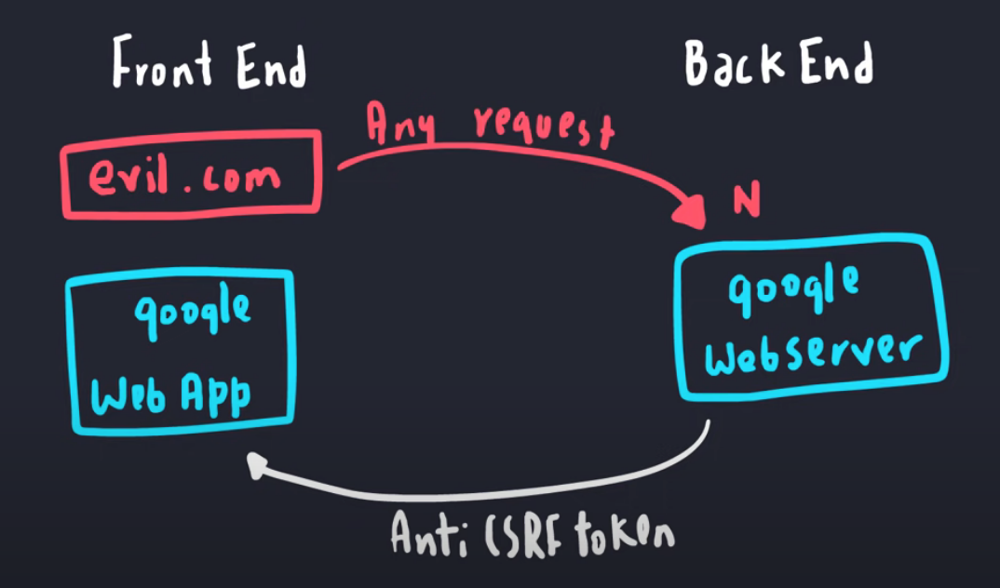

**SECURITY PREVENTION**

- ***_CSRF_***: cross site request forgery, happen at client side.	- **Attack vector**: Attacker send the same payload to server (with cookie, cookie is automatically send along request) and without any checking mechanism, server execute that request.
	- **Prevention**: use randomize id when user send request, server checking that id first (randomize id is not automatically send as cookie).
	- **Note**: not confuse with same-origin-policy in browser, browser have same-origin-policy that request with same port, domain and schema can send request but response is not display.

- ***_Data integrity_***
- ***_Data masking_***
- ***_SQL Injection_***
- ***_Update regularly_***

**SSO MECHANISM**

- SSO can be implement by:
  - Oauth
  - OpenID
  - SAML (old)

**OAUTH**

Request flow:

How access token is validate:
    - Perform standard JWT validation
    - Checking audience claims
    - Checking scope

Authorization code flow:
  -  Click login
  -  Client redirect to login page
  -  User consent
  -  Authorization Server return Authorization Code
  -  Client send:
     -  Auth Code
     -  Client ID
     -  Client secret to Authorization Server to get Access Token

PCKE enhancement:
    - Problems: some client app can not save Client Id, client secret so that PCKE provide a better way to handle it.
    - Request authorize and get access token will have code_challenge parametet into it.

Opaque Tokens:
    - Basically we want to hide data from JWT, it will require additional encrypt/decrypt

**COOKIES AND SECURITY**
- Ways to steal a cookies:
  - Packet sniffer
  - DB attack
  - XSS cross site scripting attack
  - Gains physical access

**HASHING, ENCODING, ENCRYPTION**
- Hash: SHA-256, Bcrypt, MD5
- Encoding: BASE64
- Encryption: RSA

**SALT, PEPPER**
- A salt is a unique, randomly generated string that is added to each password as part of the hashing process, next to each password

- Pepper is a randomly generated string that is added to password as part of the hashing process.
- Similar to Salt, but:
    - Pepper is not stored in database. (env variable, secure centralized store)    
    - Pepper is shared between all passwords rather than being unique like a salt.

**WHAT HAPPEN WHEN YOU TYPE URL**

https://github.com/alex/what-happens-when

**TLS STEPS**
- Client hello
- Server hello, send server certificate, cipher spec
- Client verify domain name, CA, expire date
- Session key
- 