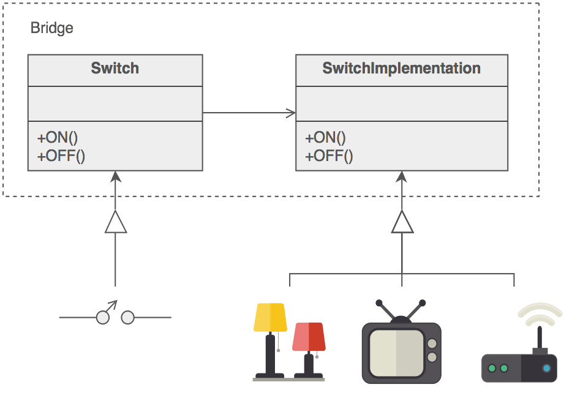
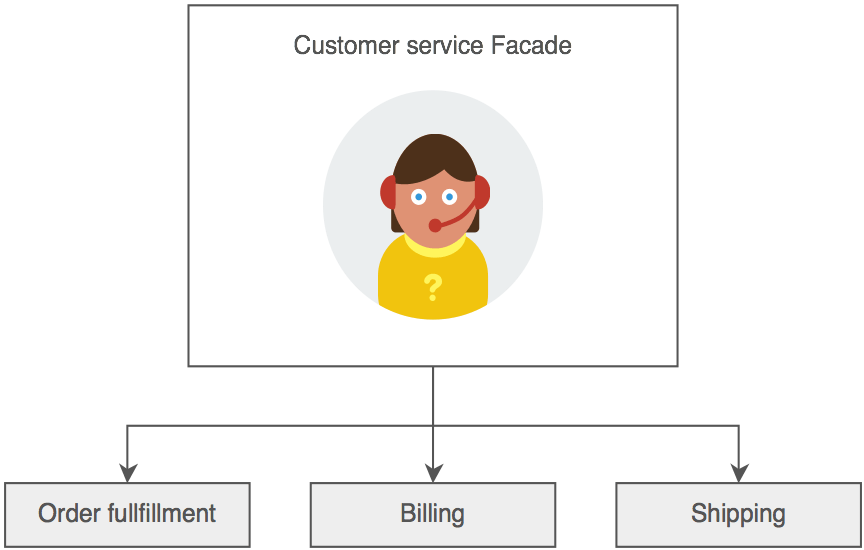
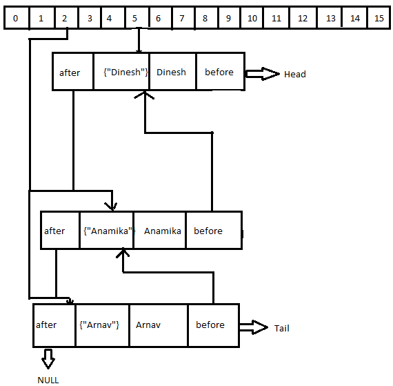

# Software Pattern

**ARCHITECT_PATTERN**

- Client server
- Layer pattern:
    - UI
    - Service
    - DAO
- Broker pattern
- Pipeline pattern
- Event Bus pattern
- Peer to peer: gossip protocols

**CODE_PATTERN**

- Creation pattern:
    - Builder
    - Factory
    - Singleton
    - Prototype
- Strutural pattern:
    - Proxy: use in spring
    - Adapter
    - Facade
- Behaviour pattern:
    - Observer
    - Strategy
    - Chain of resposibility

- Singleton best practice:
	- Lazy initialization of Singleton

```java
public class LazyInitializedSingleton {

    private static LazyInitializedSingleton instance;

    private LazyInitializedSingleton(){}

    public static LazyInitializedSingleton getInstance() {
        if (instance == null) {
            instance = new LazyInitializedSingleton();
        }
        return instance;
    }
}
```
	
- In order to execute Singleton thread safe, we use synchronize to block static method in class, only ensure one thread can access code block at the time.

```java
public class ThreadSafeSingleton {

    private static ThreadSafeSingleton instance;

    private ThreadSafeSingleton(){}

    public static synchronized ThreadSafeSingleton getInstance() {
        if (instance == null) {
            instance = new ThreadSafeSingleton();
        }
        return instance;
    }
}

// Double check singleton list
public class DclSingleton {
    private static volatile DclSingleton instance;
    public static DclSingleton getInstance() {
        if (instance == null) {
            synchronized (DclSingleton .class) {
                if (instance == null) {
                    instance = new DclSingleton();
                }
            }
        }
        return instance;
    }

    // private constructor and other methods...
}

```

**WHAT IS GC, HOW GC WORK INTERNALLY?**

- Garbage collection (GC) is a memory recovery feature built into programming languages such as C# and Java. A GC-enabled programming language includes one or more garbage collectors (GC engines) that automatically free up memory space that has been allocated to objects no longer needed by the program. 

- GC collect object that no longer have any reference to it.


**EXPLAIN AND IMPLEMENT FACTORY DESIGN PATTERN**


```java
public class Rectangle implements Shape {

   @Override
   public void draw() {
      System.out.println("Inside Rectangle::draw() method.");
   }
}

public class Square implements Shape {

   @Override
   public void draw() {
      System.out.println("Inside Square::draw() method.");
   }
}


public class Circle implements Shape {

   @Override
   public void draw() {
      System.out.println("Inside Circle::draw() method.");
   }
}

public class ShapeFactory {
	
   //use getShape method to get object of type shape 
   public Shape getShape(String shapeType){
      if(shapeType == null){
         return null;
      }		
      if(shapeType.equalsIgnoreCase("CIRCLE")){
         return new Circle();
         
      } else if(shapeType.equalsIgnoreCase("RECTANGLE")){
         return new Rectangle();
         
      } else if(shapeType.equalsIgnoreCase("SQUARE")){
         return new Square();
      }
      
      return null;
   }
}

```

**EXPLAIN AND IMPLEMENT SINGLETON DESIGN PATTERN**

```java
public class ThreadSafeSingleton {

    private static ThreadSafeSingleton instance;

    private ThreadSafeSingleton(){}

    public static synchronized ThreadSafeSingleton getInstance() {
        if (instance == null) {
            instance = new ThreadSafeSingleton();
        }
        return instance;
    }

}
```

**DB**

- How many time of index ?
    - Bit map index: use for low cardinality
    - B-tree index: use for normal value index
- Connection pool best practice:
    - Connection pool is a scared resources that need to use optimizely
- How to optimize SQL query ?
    - Adding index
    - Cache small-table full-table scans
    - Choosing index type
    - Adding hints
    - Divide index query into sub-query, oracle have the global temporary table (GTT) for sub-query.
    - Replace NOT IN with outer join
    - Avoid the use of NOT IN or HAVING
    
- Schema design ?
    - Star design vs snowflake design

**CASSANDRA**

- Cassandra is a column-wide, distributed database system, data is put on different machine, so that there will be not a single point of failure.
- Architect and replication factor:
    - Cassandra are divided into node, where each node communicate with each other via gossip protocols.
    - Entity in cassandra: node < data center < cluster
    - Commit log in cassandra is stored for DR
    - SStable and Memtable: every write is writen into memTable, when memTable reach certain threshold, data is flushed to an SSTable disk file.
- Replication strategy:
    - Replication factor: number of copy put in different node. One Replication factor means that there is only a single copy of data while three replication factor means that there are three copies of the data on three different nodes.
    - There are two strategy: simple and topology, simple strategy suitable for cassandra in one data center.
- Write operation:
    - Coordinatoor send write operation to cluster, depend on consistency level that determines how many nodes will respond back with the success acknowledgment.
    - Process of write:
        - Coordinatoor send write request to nodes
        - Node write data to mem-table and commit log
        - Mem-table is full, data is flushed to the SSTable data file.
- Read Operation:
    - There are three type of request:
        - Direct request
        - Digest request
        - Repair request
    - The coordinator sends direct request to one of the replicas. After that, the coordinator sends the digest request to the number of replicas specified by the consistency level and checks whether the returned data is an updated data.

- Cassandra entity:
    - Keyspace: is similar to database in RDBMS.

- What is the use of Cassandra and why to use Cassandra?
    - For bigdata, distributed data system with no singple point of failure
    - Optimize for write heavy application
    - Flexible schema design

- Cassandra data model:
    - Cluster
    - Keyspace
    - Column 

- Component in cassandra:
    - Node < Data center < Cluster
    - SS-table, Mem-table, commit log, bloom filter

- In each columne there are value, timestamps and columne name.

- When to use Cassandra:
    - Large data set.
    - Availability.
    - Data change constantly
    - Eventual consistency

- Cassandra data model:
    - Cluster:
        - Keyspace (like schema): 
            - Table:
                - Row 1: Primary key | Column 1 - Value 1 | Column 2 - Value 2
                - Row 2: Primary key | Column 1 - Value 1 

- When not to use cassandra:
    - Cassandra have no:
        - Join operator
        - Complex query
        - Foreign keys

```
insert into employee (emp_id,emp_name,emp_age) values(20,'john',35);
Select * from employee;
Select * from employee where emp_id=20 ;
Select * from employee where emp_name='john' ; // Only primary key or secondary index can be query
```

- Primary key in Cassandra compose of:
    - Partition key: determine which node to put data inside
    - Clustering key: sort data inside a node, we can have multiple clustering key

- If query do not contain partition key, Cassandra have to query all node, which is very inefficient.
- When we want to query by other column than partition key, it need to use secondary index.
- Cassandra data type:
    - Numeric: int, smallint, bigint, ...
    - Textual: text
    - Collection: Set, List, Map
    - Other data type: blob, time, ...

- Architecture:
    - Replication: we have to tune strategy and factor.
        - For simple strategy: the next n (n is replica factor) node will be contain copy data.
        - For network topology strategy: we can define number of replicas at specific data center.

```
    create keyspace MY_KEYSPACE 
        with replication = {
                    'class': 'SimpleStrategy', 
                    'replication_factor': '1' 
                };
    create keyspace DC_KEYSPACE 
        with replication = {
                    'class': 'NetworkTopologyStrategy', 
                    'USA': '2',
                    'Asian': '3' 
                };

```


   - Write consistency: the number of replica that need to acknowledged before return success to client.
        - Level of consistency:
            - One
            - All
            - Quorum
            - Local quorum
    - Read consistency: the number of replica that need to read before return success to client.
        - Level of consistency:
            - One: only get data from the fastest node. But a daemon task will check data from other node if data is inconsitent it will send a repair request
            - All
            - Quorum: send request to n number of quorum and checking for hash of data.
            - Local quorum
    - Gossip protocols
    - Write steps:
        - Write to commit log
        - Write to MemTable
        - When MemTable full, data to flush to SS Table (immutable file)
    - Read step:
        - Read the row cache
        - Read the key cache for data file location
        - Bloom filter checking
        - Read the partion key file index for data file location
    - Compaction:
        - Keep data with the lastest timestamps.
        - Data with mark as tombstone will be deleted out from compaction.
        - Old SS tables will be deleted.

**REPLICATION AND PARTITIONING**

- Partitioning is the process of spliting data into smaller unit.
- Partitioning advantages:
    - Better perfomance
    - Better scale
- Depend on dimension we could partition data horizontally or vertically.

- Replication:
    - Replication is the process of creating multiple copies of the same data and storing them into multiple machines. Each one of these copies is typically called a replica.
- Challenges:
    - Replication: in-consistency, there are two strategy of replication:
        - Primary - back up
        - Consensus

**CONCURRENCY**

- The synchronized keyword in Java ensures:
    - That only a single thread can execute a block of code at the same time
- Volatile: If a variable is declared with the volatile keyword then it is guaranteed that any thread that reads the field will see the most recently written value
- Java memory model:
    - Atomic variable
- What are different states in lifecycle of Thread?
    - When we create a Thread in java program,nw its state is New. Then we start the thread that change its state to Runnable. Thread Scheduler is responsible to allocate CPU to threads in Runnable thread pool and change their state to Running. Other Thread states are Waiting, Blocked and Dead. 
- What is ThreadLocal?
    The TheadLocal construct allows us to store data that will be accessible only by a specific thread.

- The probelms with concurrency:
    - Safety hazard: race condition
    - Liveness hazard: deadlock, livelock, starvation
    - Performance hazard: from synchronized and Context switching
- A thread-safe class is a class that run correctly event when multiple threadd access to it.
- How to achieve thread-safe:
    - Write stateless class, class that have no state.
    - Atomicity instance variable
    - Locking:
        - When we need locking multiple variable, using multiple atomic will not work. Because they are independent to each other
        - Locking is safe for concurrency but it decrease the performance greatly.
        - For better handling of locking, we can synchronize only a small part of code that require locking.
- Volatile variable: a read of a volatile variable always returns the most recent write by any thread. 
- Thread confinement: thread-safe can be achieve by thread confinement, for example, swing only allow event dispatcher push action to modified data.
- Thread Local: A more formal means of maintaining thread confinement is ThreadLocal, which allows you to associate a per-thread value with a value-holding object.
- Immutability: 
    - Immutable objects are always thread-safe.

- Latch vs Lock: lock is transactional scope, latch is operator scope.


**DESIGN SYSTEM**

- Exam service:
    - Load configuration in mem
    - Rate limiter
    - Circuit breaker
    - Locking distributed

- Face-id Service:
    - Elastic search
    - Redis
    - Grpc
    
- Accumulation:
    - From raw SQL to load balancing
- Portal:
    - Spring security


**WEB SOCKET**

**WebSocket**: WebSocket is bidirectional, a full-duplex protocol that is used in the same scenario of client-server communication, unlike HTTP it starts from ws:// or wss://. It is a stateful protocol. 


```java
public class ServerWebSocketHandler extends TextWebSocketHandler implements SubProtocolCapable {

    private static final Logger logger = LoggerFactory.getLogger(ServerWebSocketHandler.class);

    private final Set<WebSocketSession> sessions = new CopyOnWriteArraySet<>();

    @Override
    public void afterConnectionEstablished(WebSocketSession session) 
    	throws Exception {
        logger.info("Server connection opened");
        sessions.add(session);

        TextMessage message = new TextMessage("one-time message from server");
        logger.info("Server sends: {}", message);
        session.sendMessage(message);
    }

    @Override
    public void afterConnectionClosed(WebSocketSession session, 
    							CloseStatus status) {
        logger.info("Server connection closed: {}", status);
        sessions.remove(session);
    }

    @Scheduled(fixedRate = 10000)
    void sendPeriodicMessages() throws IOException {
        for (WebSocketSession session : sessions) {
            if (session.isOpen()) {
                String broadcast = "server periodic message " + LocalTime.now();
                logger.info("Server sends: {}", broadcast);
                session.sendMessage(new TextMessage(broadcast));
            }
        }
    }

    @Override
    public void handleTextMessage(WebSocketSession session, 
    							TextMessage message) throws Exception {
        String request = message.getPayload();
        logger.info("Server received: {}", request);

        String response = String.format("response from server to '%s'", 
        HtmlUtils.htmlEscape(request));
        logger.info("Server sends: {}", response);
        session.sendMessage(new TextMessage(response));
    }

    @Override
    public void handleTransportError(WebSocketSession session, 
    	Throwable exception) {
        logger.info("Server transport error: {}", exception.getMessage());
    }

    @Override
    public List<String> getSubProtocols() {
        return Collections.singletonList("subprotocol.demo.websocket");
    }
}

```


**TUNNING THE THREAD POOL**
- Formula:

```
Number of threads = Number of Available Cores 
						* Target CPU utilization 
						* (1 + Wait time / Service time)
```

**Step of tunning thread pools:**

- 1. Start at a maximum thread pool size of X.
- 2. Observe the system running with X concurrent threads and gather diagnostics such as throughput, response times, processor usage, monitor contention, and any other relevant resource usage.
- 3. If one of the resources exceeds (or is significantly below) a comfortable utilization level (for example, average CPU more than 90% utilized, or it is only 5%), then perform a binary search on X.

**DESIGN PATTERN RULE OF THUMBS**

- Structural design patterns:

	- **Adapter** map from old to new behaviour
	- **Bridge** define common interface an provide multiple implementation
	- **Decorator** enhance new function for object
	- **Facade or Manager** give an simple API for client, for example Keras vs Tensorflow. 







- Creational design patterns:
	- Builder
	- Factory: depend on type to create object
	- Singleton

- Behaviour:
	- Chain
	- Template
	- Strategy
	- Command
	- Observer
	- State


**TRANSACTIONAL IN SPRING**

- What have been done under the hood ?


**INTERNAL STRUCTURE COLLECTION**

***1. _MAP_***

- **LinkedHashMap**
- LinkedHashMap preserve the order of insertion




- **TreeMap**:
- Tree map allow we get custom order

- Node of tree map


-  Tree map implement red-black tree:


- **ConcurrentHashMap**
- How concurrent hash map achieve high through put:
- ConcurrentHashMap divide into 32 segment, for each segment put will block only this segment.

```java
synchronized (seg) {
  // code to add

  int index = hash & table.length - 1; 
  // hash we have calculated for key and table is Entry[] table
  Entry first = table[index];
  for (Entry e = first; e != null; e = e.next) {
    if ((e.hash == hash) && (eq(key, e.key))) { 
    // if key already exist means updating the value
      Object oldValue = e.value;
      e.value = value;
      return oldValue;
    }
  }

  Entry newEntry = new Entry(hash, key, value, first); 
  // new entry, i.e. this key not exist in map
  table[index] = newEntry; 
  // Putting the Entry object at calculated Index 
}
```
- When removing we also lock the segment

```java
Object remove(Object key, Object value) {

  Segment seg = segments[(hash & 0x1F)]; //hash we have calculated for key

  synchronized (seg) {
    Entry[] tab = this.table; 
    //table is Entry[] table    
    int index = hash & tab.length - 1; 
    //calculating index with help of hash
    Entry first = tab[index]; //Getting the Entry Object

    Entry e = first;
    while(true) {
      if ((e.hash == hash) && (eq(key, e.key))) {
        break;
      }
      e = e.next;
    }
    Object oldValue = e.value;
    Entry head = e.next;
    for (Entry p = first; p != e; p = p.next) {
      head = new Entry(p.hash, p.key, p.value, head);
    }
    table[index] = head;
    seg.count -= 1;
  }
  return oldValue;
}

```

- **ConcurrentSkipListMap**
	- Using skiplist interanally so containKey take log(n)
	- Retains natural order sorting
	- Thread safe

- **EnumMap**:
	- Enum Map use enum as key


- **IdentityHashMap**:
	- Key of this map is compare by reference meaning that: keys k1 and k2 are considered equal if and only if (k1==k2). (In normal Map implementations (like HashMap) two keys k1 and k2 are considered equal if and only if (k1==null ? k2==null : k1.equals(k2)).)

	

***2. _LIST_***
	
- Note:
	- When transverse a list and adding new element to it will throw **ConcurrentModificationException**
	- To avoid this we can use **CopyOnWriteArrayList** but it very expensive

- **ArrayList**:
	- get, isEmpty is O(1) while add operation is amortized constant time is O(1)
	- when capacity * load factor >= size, array list is reindex

- **CopyOnWriteArrayList**:
	- A thread-safe variant of ArrayList in which all mutative operations (add, set, and so on) are implemented by making a fresh copy of the underlying array.
	- All read access is lock free, write operation is lock and create a new object of array.
	
	
- **LinkedList**:
	- get is O(n), insert, remove is O(1)
	- insert, remove by index is O(N)
	
	
***3. _DEQUEUE_***

- **ArrayDeque**:
	- Support get first get last, it is a stack and queue combine. 

- **LinkedBlockingDeque**:
	- Similar to ArrayDeque but with limit 	 


**DIFFERENCE BETWEEN STATEMENT VS PREPAREDSTATEMENT VS CALLABLESTATEMENT**

- 1) Statement  –  Used to execute normal SQL queries, usually used for DDL

```java
//Creating The Statement Object
  
Statement stmt = con.createStatement();
  
//Executing The Statement
  
stmt.executeUpdate("CREATE TABLE STUDENT(ID NUMBER NOT NULL, NAME VARCHAR)");

```

- 2) PreparedStatement  –  Used to execute dynamic or parameterized SQL queries. We can pass parameters to SQL query, because, **PreparedStatement** are precompiled and the query plan is created only once irrespective of how many times you are executing that query. **Prepared statements** are much faster when you have to run the same statement multiple times, with different data. Thats because SQL will validate the query only once, whereas if you just use a statement it will validate the query each time.

```java
//Creating PreparedStatement object 
  
PreparedStatement pstmt = con.prepareStatement
	("update STUDENT set NAME = ? where ID = ?");
  
//Setting values to place holders using setter methods of PreparedStatement object
  
pstmt.setString(1, "MyName");   
//Assigns "MyName" to first place holder
          
pstmt.setInt(2, 111);
//Assigns "111" to second place holder
 
//Executing PreparedStatement
 
pstmt.executeUpdate();
```


- 3) CallableStatement  –  Used to execute the stored procedures.


**DEEP LINK**

- Scheme of deep link:
  - geo
  - content
  - sms ... 
- Deep links have two kinds:
    - For web: web links: for android 12 >, web links default open in browser
    - For app: app links 

