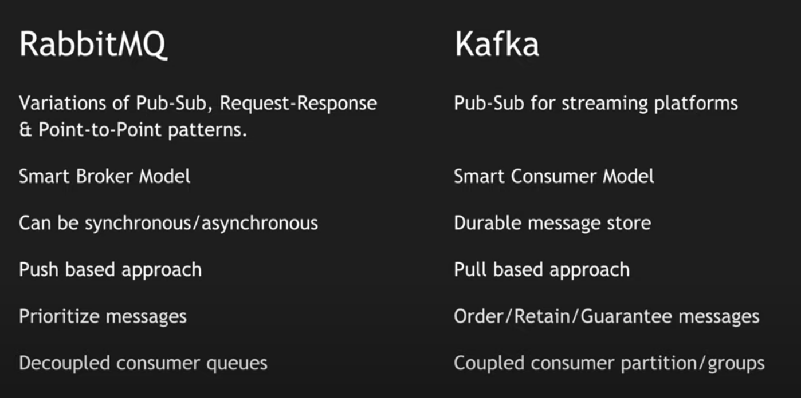
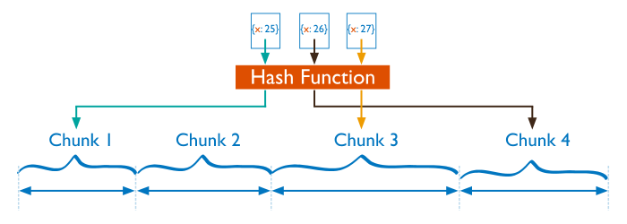
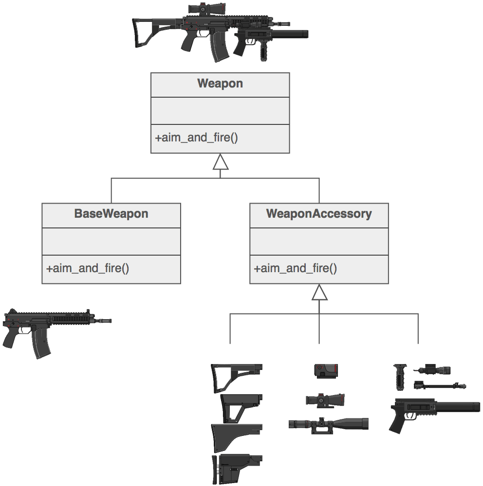
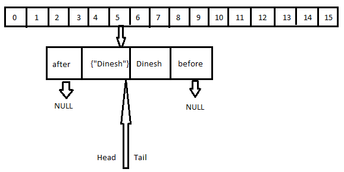
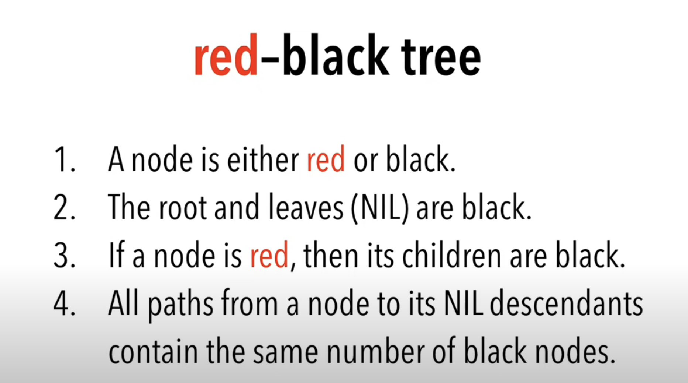
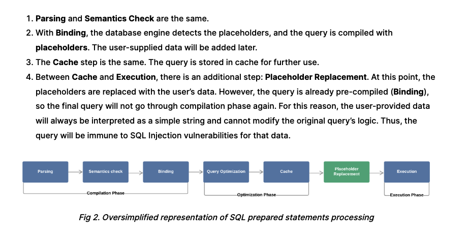

# Software Pattern

**ARCHITECT_PATTERN**

- Client server
- Layer pattern:
    - UI
    - Service
    - DAO
- Broker pattern
- Pipeline pattern
- Event Bus pattern
- Peer to peer: gossip protocols

**CODE_PATTERN**

- Creation pattern:
    - Builder
    - Factory
    - Singleton
    - Prototype
- Strutural pattern:
    - Proxy: use in spring
    - Adapter
    - Facade
- Behaviour pattern:
    - Observer
    - Strategy
    - Chain of resposibility

- Singleton best practice:
	- Lazy initialization of Singleton

```java
public class LazyInitializedSingleton {

    private static LazyInitializedSingleton instance;

    private LazyInitializedSingleton(){}

    public static LazyInitializedSingleton getInstance() {
        if (instance == null) {
            instance = new LazyInitializedSingleton();
        }
        return instance;
    }
}
```
	
- In order to execute Singleton thread safe, we use synchronize to block static method in class, only ensure one thread can access code block at the time.

```java
public class ThreadSafeSingleton {

    private static ThreadSafeSingleton instance;

    private ThreadSafeSingleton(){}

    public static synchronized ThreadSafeSingleton getInstance() {
        if (instance == null) {
            instance = new ThreadSafeSingleton();
        }
        return instance;
    }
}

// Double check singleton list
public class DclSingleton {
    private static volatile DclSingleton instance;
    public static DclSingleton getInstance() {
        if (instance == null) {
            synchronized (DclSingleton .class) {
                if (instance == null) {
                    instance = new DclSingleton();
                }
            }
        }
        return instance;
    }

    // private constructor and other methods...
}

```

**WHAT IS GC, HOW GC WORK INTERNALLY?**

- Garbage collection (GC) is a memory recovery feature built into programming languages such as C# and Java. A GC-enabled programming language includes one or more garbage collectors (GC engines) that automatically free up memory space that has been allocated to objects no longer needed by the program. 

- GC collect object that no longer have any reference to it.


**EXPLAIN AND IMPLEMENT FACTORY DESIGN PATTERN**


```java
public class Rectangle implements Shape {

   @Override
   public void draw() {
      System.out.println("Inside Rectangle::draw() method.");
   }
}

public class Square implements Shape {

   @Override
   public void draw() {
      System.out.println("Inside Square::draw() method.");
   }
}


public class Circle implements Shape {

   @Override
   public void draw() {
      System.out.println("Inside Circle::draw() method.");
   }
}

public class ShapeFactory {
	
   //use getShape method to get object of type shape 
   public Shape getShape(String shapeType){
      if(shapeType == null){
         return null;
      }		
      if(shapeType.equalsIgnoreCase("CIRCLE")){
         return new Circle();
         
      } else if(shapeType.equalsIgnoreCase("RECTANGLE")){
         return new Rectangle();
         
      } else if(shapeType.equalsIgnoreCase("SQUARE")){
         return new Square();
      }
      
      return null;
   }
}

```

**EXPLAIN AND IMPLEMENT SINGLETON DESIGN PATTERN**

```java
public class ThreadSafeSingleton {

    private static ThreadSafeSingleton instance;

    private ThreadSafeSingleton(){}

    public static synchronized ThreadSafeSingleton getInstance() {
        if (instance == null) {
            instance = new ThreadSafeSingleton();
        }
        return instance;
    }

}
```

**DB**

- How many time of index ?
    - Bit map index: use for low cardinality
    - B-tree index: use for normal value index
- Connection pool best practice:
    - Connection pool is a scared resources that need to use optimizely
- How to optimize SQL query ?
    - Adding index
    - Cache small-table full-table scans
    - Choosing index type
    - Adding hints
    - Divide index query into sub-query, oracle have the global temporary table (GTT) for sub-query.
    - Replace NOT IN with outer join
    - Avoid the use of NOT IN or HAVING
    
- Schema design ?
    - Star design vs snowflake design

**CASSANDRA**

- Cassandra is a column-wide, distributed database system, data is put on different machine, so that there will be not a single point of failure.
- Architect and replication factor:
    - Cassandra are divided into node, where each node communicate with each other via gossip protocols.
    - Entity in cassandra: node < data center < cluster
    - Commit log in cassandra is stored for DR
    - SStable and Memtable: every write is writen into memTable, when memTable reach certain threshold, data is flushed to an SSTable disk file.
- Replication strategy:
    - Replication factor: number of copy put in different node. One Replication factor means that there is only a single copy of data while three replication factor means that there are three copies of the data on three different nodes.
    - There are two strategy: simple and topology, simple strategy suitable for cassandra in one data center.
- Write operation:
    - Coordinatoor send write operation to cluster, depend on consistency level that determines how many nodes will respond back with the success acknowledgment.
    - Process of write:
        - Coordinatoor send write request to nodes
        - Node write data to mem-table and commit log
        - Mem-table is full, data is flushed to the SSTable data file.
- Read Operation:
    - There are three type of request:
        - Direct request
        - Digest request
        - Repair request
    - The coordinator sends direct request to one of the replicas. After that, the coordinator sends the digest request to the number of replicas specified by the consistency level and checks whether the returned data is an updated data.

- Cassandra entity:
    - Keyspace: is similar to database in RDBMS.

- What is the use of Cassandra and why to use Cassandra?
    - For bigdata, distributed data system with no singple point of failure
    - Optimize for write heavy application
    - Flexible schema design

- Cassandra data model:
    - Cluster
    - Keyspace
    - Column 

- Component in cassandra:
    - Node < Data center < Cluster
    - SS-table, Mem-table, commit log, bloom filter

- In each columne there are value, timestamps and columne name.

- When to use Cassandra:
    - Large data set.
    - Availability.
    - Data change constantly
    - Eventual consistency

- Cassandra data model:
    - Cluster:
        - Keyspace (like schema): 
            - Table:
                - Row 1: Primary key | Column 1 - Value 1 | Column 2 - Value 2
                - Row 2: Primary key | Column 1 - Value 1 

- When not to use cassandra:
    - Cassandra have no:
        - Join operator
        - Complex query
        - Foreign keys

```
insert into employee (emp_id,emp_name,emp_age) values(20,'john',35);
Select * from employee;
Select * from employee where emp_id=20 ;
Select * from employee where emp_name='john' ; // Only primary key or secondary index can be query
```

- Primary key in Cassandra compose of:
    - Partition key: determine which node to put data inside
    - Clustering key: sort data inside a node, we can have multiple clustering key

- If query do not contain partition key, Cassandra have to query all node, which is very inefficient.
- When we want to query by other column than partition key, it need to use secondary index.
- Cassandra data type:
    - Numeric: int, smallint, bigint, ...
    - Textual: text
    - Collection: Set, List, Map
    - Other data type: blob, time, ...

- Architecture:
    - Replication: we have to tune strategy and factor.
        - For simple strategy: the next n (n is replica factor) node will be contain copy data.
        - For network topology strategy: we can define number of replicas at specific data center.

```
    create keyspace MY_KEYSPACE 
        with replication = {
                    'class': 'SimpleStrategy', 
                    'replication_factor': '1' 
                };
    create keyspace DC_KEYSPACE 
        with replication = {
                    'class': 'NetworkTopologyStrategy', 
                    'USA': '2',
                    'Asian': '3' 
                };

```


   - Write consistency: the number of replica that need to acknowledged before return success to client.
        - Level of consistency:
            - One
            - All
            - Quorum
            - Local quorum
    - Read consistency: the number of replica that need to read before return success to client.
        - Level of consistency:
            - One: only get data from the fastest node. But a daemon task will check data from other node if data is inconsitent it will send a repair request
            - All
            - Quorum: send request to n number of quorum and checking for hash of data.
            - Local quorum
    - Gossip protocols
    - Write steps:
        - Write to commit log
        - Write to MemTable
        - When MemTable full, data to flush to SS Table (immutable file)
    - Read step:
        - Read the row cache
        - Read the key cache for data file location
        - Bloom filter checking
        - Read the partion key file index for data file location
    - Compaction:
        - Keep data with the lastest timestamps.
        - Data with mark as tombstone will be deleted out from compaction.
        - Old SS tables will be deleted.

**KAFKA**

- Kafka message format:
    - Arvo
    - JSON
    - Protobuf
- Kafka entities:
    - Topic
    - Partitioning: Kafka split message into multiple partition place on different nodes, provide kafka with scaling capacity.
    - Kafka hash message to decide which partition it send into.
    - Producer
    - Consumer
    - Schema Registry: 
        - A side server to validate schema of producer
    - Kafka stream: is a Java API that gives you easy access to all of the computational primitives of stream processing: filtering, grouping, aggregating, joining, and more, keeping you from having to write framework code on top of the consumer API to do all those things.
- Zookeeper in Kafka:
    - Zookeeper is basically used to communicate between different nodes in a cluster
    - Maintain offsets
    - Checking node status, leader election, ...
- Avoid duplication in kafka
    - On consumer side: adding UUID in message, consumer can checking uuid
    - Allow single producer per partition
- Kafka topic replication:
    - Control by replication factor, the replication factor value should be greater than 1 always (between 2 or 3). This helps to store a replica of the data in another broker from where the user can access it.
    - Multiple replicas will create confuse for client which does not know specific replicas to write into. For this reason, one replica will be choosen as leader
    , in the presence of leader, only leader can serve request. All follower, these replicas are known as ISR(in-sync-replica) can only perform sync data. The leader handle all read and write request.
- Producer write strategy:
    - Message Key: kafka using message key to hash the message and send it to specific partition. If message key dont specify, round robin will use as mean distributed across partition. 
    - Acknowledgment: 
        - Case 0: producer do not require ack
        - Case 1: producer require broker ack
        - Case all: producer require all follower

- Consumer and consumer group:
    - Parition will be distributed equally among consumer group:
        - Example 1: 3 parition, 1 consumer group with 3 consumer then each one consumer 1 parition
        - Example 2: 2 parition, 1 consumer group with 1 consumer then that one consumer consume from both 2 partitions
        - Example 3: 1 parition, 1 consumer groupe with 2 consumer then one of them will never have new data
    - Consumer offsets: 
        - Kafka store offset of each consumer group at each partition, so when it died, it will continue in current offset after backup.

- **Disadvantage of kafka**:
    - Lack of some message paradigms, certain message paradigms such as point-to-point queues, request/reply, etc. are missing in Kafka for some use cases.

- **Schema Registry**: 
    - Additional server use for contain schema ID and schema definition, when producer send message to consumer it validate the schema first before send it to consumer.

- **Kafke partition replication**
	- Each partition is assigned to be leader, if the leader fail, other will be assigned to be leader. At any given time there is one leader, other replicas is call in-sync replicas.

- **Kafka producer**:
	- Kafka producer have a routing layer, when there is error when write, retry mechanism is used.
	- How producer know message is sent successfully, it used ack-mechanism:
		- ack=0: fire and forget
		- ack=1: fire and wait for replica leader response, however error when broker write to disk is not preventable
		- acks=all: fire and wait for all replicas sync, and broker write to disk.
	- How to round to exact partition:
		- Sending with the same message key
		- Implement partitioner interface
	- Producer can use buffer memory to send multiple message at once.

```java
props.setProperty(
	ProducerConfig.BUFFER_MEMORY_CONFIG, 
	String.valueOf(64 * 1024 * 1024L)
);
```

- **Kafa consumer**:
	- Message ordering is ensure in each partition.
	- Consumer tracking current message using consumer offset.
	- Consumer offset sematic:
		- **At most once**: for unimportant message, consumer offset right after message come.
		- **At least once**: for important message, consumer offset after handle message, when consumer crash while process message, it wake up and rehandle message again.
		- **Exactly once**: using kafka api transaction.


- **Optimal Kafka partion**:
	- Num of partion = throughput/speed, speed = fix 10Mb/s.


**RABBITMQ**

- RabbitMQ message flow:
    - Publisher send message exchange
    - Exchange route to queue base on exchange type:
        - Direct, topic, fanout, ...

- RABBIT MQ vs Kafka:
    - Similar: they all using async messaging pattern.
    - Difference:
        - RabbitMQ:
            - Architect: producers, exchanges, queues, and consumers. 
            - Routing can very flexible: fanout, direct, header, topic.
            - Message is not default persitence, it need a durable flag
            - Consumer error and re-consume message:
                - Using dead letter exchanges, when message reject by consumer or ttl expire or queue is full. Special consumer will deal with Dead letter exchanges.
            - HA and DR:
                - Rabbit support HA by replica of queue.
            - Consumer receive message that being pushed by broker.
        - Kafka:
            - Architect:  producers, brokers, and consumers. 
            - Message put to topic.
            - Message is default save in broker for specific retentiion days
            - Reliability:
                - Message order
                - Message are commited when it is written into leader and num of replica depend of 'replica factor'
                - Message will not be lost as long as one replica still keep the message
            - Consumer pull message from broker and, consumer group id keep the offset number of consumer on each topic.
            - Easily replay message

**REPLICATION AND PARTITIONING**

- Partitioning is the process of spliting data into smaller unit.
- Partitioning advantages:
    - Better perfomance
    - Better scale
- Depend on dimension we could partition data horizontally or vertically.

- Replication:
    - Replication is the process of creating multiple copies of the same data and storing them into multiple machines. Each one of these copies is typically called a replica.
- Challenges:
    - Replication: in-consistency, there are two strategy of replication:
        - Primary - back up
        - Consensus

**CONCURRENCY**

- The synchronized keyword in Java ensures:
    - That only a single thread can execute a block of code at the same time
- Volatile: If a variable is declared with the volatile keyword then it is guaranteed that any thread that reads the field will see the most recently written value
- Java memory model:
    - Atomic variable
- What are different states in lifecycle of Thread?
    - When we create a Thread in java program,nw its state is New. Then we start the thread that change its state to Runnable. Thread Scheduler is responsible to allocate CPU to threads in Runnable thread pool and change their state to Running. Other Thread states are Waiting, Blocked and Dead. 
- What is ThreadLocal?
    The TheadLocal construct allows us to store data that will be accessible only by a specific thread.

- The probelms with concurrency:
    - Safety hazard: race condition
    - Liveness hazard: deadlock, livelock, starvation
    - Performance hazard: from synchronized and Context switching
- A thread-safe class is a class that run correctly event when multiple threadd access to it.
- How to achieve thread-safe:
    - Write stateless class, class that have no state.
    - Atomicity instance variable
    - Locking:
        - When we need locking multiple variable, using multiple atomic will not work. Because they are independent to each other
        - Locking is safe for concurrency but it decrease the performance greatly.
        - For better handling of locking, we can synchronize only a small part of code that require locking.
- Volatile variable: a read of a volatile variable always returns the most recent write by any thread. 
- Thread confinement: thread-safe can be achieve by thread confinement, for example, swing only allow event dispatcher push action to modified data.
- Thread Local: A more formal means of maintaining thread confinement is ThreadLocal, which allows you to associate a per-thread value with a value-holding object.
- Immutability: 
    - Immutable objects are always thread-safe.

- Latch vs Lock: lock is transactional scope, latch is operator scope.


**DESIGN SYSTEM**

- Exam service:
    - Load configuration in mem
    - Rate limiter
    - Circuit breaker
    - Locking distributed

- Face-id Service:
    - Elastic search
    - Redis
    - Grpc
    
- Accumulation:
    - From raw SQL to load balancing
- Portal:
    - Spring security

**POSTGRE**

- Objects of POSTGRE:
    - Database
    - Schema
    - Table
    - Views: data in views is not updatable, if view is retrieve from one table, it can be update, if view is aggregated from multiple table, it need a trigger to update views. Materialized view cache the underlying data.
    - Extension: equivalent of package in Oracle.
    - Function
    - Foreign table, PostGre create virtual table for data outside source such as CSV, noSQL database, ...
    - Trigger
    - Type
    - Full text search
    - Sequence
- Manage disk storage with tablespaces:
    - Tablespace: is a storage location where the actual data underlying database objects can be kept.
- Using explain icon for anaysis result:
    - Checking: cost, parallel aware.
- PostgreSQL:
    - Views:
        - From 9.3, when view draws from one DB than it can be updated directly.
        - From 9.3, materialized view only update value when you issue REFRESH command.
        - Use trigger to update views
        - Materialized view cache the underlying data.
    - ILIKE for case sensitive
    - UPSERTs: INSERT on CONFLICT UPDATE
- Performance tunning:
    - Using EXPLAIN (ANALYSE, VERBOSE, BUFFER) cache the analysis.
        '''
        EXPLAIN (ANALYZE)
        SELECT tract_id, hispanic_or_latino
        FROM census.hisp_pop
        WHERE tract_id = 25025010103;
        '''
    - PostgreSQL caches plans and data after each execution.
    - Writing better queries:
        1. Avoid writing subqueries in SELECT, rewriting using join
        2. Avoid SELECT *, because some PostgreSQL stores large blob and text objects using TOAST (The Oversized-Attribute Storage Technique) aggregate them took a lot of time.
        3. Use CASE for sub-queries.
    - Parallelize query: Parallel query is enabled by default in PostgreSQL 10 and is controlled through the configuration value for max_parallel_workers_per_gather. Run EXPLAIN will show Gather keyword.

- Replication and External Data:
    - In PostGrel there are several way to sharing data to other external source:
        - Built-in replication
        - Third party tool
        - Foreign data wrapper (FWD) for sending to multiple source
    - Replication can help to achieve availability and scalability:
        - Availability: when server when down, replica can back up immediately
        - Scalability: Read replica can handle read request, write replica can handle write repuest.
    - Components for replication:
        - Master
        - Slave
        - WAL
        - Sync replication
        - Async replication
        - Streaming replication
        - Cascading replication
    - There are two way for replication:
        - Streaming and File-based replication

**SPARK**

- Spark is depend on hadoop for own cluster management. Hadoop is one way to implement Spark.
- Spark use Hadoop for Storage and Processing.
- The main feature of Spark is its in-memory cluster computing that increases the processing speed of an application.
- HDFS is a distributed file system that handles large data sets running on commodity hardware. 
- Component of Spark:
    - Core
    - ML
    - Grapl
    - Streaming
    - SQL
- Spark 3:
    - Faster 
    - Deprecate python 2
    - GPU support
    - Support k8s scaling
- Spark overview:
    - Fast and general engine for fast data processing.
    - Spark use DAG directed acyclic graph for speed
    - Built around RDD (resilience distributed dataset)
- RDD: abstraction of a datasets.
    - Create and manage by SparkContext
    - Example: sc.textFile("data/ml-100k/u.data")
    - Other datasource such as: cassandra, mysql, s3 can also be used.

**DATA_INTENSIVE**

- SStable:
    - SS table divided into fix number of segment, in each segment data is sorted.
    - SS Table utitlize sorted characteristic to find index: for an example: say you are looking for the key handiwork, but you dont know the exact offset of that key in the segment file. However, you do know the offsets for the keys handbag and handsome, and because of the sorting you know that handiwork must appear between those two. This means you can jump to the offset for handbag and scan from there until you find handiwork.
    - SS table use AVL or red black tree to keep the index sorted.
    - SS table use mem table for initial write and when it full flush it to the SS table.
    - SS table have one weakness of lost data in mem table when server crash, this can be fixed by using WAL.
    - SS table index is manage by a LSM-tree which is a spare index.

- B-Tree:
    - B-tree structure divide data into blocks, typically 4kb. Each block hold a reference to other block.
    - For example: We want to find index 120
        - 100 ref 200 ref 300 ref (100 < 300)
        - ref 130 ref 160 ref (130 < 160)
        - ref 120 
    - B-tree also use WAL for crash recovery.
    - Some B-tree use copy-on-write (versioning) to protect content of index.


**WEB SOCKET**

**WebSocket**: WebSocket is bidirectional, a full-duplex protocol that is used in the same scenario of client-server communication, unlike HTTP it starts from ws:// or wss://. It is a stateful protocol. 


```java
public class ServerWebSocketHandler extends TextWebSocketHandler implements SubProtocolCapable {

    private static final Logger logger = LoggerFactory.getLogger(ServerWebSocketHandler.class);

    private final Set<WebSocketSession> sessions = new CopyOnWriteArraySet<>();

    @Override
    public void afterConnectionEstablished(WebSocketSession session) 
    	throws Exception {
        logger.info("Server connection opened");
        sessions.add(session);

        TextMessage message = new TextMessage("one-time message from server");
        logger.info("Server sends: {}", message);
        session.sendMessage(message);
    }

    @Override
    public void afterConnectionClosed(WebSocketSession session, 
    							CloseStatus status) {
        logger.info("Server connection closed: {}", status);
        sessions.remove(session);
    }

    @Scheduled(fixedRate = 10000)
    void sendPeriodicMessages() throws IOException {
        for (WebSocketSession session : sessions) {
            if (session.isOpen()) {
                String broadcast = "server periodic message " + LocalTime.now();
                logger.info("Server sends: {}", broadcast);
                session.sendMessage(new TextMessage(broadcast));
            }
        }
    }

    @Override
    public void handleTextMessage(WebSocketSession session, 
    							TextMessage message) throws Exception {
        String request = message.getPayload();
        logger.info("Server received: {}", request);

        String response = String.format("response from server to '%s'", 
        HtmlUtils.htmlEscape(request));
        logger.info("Server sends: {}", response);
        session.sendMessage(new TextMessage(response));
    }

    @Override
    public void handleTransportError(WebSocketSession session, 
    	Throwable exception) {
        logger.info("Server transport error: {}", exception.getMessage());
    }

    @Override
    public List<String> getSubProtocols() {
        return Collections.singletonList("subprotocol.demo.websocket");
    }
}

```


**ELK STACK**

- LogStash configure log path and ES server:

```
input { file { path => "/var/log/apache/access.log" 
	start_position => "beginning" } } 

filter { grok { match => { "message" => "%{COMBINEDAPACHELOG}" } } 
	date { match => [ "timestamp" , "dd/MMM/yyyy:HH:mm:ss Z" ] } 
	geoip { source => "clientip" } } 

output { elasticsearch { hosts => ["localhost:9200"] } }

```

- Kibana configure

```

filebeat.prospectors: 
	- type: log enabled: true 
	- paths: - /var/log/puppetlabs/puppetserver/puppetserver.log.json - /var/log/puppetlabs/puppetserver/puppetserver-access.log.json json.keys_under_root: true output.elasticsearch: 
# Array of hosts to connect to. 
hosts: ["localhost:9200"]
```

**KAFKA VS RABBITMQ**




**CI/CD PIPELINE**

- **Continuous integration (CI)** aims to solve this problem, making agile development processes possible. Continuous integration means that every change developers make to their code is immediately integrated into the main branch of their software project. 

- **Continuous delivery (CD)** aims to solve these challenges with automation. In a CD approach, software is packaged and deployed to production as often as possible. A core principle of CD is that every change to the software can be deployed to production with no special effort. 


**TUNNING THE THREAD POOL**
- Formula:

```
Number of threads = Number of Available Cores 
						* Target CPU utilization 
						* (1 + Wait time / Service time)
```

**Step of tunning thread pools:**

- 1. Start at a maximum thread pool size of X.
- 2. Observe the system running with X concurrent threads and gather diagnostics such as throughput, response times, processor usage, monitor contention, and any other relevant resource usage.
- 3. If one of the resources exceeds (or is significantly below) a comfortable utilization level (for example, average CPU more than 90% utilized, or it is only 5%), then perform a binary search on X.


**JMETER TESTING**

- Performance test:
	- Load test: help you understand how a system behaves under an expected load.
	- Stress test: find the maximum load. 

- Step of load test:
	- Create thread group
	- Define path
	- Define parameter like ramp up, number of max user
	- Add a graph

- Assertion:
	- Response 
	- Duration


**GRPC**

gRPC is a high-performance, open-source framework for building distributed systems. Some of the key benefits of using gRPC include:

* Performance: gRPC uses Protocol Buffers, a compact binary format, as the data serialization format which leads to efficient and fast serialization and deserialization of data.

* Interoperability: gRPC can work across different programming languages and platforms, making it ideal for microservice-based architectures.

* Scalability: gRPC has built-in support for load balancing and server-side streaming, making it easier to build scalable systems.
 
* Bi-directional streaming: gRPC supports bi-directional streaming, enabling real-time communication between the client and server.
 
* Strong typing: gRPC uses Protocol Buffers to define the structure of the data being sent, which leads to stronger typing and reduced likelihood of errors.
 
* Improved developer experience: gRPC provides a simpler and more efficient way of defining and consuming APIs, reducing the time and effort required to create and maintain them.
 
* Security: gRPC supports SSL/TLS encryption to secure communication between the client and server, and also supports authentication using OAuth2.
  


**ISTIO**

- Traffic management:
	- Circuit breaker
	- Timeout
	- Canary rollouts 
	- Percentage-based traffic split

- Isito create its own service registry and detect all service in k8s cluster
	- Using this service registry, the Envoy proxies can then direct traffic to the relevant services. 

- Ingress vs Istio gateway

```yaml

apiVersion: networking.k8s.io/v1
kind: Ingress
metadata:
  name: minimal-ingress
  annotations:
    nginx.ingress.kubernetes.io/rewrite-target: /
spec:
  ingressClassName: nginx-example
  rules:
  - http:
      paths:
      - path: /testpath
        pathType: Prefix
        backend:
          service:
            name: test
            port:
              number: 80


apiVersion: gateway.networking.k8s.io/v1beta1
kind: Gateway
metadata:
  name: sample-gateway
  namespace: sample-ingress
spec:
  gatewayClassName: istio
  listeners:
  - name: http
    hostname: "*.sample.com"
    port: 80
    protocol: HTTP
    allowedRoutes:
      namespaces:
        from: All

apiVersion: gateway.networking.k8s.io/v1beta1
kind: HTTPRoute
metadata:
  name: helloworld
spec:
  parentRefs:
  - name: sample-gateway
    namespace: sample-ingress
  hostnames: ["helloworld.sample.com"]
  rules:
  - matches:
    - path:
        type: Exact
        value: /hello
    backendRefs:
    - name: helloworld
      port: 5000

apiVersion: gateway.networking.k8s.io/v1beta1
kind: HTTPRoute
metadata:
  name: helloworld
spec:
  parentRefs:
  - name: sample-gateway
    namespace: sample-ingress
  hostnames: ["helloworld.sample.com"]
  rules:
  - matches:
    - path:
        type: Exact
        value: /hello
    backendRefs:
    - name: helloworld-v1
      port: 5000
      weight: 90
    - name: helloworld-v2
      port: 5000
      weight: 10

``` 


**MONGODB VS CASSANDRA**

- Mongo DB:
	- Schemaless
	- Do not support complex query but can use look up
	- Support data sharding and replicas
	- Support ACID
	- Sharding strategy:
		- Hash chunk: data is divided into chunks with responding hash range, suitable for shard key that change monotically.
		- Range shard





**DESIGN PATTERN RULE OF THUMBS**

- Structural design patterns:

	- **Adapter** map from old to new behaviour
	- **Bridge** define common interface an provide multiple implementation
	- **Decorator** enhance new function for object
	- **Facade or Manager** give an simple API for client, for example Keras vs Tensorflow. 





- Creational design patterns:
	- Builder
	- Factory: depend on type to create object
	- Singleton

- Behaviour:
	- Chain
	- Template
	- Strategy
	- Command
	- Observer
	- State


**TRANSACTIONAL IN SPRING**

- What have been done under the hood ?


**INTERNAL STRUCTURE COLLECTION**

***1. _MAP_***

- **LinkedHashMap**
- LinkedHashMap preserve the order of insertion




- **TreeMap**:
- Tree map allow we get custom order

- Node of tree map


-  Tree map implement red-black tree:




- **ConcurrentHashMap**
- How concurrent hash map achieve high through put:
- ConcurrentHashMap divide into 32 segment, for each segment put will block only this segment.

```java
synchronized (seg) {
  // code to add

  int index = hash & table.length - 1; 
  // hash we have calculated for key and table is Entry[] table
  Entry first = table[index];
  for (Entry e = first; e != null; e = e.next) {
    if ((e.hash == hash) && (eq(key, e.key))) { 
    // if key already exist means updating the value
      Object oldValue = e.value;
      e.value = value;
      return oldValue;
    }
  }

  Entry newEntry = new Entry(hash, key, value, first); 
  // new entry, i.e. this key not exist in map
  table[index] = newEntry; 
  // Putting the Entry object at calculated Index 
}
```
- When removing we also lock the segment

```java
Object remove(Object key, Object value) {

  Segment seg = segments[(hash & 0x1F)]; //hash we have calculated for key

  synchronized (seg) {
    Entry[] tab = this.table; 
    //table is Entry[] table    
    int index = hash & tab.length - 1; 
    //calculating index with help of hash
    Entry first = tab[index]; //Getting the Entry Object

    Entry e = first;
    while(true) {
      if ((e.hash == hash) && (eq(key, e.key))) {
        break;
      }
      e = e.next;
    }
    Object oldValue = e.value;
    Entry head = e.next;
    for (Entry p = first; p != e; p = p.next) {
      head = new Entry(p.hash, p.key, p.value, head);
    }
    table[index] = head;
    seg.count -= 1;
  }
  return oldValue;
}

```

- **ConcurrentSkipListMap**
	- Using skiplist interanally so containKey take log(n)
	- Retains natural order sorting
	- Thread safe

- **EnumMap**:
	- Enum Map use enum as key 


- **IdentityHashMap**:
	- Key of this map is compare by reference meaning that: keys k1 and k2 are considered equal if and only if (k1==k2). (In normal Map implementations (like HashMap) two keys k1 and k2 are considered equal if and only if (k1==null ? k2==null : k1.equals(k2)).)

	

***2. _LIST_***
	
- Note:
	- When transverse a list and adding new element to it will throw **ConcurrentModificationException**
	- To avoid this we can use **CopyOnWriteArrayList** but it very expensive

- **ArrayList**:
	- get, isEmpty is O(1) while add operation is amortized constant time is O(1)
	- when capacity * load factor >= size, array list is reindex

- **CopyOnWriteArrayList**:
	- A thread-safe variant of ArrayList in which all mutative operations (add, set, and so on) are implemented by making a fresh copy of the underlying array.
	- All read access is lock free, write operation is lock and create a new object of array.
	
	
- **LinkedList**:
	- get is O(n), insert, remove is O(1)
	- insert, remove by index is O(N)
	
	
***3. _DEQUEUE_***

- **ArrayDeque**:
	- Support get first get last, it is a stack and queue combine. 

- **LinkedBlockingDeque**:
	- Similar to ArrayDeque but with limit 	 

	
	
	
	
	
**DIFFERENCE BETWEEN STATEMENT VS PREPAREDSTATEMENT VS CALLABLESTATEMENT**

- 1) Statement  –  Used to execute normal SQL queries, usually used for DDL

```java
//Creating The Statement Object
  
Statement stmt = con.createStatement();
  
//Executing The Statement
  
stmt.executeUpdate("CREATE TABLE STUDENT(ID NUMBER NOT NULL, NAME VARCHAR)");

```

- 2) PreparedStatement  –  Used to execute dynamic or parameterized SQL queries. We can pass parameters to SQL query, because, **PreparedStatement** are precompiled and the query plan is created only once irrespective of how many times you are executing that query. **Prepared statements** are much faster when you have to run the same statement multiple times, with different data. Thats because SQL will validate the query only once, whereas if you just use a statement it will validate the query each time.

```java
//Creating PreparedStatement object 
  
PreparedStatement pstmt = con.prepareStatement
	("update STUDENT set NAME = ? where ID = ?");
  
//Setting values to place holders using setter methods of PreparedStatement object
  
pstmt.setString(1, "MyName");   
//Assigns "MyName" to first place holder
          
pstmt.setInt(2, 111);
//Assigns "111" to second place holder
 
//Executing PreparedStatement
 
pstmt.executeUpdate();
```



- 3) CallableStatement  –  Used to execute the stored procedures.


**SECURITY PREVENTION**

- ***_CSRF_***: cross site request forgery, happen at client side.	- **Attack vector**: Attacker send the same payload to server (with cookie, cookie is automatically send along request) and without any checking mechanism, server execute that request.
	- **Prevention**: use randomize id when user send request, server checking that id first (randomize id is not automatically send as cookie).
	- **Note**: not confuse with same-origin-policy in browser, browser have same-origin-policy that request with same port, domain and schema can send request but response is not display.


- ***_Data integrity_***
- ***_Data masking_***
- ***_SQL Injection_***
- ***_Update regularly_***


**SSO MECHANISM**


- SSO can be implement by:
  - Oauth
  - OpenID
  - SAML (old)

**OAUTH**

Request flow:


How access token is validate:
    - Perform standard JWT validation
    - Checking audience claims
    - Checking scope

Authorization code flow:
  -  Click login
  -  Client redirect to login page
  -  User consent
  -  Authorization Server return Authorization Code
  -  Client send:
     -  Auth Code
     -  Client ID
     -  Client secret to Authorization Server to get Access Token

PCKE enhancement:
    - Problems: some client app can not save Client Id, client secret so that PCKE provide a better way to handle it.
    - Request authorize and get access token will have code_challenge parametet into it.

Opaque Tokens:
    - Basically we want to hide data from JWT, it will require additional encrypt/decrypt


**DEEP LINK**

- Scheme of deep link:
  - geo
  - content
  - sms ... 
- Deep links have two kinds:
    - For web: web links: for android 12 >, web links default open in browser
    - For app: app links 

**COOKIES AND SECURITY**
- Ways to steal a cookies:
  - Packet sniffer
  - DB attack
  - XSS cross site scripting attack
  - Gains physical access


**HOW Ksql WORKS?**

