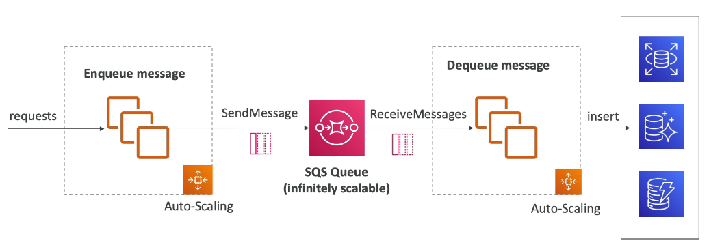

# Cloud Architect:

## 1. AWS Fundemental
- AWS Region: 
    - Example us-east-1 ...
    - Region is a cluster of data center.
    - How to choose region:
        - Compliance
        - Latency
        - Pricing

- AWS AZ: 
    - Each region have different AZ (us-east-1a)
    - Use to prodvide redundancy.

- AWS Edge location

## 2. IAM and groups:
- IAM service is global
- One IAM can belong multiple groups
- Group can not contain sub-group

- Policy: file JSON describe permission to:
    - USER
    - GROUP
- Policy example:

```json
{
  "Version": "2012-10-17",
  "Statement": [
    {
      "Effect": "Allow",
      "Action": "s3:GetObject",
      "Resource": "arn:aws:s3:::your-bucket-name/*"
    }
  ]
}
```
- IAM inheritance: 
    - User inside a group have all permission of that group.

- Permission Structure:
    - Version
    - ID
    - Array of statements:
        - Effect: allow/not allow
        - Principal: which account affect
        - Actions: example PUT object/ GET object
        - Resource: s3 bucket

- Roles:
    - Roles is simply a group permission for AWS service on our behalf.
    - For example: lambda-service-role have permission to access VPC, EC2FullAccess ...

- IAM Best practice:
    - Don't use root account
    - User belong to group have all inheritance permission of that group


## 3. EC2: 
- EC2 Instance type:
    - General purpose (tag with A,T,M)
    - RAM optimise: node in Spark (tag with R,X,z)
    - Storage optimise: OTLP system (tag with H,I,D)
    - Compute optimise: use for batch process, video encoding, decoding ... 

- Security Group (fire wall):
    - Configuration of inbound and outbound networking, simply a firewall

- EC2 Purchasing model:
    - Pay as you go
    - Reserving: pay an upfront amount
    - Saving plan: similar to reserving, but need commit at least X$/hour (lock per region)
    - Spot instance: huge discount but can be terminate at any point, not suitable for critical task
    - Dedicated host: offer a physical host for ec2

- Spot instance:
    - Can have 90% discount
    - Define max spot price and get the instance working while spot price < MAX spot price
    - If current price > MAX, we need terminate or stop spot instance

## 4. EC2 Associate:

- Elastic IP:
    - If we need a fix IP for our instance, we need elastic IP
    - By default, all AWS accounts are limited to 5 Elastic IP addresses per Region

- EC2 Placement group:
    - Placement strategy:
        - Cluster: multiple instance on the same AZ (same rack, same AZ, have low latency 10Gps network)
        - Spread: spread instance across multiple AZ (minimize failure, limit 7 instance per AZ)
        - Partition: divide ec2 into multiple partions base on racks (multiple partition on multiple AZ), each partition is a rack

- Elastic Network interface (ENI):
    - Logical component in a VPC that represent a virtual network card.
    - 1 ENI can comprise of:
        - Multiple private IPs
        - 1 Public IP
        - 1 MAC address
        - 1 or more security groups
    - Elastic Network Interfaces (ENIs) are bounded to a specific AZ. You can not attach an ENI to an EC2 instance in a different AZ.

- EC2 Hibernate:
    - Stop: instance disk is kept intact until next start
    - Terminate: instance disk will be removed
    - Hibernate: RAM is preserved on EBS volumne when stop, instance can not hibernate more than 60 days

## 5. EC2 Instance storage:

- EBS: is a volumne network drive you can attach to your instance while they run.
- It allow instance persist data, even after termination, only one EBS can attach to one EC2 at the time.
- Think of them as network USB sticks
- Belong to AZ, to move we can take snap shot.
- Delete on Termination: remove EBS along side with EC2

- EBS snap shot feature:
    - EBS snap short archive: snapshot can be move to cheaper tier
    - Recycle bin for snap shot
    - Fast snapshot restore

- AMI: Amazon machine image, customization of EC2
- AMIs are built for a specific AWS Region, they're unique for each AWS Region. You can't launch an EC2 instance using an AMI in another AWS Region, but you can copy the AMI to the target AWS Region and then use it to create your EC2 instances.

- EC2 Instance Store: ephemeral storage, refers to the temporary block-level storage that comes with certain types of Amazon Elastic Compute Cloud (EC2) instances. This store is not persisted. 
- EC2 Instance store != EBS 
- EC2 Instance Store provides the best disk I/O performance.

- EBS volumne type:
    - General purpose (gp2/gp3):
        - Cost effective, low latency
        - Range from 1 GB to 16 TB
        - gp2 size of volumne and iops are linked, in gp3 iops, throught put can be scaled independently.
        - Provision IOPS: when we need iops > 16k -> we need to switch to io1/io2
    - High performance (io1/io2)
        - Max PIOPS: 64k
        - Support multi attach
    - Low cost (st 1):
        - Can not be boot volumne
        - Throughput optimize
    - Lowest cost (sc 1):
        - For data that infrequent access

- EBS can be choosen by:
    - Size
    - Throughput
    - IOPs

- With IOPS of 310,000 only solution is to used EC2 Instance store.

- EBS multi-attach:
    - attach the same ebs to multiple ec2 in the same AZ
    - only allow for io1/io2

- To create new EBS encrypt from EBS unencrypt, create a encrypt snap shot and re-attach to ec2

- EFS: a network file system:
    - EFS work with ec2 in multi-AZ
    - Use case: content management, web servining ...
    - Compatible with Linux based AMI
    - Performance mode:
        - General: 
        - Max IO
    - Throughtput mode:
        - Bursting: 50Mb/s -> 100Mb/s
        - Provisoned: set a fix throughput
        - Elastic: automatically scale base on workload
    - Storage tiers:
        - Standard for frequently access
        - Low cost option
    - Availability:
        - Standard: for multi-AZ (regional)
        - One AZ: for development, low cost option access.
    - When create EC2: we can attach it to file system
    - We can use EFS as a way to share file data between different AZ

- EFS vs EBS:
    - EBS: 
        - attach to one instance
        - lock at AZ level
        - IO increase when size increase
        - az migration step:
            - take a snapshot
            - copy to another AZ
        - get terminated by default along with EC2
    - EFS:
        - share across multiple AZ
        - have a higher price 

## 6. Load balancer:

- ELB: 
    - Classical load balancer
    - Gateway load balancer 2020
    - Network load balancer 2017
    - Application load balancer 2016

- ALB: layer 7 load balancer:
    - Route traffic to multiple instance ec2
    - Support HTTP2/web socket
    - Support redirect
    - Route table to different groups:
        - base on path
        - route base on host name
        - route base on query string, header.
    - ALB can dynamic map port for soluiton like ECS
    - ALB can route to multiple target group
    - ALB even can route to on-premise and EC2-based target group
    - Good to know: 
        - True IP, port and proto is passed via: 
            - X-Forwarded-For
            - X-Forwarded-Port
            - X-Forwarded-Proto
    - You can't attach an Elastic IP address to Application Load Balancers.

- NLB: network load balancer layer 4 load balancer
    - Allow to:
        - Forward TCP and UDP 
        - Handle millions of request per seconds
        - Less lantency = 100 ms < (ALB is 400 ms)
        - NLB have one static IP per AZ (note per AZ, each AZ will have different IPs)
        - NLB is used for extreme performance
        - NLB is not free
    - NLB target groups:
        - EC2 instances 
        - IP addresses
        - Another ALB
    - NLB health check supports:
        - TCP
        - HTTP
        - HTTPs
    - Network Load Balancer has one static IP address per AZ and you can attach an Elastic IP address to it. Application Load Balancers and Classic Load Balancers have a static DNS name.

- GLB: gateway load balancer, use as a middleware for 3 party network system, for example: firewall, intrusion detection, deep packet inspection, ...
    - Operate at layer 3 (network layer)
    - Use GENEVE protocol on port 6081
    - Possible target:
        - EC2 instance
        - Private IPs

- Sessions stickiness:
    - All request will stick with the same client and target, this work for ALB, NLB and classic,
    - It use cookies for sessions stickiness
    - Cookie name:
        - Application base cookie:
            - Custom cookie:
                - Set by target
                - Must specify per each target group
                - Must not be AWSAPP, AWSALBAPP, AWSALBTG
            - Application cookie:
                - Generated by load balancer
                - Cookiename is AWSALBAPP
        - Duration base cookie:
            - Generated by the load balancer
            - Cookie name = AWSALB or AWSELB
        
- Cross-zone load balancing: load balancing across multiple AZ
    - ALB: enalbe by default (can disable at target group level), no charge across AZ
    - NLB: disable by default, cost money

- SSL/TLS: 
    - Server name indicator: multiple cert can be load to ALB, NLB it can detect which cert to get base on host name.

- Connection draining or deregistration delay: for ALB and NLB.
    - When instance is unhealthy or dead (draining state), it will not route traffic to that instance for a period of time (1 -> 3600 sec) default is 300 seconds.

- Auto scaling groups:
    - Used for scale load
    - ASG is auto register EC2 to load balancer
    - Set minimum/desired/max capacity
    - ELB can health check EC2
    - Attribute:
        - Launch template: contain AMI, instance type, EBS volumne, security groups, SSH key pair ,...
        - Have min/max capacity
        - Scale ASG base on CloudWatch arlam metric (CPU, custom metric)
    - Scaling policy:
        - Simple target policies: for example keep CPU usage around 40%
        - Step scaling policies: for example add 1 unit if CPU > 70%
        - Schedule action: for example at 1 AM add 1 unit for processing job
        - Preditive scaling: base in history usage
    - Metric for scaling:
        - CPU usage
        - Request per instance
        - Avg network 
    - Scaling cool down: after an increase or removal there will be a 300 cool down period.

## 7. RDS:

- RDS:
    - RDS advantage:
        - Automated provisioning, OS patching.
        - Continous patching, backup at timestamp.
        - Read replicas
        - Multi AZ back up
        - Scaling capability 
        - Storage back by EBS
    - RDS can't be SSH
    - Storage auto scaling:
        - Set by threshold
    - RDS read replicas for read scalability:
        - Up to 15 replicas
        - Three options to replicate:
            - Across AZ
            - Across Region
            - Same AZ
        - Replication is async
        - Replica can be promoted to their own DB
        - Application must update connection to leverage replicas.
    - RDS replication network cost:
        - Same region --> No fee
        - Cross region --> Have fee

    - RDS multi AZ: use for Discovery disaster recovery:
        - SYNC replication 
        - In another AZ, failover when AZ lost or lost connection
        - Master and DR replicas share the same DNS
        - Note: Read replicas can be set up as DR

    - RDS from single -> multi AZ: zero-down time operation.
        - Internally:
            - A snapshot is taken
            - A new DB is created from snapshot
            - New Sync connection create between master and DR 

    - Amazon Auroras:
        - "Cloud optmized" have better performance for PostGres and MySQL.
        - Storage grow increment from 10Gb -> 128 TB
        - Can have 15 replicas
        - Failover in Auroras is instaneous
        - Auroras cost more 20%
    
    - Auroras HA:
        - 6 Copies accross multiple AZ
        - Support cross region replication.
    - Auroras cluster: 
        - Have one write end point
        - Have read end point: load balancing between read-replicas.
    - Feature:
        - Auto failover
        - Auto scale
        - Back up
        - Back track: restore data in the past without backup.
    - Advanced concept:
        - Auto-scaling: read endpoint auto cover newly created replicas.
        - Custom endpoint: for analytical for example
        - Serverless: Good for infrequent unpreditable workload.
        - Global database:
            - 1 primary region (all read and write)
            - Up to 5 secondary regions, replication lag < 1 sec 
            - Promote 1 region take less than 1 min
        - ML:
            - SageMaker
            - Comprehend (sentiment analysis)
        - RDS backup:
            - Daily back up
            - 5 mins back up from transaction logs
            - Retention time = 1 - 35 days for automate back up
            - Retention time = infinite for manual back up
        - RDS clone: will be very fast, because they will share the same EBS volume, additional write/update will be kept seperate
        - RDS & Auoras security:
            - At-rest data encryption: database and replicas encryption using KMS - must be defined at launch time.
            - If data is unencrypted -> require take a snapshot and restore.
            - In-flight encryption: TLS-ready by default.
            - IAM Authentication: IAM roles to connect to your database.
            - Security group: control inbound-outbound.
            - No SHH access
            - Audit logs sent to cloud watch
    - RDS Proxy:
        - Create a proxy for RDS, manage connection pool, in order to reducing the stress on DB and minimize open connection.
        - RDS proxy must be access from a VPC.

    - ElastiCache:
        - Similar to RDS for manage relational database, ElastiCache is to get managed Redis or Memcached.
        - Using ElastiCache require heavy code change.
        - Security:
            - IAM 
            - Security group
            - User/password
            - SSL in-flight

## 8. DNS:

    - DNS Terminologies:
        - Domain Registar: route 53, go Daddy
        - DNS records 
        - Zone files: database contain DNS records
        - Name server: resolve DNS (Authorities and non-authorities)
        - Top level: .com, .us
        - Second level domain: .example
        - Sub domain: www
        - FQDN: www.google.com

    

    - Route 53:
        - DNS of AWS.
        - Also a domain registar
        - Can check health of resource

    - Route 53 record:
        - Domain, sub-domain
        - Record type: A vs AAAA vs CNAME, NS:
            - A map to Ip4
            - AAAA map to Ip6
            - CNAME: map host name to another host name
        - Value
        - Routing policy
        - TTL

    - Host zones:
        - A container of record that define how to route traffic to domain and sub domain
        - There are two type of host zones:
            - Public host zones: allow all client from internet to query DNS
            - Private host zones (for routing within VPCs)
            - 0.5 per month per host zones


    - Create record in route 53:


    - CNAME vs alias:
        - CNAME: map an Root domain (fully test.mydomain.com) to a AWS resource.
        - Alias: map an Root domain or non root domain (like mydomain.com) to a AWS resource, also free of charge and health check, can't set TTL.
            - Target for Alias: ELB, Cloud front, API Gateway, Beanstalk, S3.
            - You can not set DNS alias for EC2 DNS
    
    - Routing policies:
        - Simple
            - Typically route traffic to a single resource, can specify multiple values in the same records --> random one will be chosen.
        - Weight
            - Control the % of request that go to each resources
        - Latency
            - Can be associate with health check to route to the nearest region.
            - Health check:
                - HTTP health check for PUBLIC records.
                - Type:
                    - Monitor endpoint:
                        - Interval 30s
                        - If 18 % report is healthy -> healthy
                        - We must allow request for health checker in firewall rule
                    - Calculate health check:
                        - Combine by AND, OR, NOT operator of multiple child health check
                        - For private resource, we must create cloud watch alarm assiciate with it.
        - Failover:
            - We have a active/passive (or disaster recovery instance), when main instance down, route 53 automatically change to secondary instance.
        - Geolocation
            - Route to when user actually located.
        - Geoproximity
            - Used to shift traffic from one AZ to another one
        - IP-based routing:
            - We provide a list of CIDRs (IP range) and their corresponding endpoint/location.
        - Multi-value routing: 
            - Use to route traffic to mutiple resources
            - Can associate with health check
        
    - Domain registar vs DNS service:
        - Domain registar is where you can buy a domain with fee.
        - DNS service is a database for you to manage your DNS record (domain -> IP).      

        
        - How to use 3rd party (GoDaddy, ...) domain with route 53 ? 
            - Firstly, buy a domain
            - Secondly, create a host zone
            - Third, specify name server of created host zone in 3rd party domain registar
        
    - Route 53 can not replace Load balancer because of their incapacity of add/remove instance on the fly.

## 9. Solution architect dicussion:

- What time is it ?


- Five pillar of a well architect application:
    - Cost
    - Performance
    - Reliability
    - Security
    - Operational excellence


- Elastic beanstalk:
    - Provide a developer centric-view of deploying application on AWS.
    - Environment:
        - Worker
        - Web server

## 10. S3

- S3 Introduction:
    - S3 is a backbone buidling block of many websites
    - Usage:
        - Backup and storage
        - Disaster recovery
        - Archive
        - Application hosting
        - Media hosting
        - Data lake and big data
        - Example: Nasdag store 7 years of data into S3
    - S3 allow file to store in bucket
    - Bucket name have to be unique (globally)
    - Bucket are regional level (can not transfer across region directly)
    - Key is the indentifier for object that stay in bucket:
        - Full path: s3://bucket_name/my_file.txt
    - Object:
        - Can be aquire using key
        - Max size = 5000 GB (5 TB)
        - If upload more than 5Gb, must use "multi part upload"
        - Object can be associate with:
            - Meta data: system data
            - Tag: user-defined data
            - Version ID
    - Bucket security:
        - User-based: access to bucket via IAM 
        - Resource-based: set up security for bucket cross account
        - ACL
        - Encryption: using encryption key
    - S3 can host static website and make them accessible on internet.
    - S3 Versioning:
        - You can version file in S3
        - It set up at bucket level
        - Same key will overwrite with the same version: 1,2,3 ... 
        - It is best practice to version bucket because of tracking change
            - Note: file that is not versioned before enable version will have version = null
    - S3 Replication:
        - Same region replication vs Cross region replication
        - Copying is async
        - After enable replication, only new item is replicated
        - If you want replicate exist object use S3 batch replication
        - Delete marker is disable by default
    - S3 Storage class:
        - General purpose:
            - 99.99% availability
            - Used for frequent access data
            - Low latency, high througput
            - Use in normal application
        - Standard infrequent access
            - Lower cost
            - Only 99.9% availability
            - Use case: DR, back up
        - One Zone-infrequent access
            - Only 99.5% availability
            - Datalost when AZ is destroy
            - Use case: back up for on-premise data
        - Glacier instant retrieval
            - Ms retrieval
            - Min storage duration is 90 days
        - Glacier flexible retrieval
            - Flexible retrieval time, 3-5 hours, 5-12 hours, ...
            - Min storage duration is 90 days
        - Glacier deep archive
            - Longer retrieval time 12 hours, 48 hours
        - Intelligent tiering
            - Move S3 class base on usage pattern
            - No charge for S3 intelligent tiering
            - Cycle:
                - Frequent access tier: 
                - Infrequent access tier: after 30 days no access
                - Archive instant access tier: after 90 days no access
                - Archive access tier
        - We can move S3 class manually or use S3 life cycle
    - S3 Durability and availability
        - High durability, 10,000,00 object have a chance loss in 10.000 years, durability is the same for all class
        - Availability is vary accross storage class
    - S3 Life cycle rule:
        - Moving between storage class can be automated using life cycle rules.
        - Transition actions: example: move to another storage class after 30 days
        - Expire actions: configure object to be remove after some time
    - S3 Analytics help to make storage analysis
    - Life cycle action include:
        - Move object between storage class
        - Expire/permanently delete non-current object
        - Delete object with delete marker
    - S3 requester pay:
        - Normally, bucket owner pay for storage and network cost, in requester pay, the requester pay for download network (must be authenticated)
    - S3 event notification:
        - ObjectCreated, ObjectRemoved, ObjectRestore, Replication, ... to send to queue notification.
        - In order to SNS, SQS receive notification from S3, it needs resources policy attach that allow to consume S3 event.

    - S3 baseline performance:
        - Low latency 100-200 ms
        - Performance can achieve at least 3500 req/sec for PUT/POST/DEL operation, and 5000 req/sec for GET/HEAD
        - How to optimize s3 performance:
            - Multi-part upload: recommand for file 100 mb, must use for file > 5Gbs 
            - S3 transfer acceleration: transfer s3 data to an edge location than forward to target location.
            - Request byte-range, request from start -> end number of byte, parallelize request by specific byte range.
            - S3 select and glacier select: utilize server-filtering
            - S3 batch operation

    - S3 Security: 
        - Object encryption: There are 4 method to encryption of S3:
            - Server-side encryption:
                - Encryption using S3 AWS managed key: 
                    - Key is owned and managed by AWS, encryption type = AES-256
                - Encryption using KMS:
                    - Encryption is managed by KMS, user control the key, to read the object it is needed to have access to both the object and the key
                    - Limitation:
                        - KMS key have limit quota of 5500/10000/30000 req per seconds
                - Encryption using customer key
                    - Upload and retrieval require both encryption and decryption key.
            - Client-side encryption
        - S3 CORS: cors = scheme + domain + port
            - We can allow all origin with "*"
            - Before any "read" request, server is make a small OPTION request with "Host" and "Origin" to see whether web server with origin is allow retrive such request.
            - CORS prevent:
                - Cross-Site Request Forgery
                - Scripting Attacks
 
        
        - S3 access log:
            - DO NOT set the place to store access log is its own bucket, it will create an infinite looping
        - S3 pre-singed log:
            - Given a particular file a URL for external to access for a period of time.
        - S3 glacier vault lock and object lock:
            - Adopt a WORM
            - Create a vault lock policy
            - Lock for future edits
            - Helpful for compilance data
            - Impossible to delete before expire date.
        - S3 Access point:

        - S3 Object lambda:
            - Use lambda to change the object before it retrieved by called application


## 11. Cloud Front
    - Cloud front = content delivery network. Improve read performance, content is cached at the edge.
    - Cloud front have about 216 point of presence globally.
    - DDos Protection, integration with Shield.
    - S3 bucket in cloud front is used for distributing file and caching them at the edge.
    - Cloud front origin can be:
        - ALB
        - EC2 instance response
        - S3 website

    - Cloud front origin with s3 as origin

    - Cloud front and S3 cross region replication difference:
        - Cloud front: 
            - leverage existing edge location
            - file are cached with TTL
            - best use for static content
        - S3 replication:
            - Must set up manually for each region
            - File update are near real time
            - Read only
            - Best use for dynamic content


    - Cloud front Geo restriction:
        - Restrict who can access distribution
            - Allowlist: allow user to access content if come from specific country.
            - Blocklist: prevent user from accessing content if come from specific country.
            - "Country" is determine using 3rd party database.

    - Cloud front price class:
        - All around the world
        - Use North America, Europe, Asia, Middle East, and Africa
        - Use only North America and Europe
    
    - Cloud front invalidation:
        - We can specify a "/path/*" to invalidate all file in that path.
    
    - AWS global accelerator: 
        - Unicast vs Anycast:
            - Unicast: server share the same ip
            - Anycast: server share different ip
        - Multiple Edge location with the same IP will be spread around the world, request travel to the nearest one -> to ALB

        - AWS global accelerator vs Cloud front:
            - both are leverage the AWS network and can be used to prevent DDos
            - Difference:
                - Cloud front: use for boost performance and response by cache at edge location
                - Global accelerator: use as a proxy network from edge location to origin

## 12. AWS Snow
- AWS Snow is a portable device to collect and process data at edge and migrate data to AWS
    - Data migration: Snowcone, Snowball edge, Snow mobile
    - Edge computing: Snowcone, Snowball edge
- Challenges with normal migration:
    - Limit connect, bandwidth, network cost
    - If it take more than a week to transfer data --> use aws snow
- Use case: AWS snow: large data migration, DC decomission.

- AWS FSx:
    - Use for launching high-performance file system in FSx

- AWS FS for window:
    - Support SMB protocol, Window NTFS
    - Microsoft active directory, ACLs, quotas.
    - Can be mounted on EC2 instance.
    - Scale up to 10s of GB, million of IOPs,

- AWS FS for Lustre
    - Parallel file distributed system
    - use for parallel computing, machine learning computing, video processing
    - Storage option:
        - HDD
        - SSD
    - S3 integration:
        - Read and write back

- Hybrid cloud for storage:
    - Part is on cloud
    - Part is on on-premises

- Reasons:
    - Long cloud migration
    - Law compliance
    - IT strategy

- AWS storage gateway is a solution for this:
    - Use to bridge data between on-premise and cloud data
    - Type of gateway:
        - S3 file GW 
        - FSx GW
        - Voluume GW 
        - Tape GW

- AWS S3 File gateway:
    - Configured bucket are accessible using NFS and SMB
    - Most recently used data is cached 
    - Support for S3 standard, One zone A, Standard IA, intelligent tiering
    - Bucket using IAM role for File GW


- AWS FSx File gateway:
    - Native access to Amazon FSx
    - Local cache for Infrequent access data


- Volumne gateway:
    - S3 storage back by EBS
    - Cached volume: low latency access to most recent data
    - Stored volume: entire dataset is onpremise, scheduled backup to S3


- AWS transfer:
    - We want to use FTP to transfer data to S3 and EFS
    - Support protocols:
        - FTP
        - FTPs
        - SFTP
    - Pay per hour and network transfer
    - Integrate with authentication system (Okta, Microsoft active directory, LDAP, ...)

- DataSync: 
    - Use to move large amount of data from one location to another one.
        - On premises to cloud of AWS - need agents
        - AWS service to another AWS service - no agent is need
    - Can synchronize between
        - S3
        - EFS
        - FSx
    - Replication task can be scheduled hourly, daily or weekly
    - File permission and meta data is preserved.
    - One agent task can be use 10 Gbps


- Storage comparision:
    - S3: object storage
    - EBS: network storage attach to EC2, similar to a USB stick 
    - Instance storage: have the highest Iops, physical storage of EC2
    - EFS: network transfer file system can attach to multiple EC2
    - FSx for window: file system for window
    - FSx for Lustre: high computing file system for linux
    - FSx for NetApp: high OS compability
    - FSx for OpenZFS: Manage ZFS file system
    - Storage GW: use to bridge data between on-premise and cloud
    - Transfer family: allow upload to S3, EFS via FTP, SFTP, FTPs
    - Snow family: transfer large data that network is not possible
    - DataSync: scheduled job to transfer data between on-premise to AWS or AWS to AWS

## 13. SNS, SQS, Kinesis, Active MQ

- SQS:
    - Simple queueing service

    - Fully managed service, used to decouple service.
    - Attribute:
        - Unlimited throught put, unlimited number of message in queue.
        - Default retention of message: 4 days, maximum of 14 days
        - Low latency: < 10 ms
        - Message size = 256 Kb
        - Can have duplicate message (at least one delivery, occasionally)
        - Can have out of order message
    - SQS producer:
        - Produced using SDK
    - SQS consumer:
        - Polling message (up to 10 messages at once)
        - Processing message then delete using DeleteMessage API

    - SQS with auto scaling group:
        - Group of consumer can watch a specific arlam Like `NumberOfMessages` and size up or down number of Ec2 instance.

    - SQS to decouple between application tiers
    - SQS Security:
        - In-flight encryption
        - At rest encryption using KMS key
        - Client-side encrytion if client want to perform client side encryption/decryption
    - Access control: IAM policies to regulate access to SQS API.
    - SQS Message visibility timeout:
        - When consumer by a consumer, it become invisible for a few seconds to other consumer, by default time out = 30s

        - If consumer is not processed within the visibility timeout, there is a chance, it will be processed twice
        - Consumer need to use ChangeMessage visibility API to get more time.
        - If visibility is high, consumer crashes, re-processing will take time.
        - If visibility is low, we can get duplicates
    - SQS long polling:
        - When consumer request a message from the queue, it can optionally 'wait' for message to arrive if there are none in the queue
        - Long polling can decrease number of API call while increasing the efficiency and latency of application.
        - Wait time can be 1 -> 20 seconds
        - Long polling can be enable at queue level or at API level using WaitTimeSeconds
    - SQS FIFO:
        - Gurantee order but have a limit throughtput of 300mg/seconds, exact-one capability (remove duplicates)
        - Message are consume in order
    - SQS with ASG:

    
    - If the load too big, some transaction may be lost, to handle this, we use SQS as a data buffer layer:
 


    - SNS: Simple notification service:
        - One message to multimple recceiver
        - Event producer send one message to SNS topic
        - Event receiver listen SNS topic notificatio
        - Limtiation is 12.5 million subcriber per topic. Max 100.000 topic max
        - Subcriber can be:
            - SNS
            - HTTPs end point
            - SMS and phone notification
            - Lambda
            - Emails 
        - Topic publish:
            - Create topic, create subcription -> Publish to topic
        - Direct publish:
            - Create topic
            - Create platform endpoint
            - Publish to specific endpoint
        - Security:
            - In-flight encryption
            - At-rest encryption
    
    - AWS Kinesis:
        - Kinesis make it easier to collect, process and analyze streaming data in real-time.
        - Ingest real-time data such as: app logs, click streams, IoT data.
        - Kinesis type:
            - Kinesis data stream: capture, process and store data stream
            - Kinesis data firehose: load data stream into AWS data store
            - Kinesis data analytic: analyze data stream with SQL or flink
            - Kinesis data video: process video.
        
        - Kinesis data stream:
            - Producer send data to kinesus with partition key and body blob (1MB max)
            - Consumer consume record with partition key and sequence number
            - Retention: 1- 365 day
            - Once data is inserted to kinesis, it can not be deleted.
            - Capacity mode:
                - Provisioned mode:
                    - Choose pre-defined number of shard, scale manually or via API
                    - Each shard input get 1 MB/s
                    - Each shard output get 2 MB/s
                    - Pay per shard provisioned
                - On demand mode:
                    - No need to provision or manage capacity
                    - Default capacity = 4Mb
                    - Scale base on output observed
                    - Pay per stream per hour % and network data per gB


```sh
aws kinesis put-record --stream-name demo_stream --partition-key 12412 --data "user extreme" --cli-binary-format raw-in-base64-out

aws kinesis describe-stream --stream-name demo_stream

aws kinesis get-shard-iterator --stream-name demo_stream --shard-id shardId-000000000000 --shard-iterator-type TRIM_HORIZON

aws kinesis get-records --shard-iterator "AAAAAAAAAAEkHWfjF9hVCb80AhCkfpTg9JVstMI2QFwFVvxTwwYcvVn+O70SQCf5yZTkYB6nWfEhg8TTH0vfHugQnM82hCdy94Pu7oLxdSj/E3usqCj5618UtHT4DxEKPmp4+FtT4PVj/L2+iXDWDGC28slyF3kOQXvBFQaHNcxMtk79sg85nxNTs7zn3QH0o1NO9VU4RQN4/VEPT5e+VfBBPj8JKx3IHSY/nLDWYgaCxTkklCMPPA==",
```
        - Kinesis data firehose:
            - Get data stream from producer including device, application kinesis data stream
            - After stranformation it can be batch insert to AWS destination like S3, Amazon red shift, Amazon open search
            - No admin managed, automatically scaling, serverless
            - Near real, 60s latency maximum
            - Support custom transformation using AWS lambda
            - Can send fail data to backup S3 bucket.


        - Difference between Kinesis data stream and kinesis firehorse:
            - Kinesis data stream:
                - Custom producer and consumer code
                - Real time 200ms
                - Manage scaling (shard spliting)
                - Data storage up from 1 to 365 days
                - Can be replay (because data is saved)
            - Kinesis firehose:
                - No cusom code
                - Auto scale
                - Near real time (60s)
                - No data storage
                - Can not replay
        - Ordering data into Kinesis queue:
            - We using partition key to keep value in the queue ordering.
        - Ordering in SQS:
            - For standard SQS there is no ordering gurantee
            - For SQS FIFO, if you don't use group ID, message consume in order they send.
            - When we want to scale number of consumer, but message is grouped, we used group id key to group them.
        - SQS Fifo vs Kinesis stream:
            - For example we have 100 truck and want info from truck_id is ordering we can:
            - Kinensis data stream:
                - Partition key = truck_id, there are 20 trucks per partition
                - Truck data is belong to each shard
            - SQS FIFO:
                - Each truck can be 1 group with 1 group id
    
    - SQS vs SNS vs Kinesis:
        - SQS:
            - Consumer pull data and must delete via delete API after consume
            - Can have as many consumer as we want
            - Order is only guratee on FIFO queue
            - When message is being consumed it's invisible
            - Individually message delay capability
            - Message is persisted
        - SNS:
            - Pub/sub model, data is send to all subcriber
            - Data is not persisted
            - Max 100,000 topic
        - Kinesis:
            - Standard: pull data with 2Mb/sec
            - Enhanced fan-out mode: 2Mb/sec per shard
            - Message is persited
            - Mean to used for ETL, big data.
            - Ordering at shard level

## 14. ECS, EKS, Fargate.
    - Docker:
        - Docker container ECR
        - Docker vs virtual machine
            - In docker, resource are share with the host, in VM, resource are not share, only a limit number of VM per one host.
            - Docker container are much lighweight.
    - ECS:
        - ECS = Elastic container service, launching container on AWS meaning launch a ECS task.
        - ECS cluster compose of multiple EC2 instance with ECS angent installed.
        - ECS can be serverless (fargate launch type). We just need to create task definition.
        - EC2 profile (use for EC2 launch type only)

        - ECS task: allow specific role per task.
        - AWS integration with load balancer
    - ECS auto scaling:
        - Number of task can be up or down scale base on:
            - CPU Utilization
            - Scale base on RAM
            - ALB request per target
        - Target scaling base on Cloud watch metric.
        - Step scaling
        - Or Schedule scaling
        - Note: scale ECS at task level != scaling of EC2
        - If launch type is EC2, it will be scale base on Auto scaling group.
        - ECS Cluster capacity provider:
            - Automatically provision and scale the infra
            - Capacity provider pair with auto scaling group
    - ECS Solution architect:
        - ECS task invoke by event bridge

        - ECS stop task notification

    - ECS: Elastic container registry:
        - There are public and private container registry.
    - EKS:
        - Architect: EKS pod installed in private subnet, expose via ELB.

        - Node types:
            - Self-managed node group:
                - Create and manage Node (EC2 instance)
                - Support On-demand or spot instance
                - We can self create ASG and assign them to EKS
                - We can use pre-built AIM image
                - Support On-demand and spot instance.
            - AWS fargate mode:
                - No maintainace require, no node managed, serveless.
        - Data volumne:
            - Need to specify StorageClass manifest in your EKS cluster.
            - Support for:
                - EBS
                - EFS
    - AWS app runner:
        - Service that deploy code to AWS with little configuration infra.
        - Start with source code (or container image).
        - It's will automatically build and deploy to the application.

## 15. Serverless
    - Serverless does not mean that we don't provision, it just mean that server is not managed by ourselves.
    - Lambda overview: 
        - Virtual functions -> no server to managed.
        - Limit execution time (15 mins)
        - Run on demand.
        - Auto - scale
    - Lambda cost benefit:
        - Pay per request and compute time.
        - Free tier of 1 million aws request.
    - Lambda limit:
        - Execution:
            - Memory allocation: 128 Mb - 10 GB
            - Maximum execution time: 15 mins.
            - Env variable: 4 kb max
            - Disk capacity for function container 512 MB, 10 Gb.
            - Concurrency execution: 1000
        - Deployment:
            - Compressed zip size: 50 MB
            - Size of uncompressed deployment: 250 MB
            - Can use /tmp directory to load other files at start up.
    - Lambda snap start:
        - Improve lambda start time. When enable, it's invoked from pre-intialized state.
        - Snap shot is cached for low - lantency access.
    - Lambda edge:
        - We can "move" lambda to closer source of user. 
        - Cloudfront provide two types:
            - Cloudfront function
                - Lightweight function written in JavaScript
                - For highly-scale, latency-sensitive CDN
            - Lambda at edge
                - Write in JavaScript/NodeJS/Python
                - Scale up to 1000 req/s
        - Use case:
            - Cache key normalization: parse and format cache key
            - Header malnipulation
            - URL rewrite/redirect
            - Request authentication and authorization 
    - Lambda in VPC: 
        - Lambda with RDS proxy:
            - Better ultilize connection pool

    - Lambda invoking from RDS & Auora:
        - RDS can listen incoming event to invoke lambda function. Event like created, stop, start, ...
        - We don't have any information about the data itself.
    
    - Amazon DynamoDB:
        - NoSQL database with transactional support.
        - Scale to massive workload, distributed database.
        - Litle maintainance and patching.
        - Dynamo DB basic:
            - DB is made of table
            - Each table must have a pre-defined primary key
            - Each table can have infinite number of item
            - Each item has attribute (can be added over time)
            - Maximum item size is 4kb
            - Data type:
                - Scalar
                - Document type: list, map
                - Set type: number set, string set
            - Primary key comprise of
                - Partition key: indicate where data store in which partition
                - Sort key, data will be naturally sort by this key
            - Capcity mode:
                - Provision mode: we must specify number of read/write per seconds in advance.
                - On-demand mode: Read/write per second is scaled up/down base on your workload.

        - Dynamo DB advance feature:
            - Dynamo DB Accelerator: 
                - Fully-managed, highly available, seamless in memory cache in DynamoDB.
                - Help solve read congestion by caching.
                - Microseconds latency for cached data.
                - Doesn't require application logic change.
                - 5 Min TTL
            - Dynamo DB Accelerator is good for query individual result. But for storing Aggregation result it better use ElasticCache.
            - Dynamo DB Stream processing: 
                - We can have a ordered of stream of all item-level modification (create/update/delete) in a table.
                - Use case:
                    - React change in real-time
                    - Real-time usage analytic
                    - Lamba invoking
                - Dynamo DB stream:
                    - Retention = 24 hours
                    - Have limited number of consumers
                - vs Kinesis data stream:
                    - 1 year retention
                    - Higher number of consumer


            - Dynamo global table:
                - There are two instance of table that you can write to either of them and they automatically replicated.
                - Active-active replication
                - Must enable dynamo DB stream as required

            - Dynamo DB TTL:
                - Automaticall delete item after expiry time.

            - Dynamo DB Backups for DR:
                - Continuous backups using point in time recovery (automatically)
                - On-demand back up: full back up for long time retention
        
        - AWS Step function:
            - Build serverless visual workflow to orchestarte aws lambda
            - Can integrate with human work flow.
        
    - AWS architect example:
        
        - AWS ToDoList:
            - Rest API with HTTPs
            - Direct modification of S3
            - Have ability to authenticate

        
        - MyBlog.com
            - This web should scale globally
            - Blog are heavy read.
            - Caching should be implemented
            - New user should be receive an welcome email
            - Any photo uploaded to blog should have thumbnail generated
            - IAM bucket policy to only authorize request from cloud front


        - Software update offloading:
            - When there is new update is out, new version is distributed in mass over the network. It's very costly.
            - We don't want to change our application, but we want to optimize cost and CPU
            ----> we can use cloud front distribution:
                - No change in architect
                - Will cache SW at edge
    
## 16. Database on AWS:
- Choosing the right database:
    - Read-heavy or write heavy
    - Throught put ? 
    - Scale and fluctuate


- RDS:
    - Manage open source database like PostGres, MySQL, Oracle, MariaDB, ...
    - Auto-scaling for storage
    - Support read replica and multi AZ
    - Support auto back up available for 35 days
    - Manual back up for longer storage
- Aurora:
    - Proprietary DB version of AWS, support MySQL and PostGres
    - Data is automatically store in 6 replicas, HA, self-heal, auto-scale.
    - Aurora special feature:
        - Serverless: for unpredictable work load
        - Global: 
        - ML: intergrate with SageMaker
        - Database cloning: no need to create snap shot
- DynamoDB:
    - Document DB, is a Proprietary noSQL of AWS.
    - Can define capacity of on-demand mode
    - Can be support by DAX cluster (for cache)
    - Global table feature: active-active, meaning that user can write to any region
    - Automated back up for 35 days or on-demand back up.
- Timestream:
    - Allow recent data be kept in cache


## 17. Data & analytic:

- Athena: 
    - Serverless, service for scan and analyze s3 file
    - Support format:
        - Arvo
        - Parquet
        - Json
        - CSV
    - Athena is calculate by scan so parquet is recommend

- Red shift:
    - Red shift is based on PostGreSQL but not use for OLTP
    - It's OLAP 
    - It's columnar storage (not row based) & support parallel query

- OpenSearch(= Elastic Search)
    - In dynamoDB, we can only query by primary key or index field
    - With OpenSearch, we can perform text search
    - Two mode: managed cluster or serverless

- EMR: Elastic MapReduce = Hadoop
    - EMR handle provisioning of big data tool set like: Spark, Hbase, Presto, Flink

- QuickSight: dashboard tool

- Glue: 
    - ETL service

## 18. Machine learning:
- Rekcognition:
    - Using for content moderation
    - Set a minimum value for image to get flag

- Transcribe:
    - Auto convert speech to text.
    - 

## 19. Cloudwatch:

- Metric:
    - Metric is just a variable to monitor like CPU & network
    - Dimension is an attribute of metric like instance_id, environment, ...
    - Max 30 dimension per metric
    - Can create Cloudwatch dashboard
    - Cloudwatch stream can send data to destination of choice like: data dog, Splunk, ... 

- Logs:
    - Cloud watch log insights
    - Cloud log export to S3
    - Cloud watch log aggregation multi-account & multi-region, and add filter for sensitive data.


- Cloud watch should have EC2 enable Cloud watch log agent, to send log to Cloud watch.
- Composite alarms combine of multiple single cloud watch arlam
- Cloud trail, use for audit event from AWS


## 20. IAM Advanced:

- Organization:
    - Global service:
        - Allow to manage multiple accounts
        - Shared reserved instance multiple accounts


- Oraganiazation Unit:
    - By department 
    - By environment
    - By project based

- Advantage:
    - Multi account vs one account multi VPC
    - Use tagging standards for billing purpose

- IAM Role vs Resource Based policies:
    - When try to access some resources in AWS there are two approaches:
        - IAM roles
        - Resources-Based policies

    - When you assume a role, you give up your original permission and take the permission assigned to the role.
    - When you use a resources-based policy you keep your original permission.

- Example: user in account A needs to scan a DynamoDB table in account A and dump it in a S3 in account.

- Resource base policies: lambda, SNS, SQS, Cloudwatch Logs, API gateway.
- Role base: ECS, EC2


- IAM Permission boundaries:
    - IAM permission boundaries are supported for users and roles (not groups)
    - IAM boundaries allow us to filter out maximum permission an IAM entity can get:


- AWS IAM Identity center (former AWS SSO)
    - A single sign on for AWS account
    - Business cloud application, (Sale forces, Box, 365)
    - SAML 2.0


- **Service control policies**:

- Service control policies (SCPs) are a type of organization policy that you can use to manage permissions in your organization. SCPs offer central control over the maximum available permissions for all accounts in your organization

- **AWS Discovery service**:

- Directory service: directory service is an system to manage employee data and relationhips of user with digital assests of the company.


- There are three type of AWS discovery service:
    - AWS two way trust relationship: use both of on-premise and AWS managed AD
    - AD Connector: AWS is just a proxy to route traffic to On-prem AD
    - Simple AD: everything stay within AWS


## 21. VPC (very important):

**CIDR**:
- Is a method for allocating IP, they help to identify IP address range:
- For example
    - XX.YY.ZZ.KK/32 -> One IP
    - 0.0.0.0/0 -> All IP
    - 192.168.0.0/24 ->  192.168.0.0 to 192.168.0.255 (64 IP address)
    - 192.168.0.0/16 ->  192.168.0.0 to 192.168.255.255 (64 IP address)

- CIDR comprise of:
    - Base IP: XX.YY.ZZ.KK
    - Subnet mask: defone how many ip in that range:
        - /16: 65,536 IP
        - /32: 1 IP
        - /0: Allow all range 

**Default VPC**:

- All new AWS have a default VPC 
- New EC2 instance are launched into default VPC if no subnet specified.
- Default VPC have all internet connection.
- Each subnet have their own CIDR

**VPC**:
- Max 5 VPC per region
- Max number of CIDR block in VPC is 5:
    - Min size = /28 (16 IP)
    - Max size = /16 (65536 IP)
- CIDR should NOT overlap with other networks

- VPC setting note:
    - CIDR range
    - Tenancy: dedicated use dedicated hardware or shared hardware.

**Sub net**:
- AWS reserve 5 IP for its subnet configuration, they are:
    - 10.0.0.0: Network address
    - 10.0.0.1: Network router
    - 10.0.0.2: for mapping to AWS-provided DNS
    - 10.0.0.3: for future use of AWS
    - 10.0.0.255: Network broad cast address

**Intenet GW and route table**:

- Internet GW:
    - Create seperately with VPC
    - One VPC can have one Internet GW

- The public subnet itself does not accessible from internet, it need internet GW and route table.


**Bastion Host**:

- Bastion host is an instance in a public subnet that provide access from outside to private subnet.
- Bastion host should allow access from port 22
- EC2 in private subnet should allow access from EC2 bastion instance.


**NAT Instance**:
- Allow EC2 instance in internet to connection to internet.
- NAT instance must be launched in public subnet.

**NAT GW**:
- AWS managed NAT, higher bandwidth, higher availability, no administration.
- NAT GW can not be used by EC2 instance in the same subnet.
- The flow is from:
    - Private subnet -> NAT GW -> IGW
- NAT GW is resilient with in single AZ


**NACL and Security group**
- NACL will attach to each subnet, request need to pass NACL before checking under security group.
- The **Default NACL** will accept all inbound/outbound with the subnet.

**Ephemeral port**
- For any two endpoints to establish a connection they need to use port.
- OS use a random port to send request to destination.


**Security group vs NACLS**:
- Instance level vs Subnet level
- Support allow rule vs both allow and deny rule

**VPC Peering**:

- VPC can be privatelt connected.
- They must not overlapping CIDR.
- VPC peering is not transitive (hon v)
- VPC peering can establish between VPC cross account.

**VPC Endpoint**:

- Instead of go throw NAT GW and Internet GW, we can call directly to VPC End point to external service.


- Type of endpoint:
    - Interface endpoint: provide an ENI as an entry point. 
    - GW: provide a gateway for s3 and dynamoDB (free)

**VPC Flow log**:
- Allow us to capture IP going into interfaces.

**Site to site VPN**:


Cloud hub:


**Direct connect**:
- Provide a dedicate connection between on-premise DC to VPC
- Access to public connection like s3 and EC2 in the same connection 
- Use case:
    - When we work with large dataset. Increase bandwidth throught put and lower cost.


- If we need to set direct connect to one or more VPC in many different region. you must you Direct connect gateway bridge with AWS direct connection.

- Direct connection type:
    - Dedicated: physical connection host, higher bandwidth but more expesnsive
    - Host connection: lower bandwidth but higher in 

- Direct connect resilient:


**NOTE: Site to site VPN can be use as back up for direct connection:**


**Transit Gateway**:

- When we have a lot more VPC that need to be connect, it's a lot harder to connect them all and the network topology is a mess. 
- -> The solution is to use Transit Gateway to utilize hub and spoke (star) connection.


- Support IP multi cast.
- We can share direct connect to multiple account.


**VPC Traffic mirroring**:

- Allow to capture and inspect network traffic in VPC
- Route the traffic to security appliance that you manage


**IP v6**
- IPv4 can not be disable
- Ipv6 can be enable to use a dual stack.


**Egress only internet gateway**:
- Similar to NAT GW but for IPv6
- Route table will have:
    - 0.0.0.0/0 to NAT GW
    - ::/0 to Egress internet gateway (IP v6)


**VPC Summary**:
- CIDR: A formula to caluate IP range
- VPC: virtual private cloud
- Subnet: tie to AZ, we can define multiple CIDR per subnet
- Internet GW: tie to VPC, show resource to connect to internet
- Route table: define destination in subnet given a CIDR
- Bastion host: EC2 instance in public subnet that allow connect to private EC2
- NAT instance: route request from private instacnce to internet GW (old), NAT instance must be in public subnet
- NAT GW: newer version of NAT instance.
- NACL: network ACL, at subnet level, stateless
- Security group: at instance level
- VPC Peering: connect two VPC together, given they don't have overlap CIDR.
- VPC Endpoint: provide a way for private data access S3, SSM...
- Site to site VPN, set up customer Gateway on DC and Virtual private gateway on VPC.
- Direct connect: 
- Transit GW: simplified VPC topology.
- Traffic mirroring
- Egress-only IG: