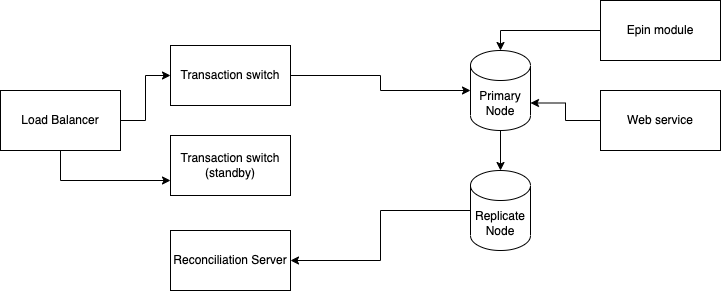
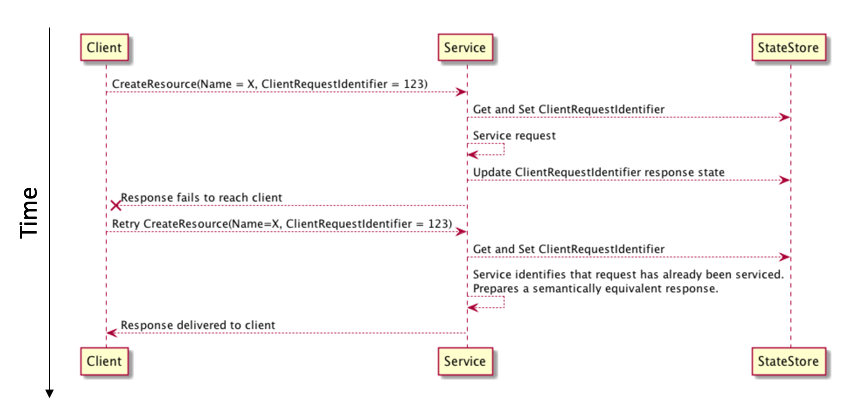
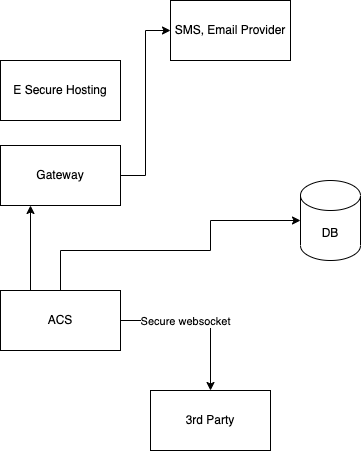

# 1. Payment system

- Architect:

- Functionality:
  - Autoswitch when:   
    - No connection with a node, connection attempt terminates with an error or takes longer than a timeout
    - Connection errors that cannot be eliminated by repeated attempts (‘invalid username or password’, ‘account is locked’, ‘restricted session’, ‘Oracle is not available’, etc.)
    - System upgrade
    - Insufficient space in a tablespace
    - Mass timeouts

- How to deal with idempotency:
  - Link: https://aws.amazon.com/builders-library/making-retries-safe-with-idempotent-APIs/

- Security concern:
  - No clear text, mass sensitive data
  - Data transfer have to be encrypt
  - Review secure code (prevent backdoor)
  - Remove data test before go production

# 2. 3D secure system
