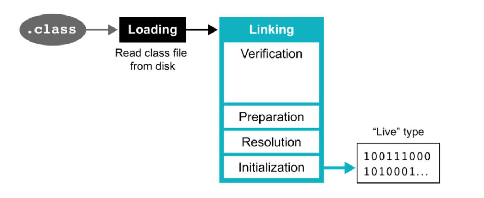
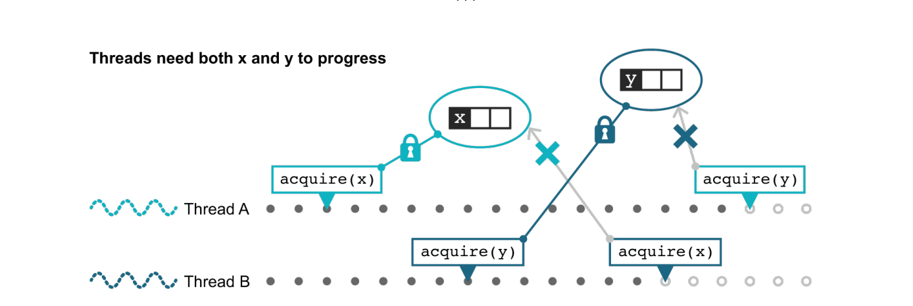
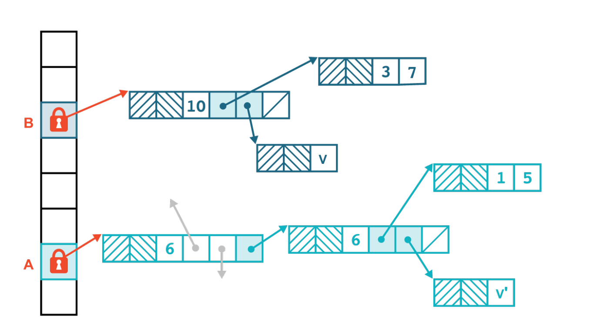
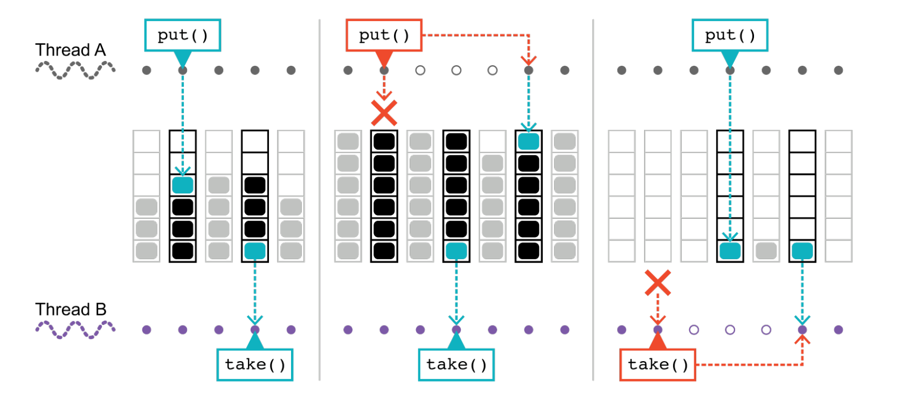
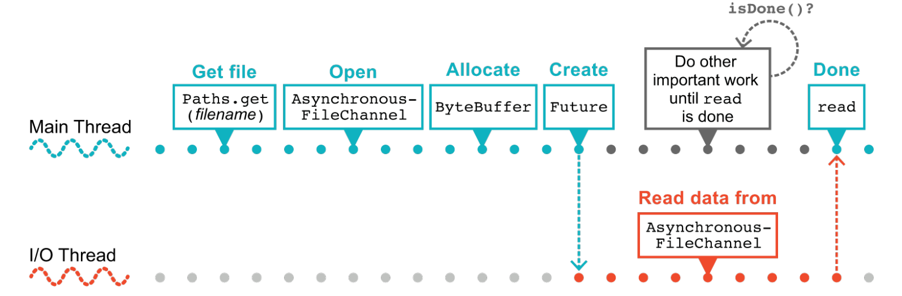

# Java Core

### Java Core

- COMPONENT OF JRE:
	- There are 5 components of JRE
		- ClassLoader
		- Heap
		- Stack
		- Program counter
		- Native code

- ORDER OF METHOD IN JAVA = MODIFIER THEN RETURN TYPE

- WHY CONSTRUCTOR CAN NOT BE FINAL STATIC ?
	- Final method can not be override, constructor already final
	- Static is not possible because of instantiate 

- STATIC METHOD IS NOT OVERRIDE

- STATIC AND DYNAMIC BINDING

```java
Person p = new Person();
p.walk(); // Java compiler resolves this binding at compile time.


public void walk(Object o){
	((Person) o).walk(); // this is dynamic binding.
}
```

- ABSTRACT CLASS CAN NOT BE INSTANTIATE

- ABSTRACT CLASS VS INTERFACE:
	- Class can inheritate multiple interface but with on abstract class
	- Abstract class can have instance variable and constructor
	- Interface only have constant. 

- WHEN OBJECT IS ELIGIBLE FOR GC:
	- When object can not be reach by a live thread
	- A set of circular reference object that can not be access by any object outside that


- WHY STRING IS IMMUTABLE ?
	- Because when create a string variable is assign to a string in string pool, once a String object is created, it cannot be changed. When we
assign the String to a new value, a new object is created.


- HOW MANY OBJECT ARE CREATED HERE ?
```java
String s = new String("ABC");
```
	- There are two object one is ABC in string pool, other is the reference point to it.


- CHECK VS UNCHECK (RUNTIME) EXCEPTION:
	- Check exception are check at compile time
	- Uncheck exception occur at runtime

- EXCEPTION PROPAGATION:
	- Exception is propagated until call stack empty

- HOW TO REMOVE WHILE ITERATE A LIST:

```java
	List<Integer> myList = new ArrayList<>();
	myList.add(1);
	myList.add(2);
	myList.add(3);
	
	ListIterator<Integer> iter = myList.listIterator();
	
	while (iter.hasNext()) {
	     if (3 == iter.next()) {
		iter.remove();
	     }
	}
```

- WHEN TO USE LINKEDLIST VS ARRAYLIST:
	- **Arraylist**: 
		- insert: o(n)
		- delete: o(n)
		- read: o(1)
	- **Linked list**:
		- delete: o(1)
		- insert: o(1)
		- read: o(n)


- TREESET:
	- Order is maintain
	- Speed is lower O(logN)
	- HashSet allow NULL

- LIST ITERATOR VS ITERATOR:
	- ListIterator allow modify list when transverse it. 


- COPYONWRITEARRAYLIST ?
	- Add and insert create a fresh copy of array so it suitable for Read-heavy application.


- IDENTITYHASHMAP:
	- Using reference instead of equals for checking hash.

- COCURRENCY HASH MAP:
	- Lock write and not lock read.

- HASHTABLE VS COCURRENTHASHMAP
	- HashTable can replace ConcurrentHashMap but with penatize.

- THREAD VS PROCESS:
	- Thread is a light weight process, threads share memory.
	- Process is more heavy process, data between process is not share but require intercall on process level to transfer data. Process can have multiple thread. Creating a process is fairly resource-intensive.

- JOIN:
	- Stop current thread and wait for thread that join to finish.

- PRE-EMPTIVE AND TIME SLICING
	- Preemptive scheduling enables the highest priority task execution until waiting or dead states entered. It also executes, until a higher priority task enters.

	- Time slicing allows a task to execute for a stipulated time slice and then reenters the pool of ready tasks. At that time the scheduler determines the executable task, based on the priority and various other tasks. 

- THREAD NOTE:
	- Thread can not start twice
	- setDaemon can not work after start
	- run() without start will run as normal thread.

- HOW TO START THREAD
	- Implement Runable
	- Create new Thread

- DOES THIS CODE THREAD SAFE:
	- No ! instance have to be **volatile**

```java
public class SingletonDoubleCheck {
  
  private SingletonDoubleCheck instance = null;
  
  public SingletonDoubleCheck getInstance() {
    if (instance == null) {
      synchronized(SingletonDoubleCheck.class) {
        if (instance == null) {
          instance = new SingletonDoubleCheck();
        }
      }
    }
    return instance;
  }
}
```  

- THREADLOCAL:
	- ThreadLocal store the state of the class.

- SEMAPHORE:
	- Semaphore limit the number of thread can access to the mutex.

- SOME TRICKY QUESTION:
	- When finnaly not call: when the system crash or system.exit
	- Double 1.0/0.0 is error or not: not error just return Double.INFINITY
	- Can we have multiple main method: yes, but the only one that pass to java command will run
	- Can we override static and private: no
	- ++ is thread safe: no it is not an atomic operation
	- Can you get instance variable in static context: no
	- Let say there is a method that throws NullPointerException in the superclass. Can we override it with a method that throws RuntimeException?: yes unchecked exception is ok but not for check exception.
	- What happend when cast byte to int: that result will lose 24 bytes.
	- What will this return 5*0.1 == 0.5? true or false? 
	- Upcasting vs Downcasting

```java
Parent p = new Child(); // Upcasting type of variable is parent class
Child c = (Child)p; // Downcasting type of varible is child class
```


- SPRING AOP WORK INTERALLY ?
	- AOP is aspect oriented programming. What it does is it wraps the original object by a proxy object and that proxy object is injected into user classes as dependency injection. 
	

- CLASS LOADING PROCESS ?

	- **Loading**: loading .class file from disk and form a basic data structure for class
	- **Linking**: doing verification, preparation, resolution(link it with its super type) and init static data for class




- REFLECTION: 
	- We can invoke function of unknown object at runtime using reflection
	- Probelms with reflections:
		- Poor performance: because of JIT compiler can not optimize

### Java Concurency

- JAVA THREADING MODEL:
	- Shared object by all threads
	- Pre-emptive thread schedule by OS

- ASPECT OF CONCURRENCY:
	- Safety
	- Liveness
	- Performance
	- Reusability

- SOURCE OF OVERHEAD:
	- Context switch
	- Number of thread too large
	- Memory threshold
	- Low performance algorithm 

	
- Synchronize and locks

```java
public synchronized boolean withdraw(final int amount) {
	// Check to see amount > 0, throw if not
	if (balance >= amount) {
		balance = balance - amount;
		return true;
	}
	return false;
}

```

- State of a thread
	- Runnable
	- Running
	- Wait 
	- Sleep
	- Blocked
	- Terminated

- Deadlocks, the example of deadlock code is:


```java

    public synchronized boolean transferTo(FSOAccount other, int amount) {
    // Check to see amount > 0, throw if not
    // Simulate some other checks that need to occur
        try {
            Thread.sleep(10);
        } catch (InterruptedException __) {
        }
        if (balance >= amount) {
            balance = balance - amount;
            other.deposit(amount);
            return true;
        }
        return false;
    }
    
    public synchronized boolean transferTo(FSOAccount other, int amount) {
        // Check to see amount > 0, throw if not
        // Simulate some other checks that need to occur
        try {
            Thread.sleep(10);
        } catch (InterruptedException __) {
        }
        if (balance >= amount) {
            balance = balance - amount;
            other.deposit(amount);
            return true;
        }
        return false;
    }

``` 





- **volative** key word ensure read and write access to variable will atomic, but not ensure an operation to variable is atomic, for example count++ will not be atomic
- **atomic** ensure whole operation on varible will be atomic by using CAS in OS level (optimistic locking)

- Immutability
- Deadlocks: one way to prevent deadlock is the ensure other of locks, in previous problems, account B require lock on account A, while account A require lock on account B. To solve this problems we depend on priority to lock the objec. For example we lock all the account with low id first then higher one.

```java

    public boolean transferTo(final SafeAccount other, final int amount) {
        // Check to see amount > 0, throw if not

        if (accountId == other.getAccountId()) {
            // Can't transfer to your own account
            return false;
        }

        if (accountId < other.getAccountId()) {
            synchronized (this) {
                if (balance >= amount) {
                    balance = balance - amount;
                    synchronized (other) {
                        other.deposit(amount);
                    }
                    return true;
                }
            }
            return false;
        } else {
            synchronized (other) {
                synchronized (this) {
                    if (balance >= amount) {
                        balance = balance - amount;
                        other.deposit(amount);
                        return true;
                    }
                }
            }
            return false;
        }
    }


```

- **ConcurrentHashMap**: instead of locking entire map, ConcurrentHashMap only lock on bucket level of map. Element on the same chain will of course be lock.





- **CopyOnWriteArrayList**: every mutate operation will create a new instance, which is very overhead on write but fairly safe on read.

- **BlockingQueue**: BlockingQueue have two properties:
	- When queue is full, a thread that want to push new element to queue have to wait for other take some element out.
	- When queue is empty, a thread that want to take element from queue have to wait for other push some element in.

	 




- **Future**:

	

	

- Example of using Future in Java:

```java

	public static void futureWork() {
		try {
			
			
			Path file = Paths.get("/Users/karianna/foobar.txt");
			var channel = AsynchronousFileChannel.open(file);
			var buffer = ByteBuffer.allocate(1_000_000);
			Future<Integer> result = channel.read(buffer, 0);
			
			// Leave IO thread do their work and do st else
			System.out.println("Do some thing else");
			
			var bytesRead = result.get();
			System.out.println("Bytes read [" + bytesRead + "]");
			
		} catch (IOException | InterruptedException | ExecutionException e) {
			e.printStackTrace();
		}
	}

```
	

- CompletableFuture vs Future:

Here are some of the key differences between CompletableFuture and Future:

- **Composition**: With Future, you can only wait for a single result, and you can't combine multiple futures together. With CompletableFuture, you can chain multiple asynchronous operations together using methods like thenApply, thenCombine, and thenCompose.

- **Completion**: A Future is considered complete when its result is available, but you can't modify that result once it's set. With CompletableFuture, you can manually complete the future by calling methods like complete, completeExceptionally, and obtrudeValue. This allows for more fine-grained control over the asynchronous operation.

- **Callbacks**: With Future, you can register a callback function that will be called when the future's result becomes available. CompletableFuture extends this functionality with additional methods like handle, whenComplete, and exceptionally, which allow you to specify different functions to handle success, failure, or both.

- **Asynchronous execution**: With Future, the asynchronous operation is typically run in a separate thread, but you have no control over the execution environment. With CompletableFuture, you can specify the Executor to use for each step of the asynchronous operation, allowing you to control the concurrency and parallelism of your program.

- Thread pools:
	- Fix thread pool
	- Cached thread pool: cached used thread 60 secs after used.
	- Scheduled thread pool: run after fix rate or fix delay
 
	

### Java Functional Programming

- Functional programming is a programming paradigm that use function as high level object.

- Some concept:
	- Higher level function
	- Pure vs impure function
	- Closure

 


	 	
	
	
	
	 	