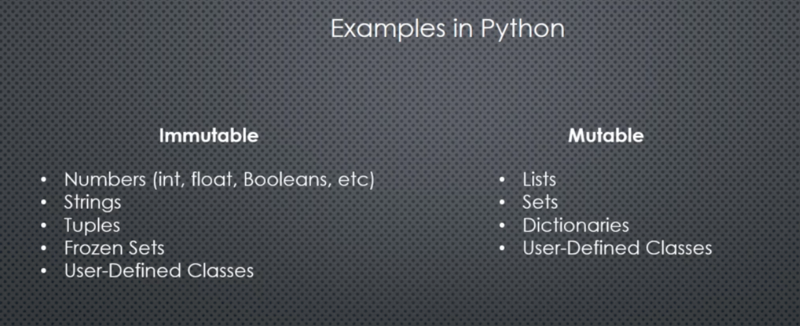

# Python

## 1. Functional & variable.


- In python memory manage by Python memory manager.

```python
a = 100
print(hex(id(a))) # Show memory 0x1014aa6d8
```

- Reference count:


```python
a = [1,2,3]
print(sys.getrefcount(a)) # 2
```

- Garbage collection:
    - Circular reference, GC can detect and reclaim circular reference.
    - For python < 3.4: __del__ can cause order of circular reference important.
    
- Dynamically and statically type:  
  - Dynamically language type is interpret during runtime
  - Statically language type is interpret during compile time

- Re assignment variable: in pythons reassign create new variable and assign variable to it


- Object mutabability:
  - Object can change internal state
  - Reference to object is not changed 




<br/>

- Immutable object are safe from passing through function.

```python

def func(x):
    x = x + "data"
    return x

my_x = "test_"
func(my_x)
my_x # test_ (string is immutable)

```

<br/>

- Share reference:
  - Immuatable object can share referenece

<br/>

- Variable equality:

    ```python
    a = [1,2,3]
    b = [1,2,3]
    print(b is a) # False
    print(b == a) # True

    c = "TEST"
    d = "TEST"

    print(c is d) # True
    print(c == d) # True

    ```


<br/>
<br/>

- Class, type, function in python is objects.
  - They have memory address.
  - Function can be pass to function
  - Function is first class citizen in python

<br/>
<br/>

- Python optimization, interning:
  - Interning meaning reuse object-on demand.
  - At startup, Python (CPython), pre-loads (caches) a global list of integers in the range [-5, 256].


<br/>

- Python optimization, peepphole:
  -  Constant expression: 12 * 60 will be precalculated
  -  Membership test: mutable is replace by immutable counter part, because check membership in **set** is much faster, for example:

```python
if e in [1,2,3]:
    # Will convert to 
if e in (1,2,3):
```


## 2. Numeric data type

- Python type:
  - int
  - float
  - complex

## 3. Function parameters
- Parameter vs arguments
- Default values:
  
```python 

def afunc(a = 1000):
  # code


# ERROR
def bfunc(a, b=100, c):
  # Every parameter after default paramter must have default value
```

- Keyword argument:
  - But once you use a named argument, all arguments thereafter must be named too

```python

def some_func(a=1, b=2):
  # code

my_func(c=1, 2, 3):
  # Error

```

## 4. Iterables

- Note:

```python
a = 1 # is not a tuple
b = (1,) # is a tuple
c = () # empty tuple
```

- Unpack with iterables:

```python
for e in any_iterables:

```

- Swap in python: this is work because in python the right hand side is evaluate and return.
```python 
a,b = b,a
```

- The use case of * 
```python 
a,b = arr[0], arr[1:]
a,*b = arr # the same

# Unpack with *
l1 = [1,2,3]
l2 = [4,5,6]
l = [*l1, *l2]

# Unpack with unorder data structure do not make sense

# Unpack dict

d1 = { p 1, y 2 }
d2 = { t 3, h 4}
d3 = { h 5, o 6, n 7 }
d = { **d1, **d2, **d3 }
```

- The * operation can only use once the the left hand side.

```python
a, *b, *c = [1,2,3,4] # this is error, SyntaxError: multiple starred expressions in assignment
a, *b, (c, *d) = [1,2,3, [4,5,6] ] # this is ok
```


## 5. *args and *kwargs

- You cannot add more positional arguments after *args
```python

def some_func(a, *args):
    print(a)
    print(args) # print tuple
    
some_func(100, 'a', 'b', 'c')

100
('a', 'b', 'c')

def func(a, b, *c ,d = 100):
    print(a)
    print(b)
    print(c)
    print(d)
    

func(1, 2, 3, 4, 5, d= 10)

```

- **kwargs:
  - *args is used to scoop up variable amount of remaining positional arguments > tuple
  - The parameter name args is arbitrary - * is the real performer here
  - **kwargs is used to scoop up a variable amount of remaining keyword arguments > dictionary
  - Nothing can came after **kwargs
  
```python

def kw_func(a, b, **kwargs):
    print(a)
    print(b)
    print(kwargs)

kw_func(10, 20, v=100, d=30)

10
20
{'v': 100, 'd': 30}
```

- Positional arguments: 
  - specific may have default values 
  - *args
  - can have keyword arguments after that.
  
- Keyword arguments:
  - after positional arguments have been exhausted
  - **kwargs: must be at the end of function

