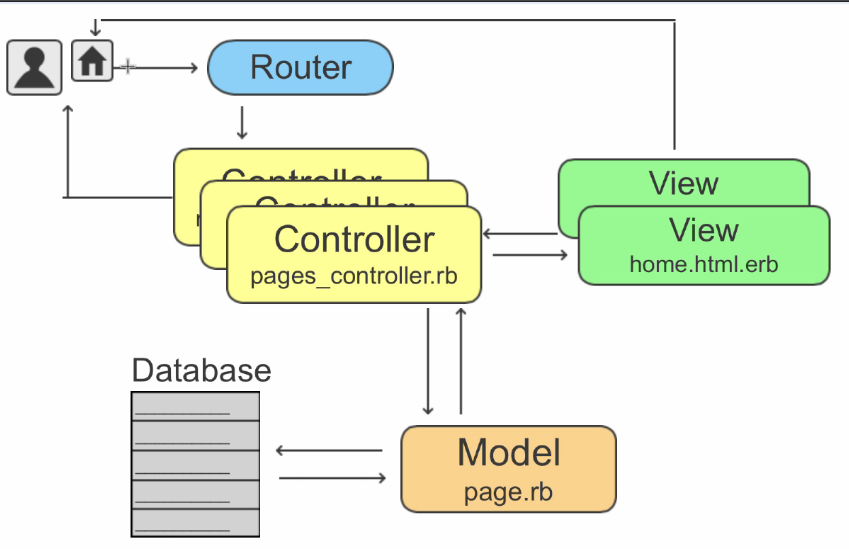

# Ruby


Ruby offers an interesting and powerful compromise, giving you the simplicity of single inheritance and the power of multiple inheritance. A Ruby class can have only one direct parent, and so Ruby is a single-inheritance language. However, Ruby classes can include the functionality of any number of mixins (a mixin is like a partial class definition). This provides a controlled multiple-inheritance-like capability with none of the drawbacks. 

So, is a variable an object?
In Ruby, the answer is ``no.'' A variable is simply a reference to an object. Objects float around in a big pool somewhere (the heap, most of the time) and are pointed to by variables.


## Rails data flow:

- Request make at browser
- Request received at router
- Request send to the right controller
- Controller can:
  - Modified models: models change in db and send back info to controller
- Controller update views



## Rails command:

```ruby
rails generate scaffold User name:string email:string
rails db:migrate
rails generate migration add_user_id_to_articles
rails generate migration add_secure_pass
rails db:migrate
rails generate migration create_user

user = User.new(name: "data", password: "12356789", email: "duyng1@gmail.com")

rails generate controller pages --skip-assets

```

## Rails model:
  
```ruby
class User < ApplicationRecord

before_save { self.email email.downcase }
has_many :articles, dependent: :destroy
validates :username, presence: true, uniqueness: 
  { case_sensitive: false },

length: { minimum: 3, maximum: 25 }

VALID_EMAIL_REGEX = /\A[\w+\-.]+@[a-z\d\-.]+\. [a-z]+\z/i

validates :email, 
  presence: true, 
  length: { maximum: 105 },
  uniqueness: { case_sensitive: false },
  format: { with: VALID_EMAIL REGEX }

has_secure_password
end
```

## Rails add index

```ruby
rails generate migration add_index_to_users_email

class AddIndexToUsersEmail < ActiveRecord::Migration[6.0]
  def change
    add_index :users, :email, unique: true
  end
end

```

## Rails to password

```ruby
rails generate migration add_password_digest_to_users password_digest:string
```

## Rails Session

```ruby
rails generate controller Sessions new

```

## Rails implement remember me

```ruby
rails generate migration add_remember_digest_to_users remember_digest:string

```