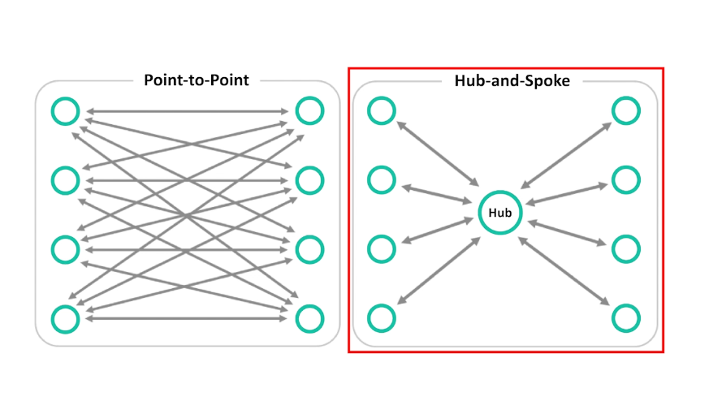
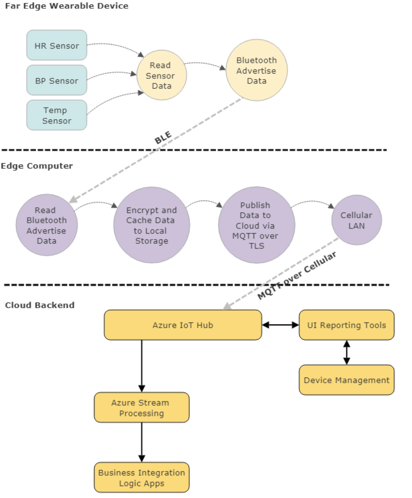
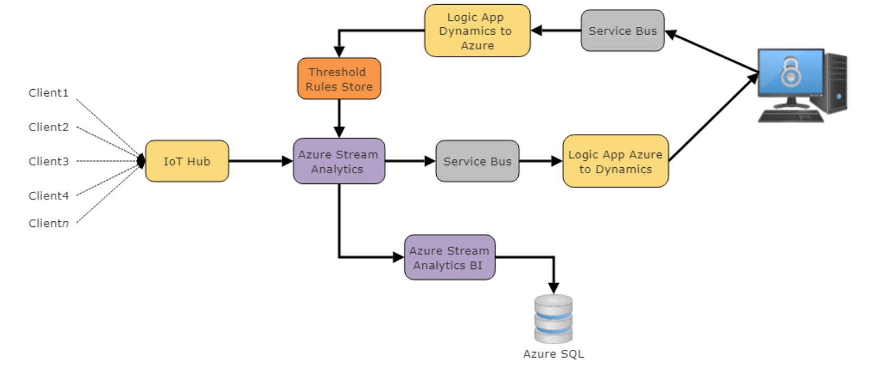
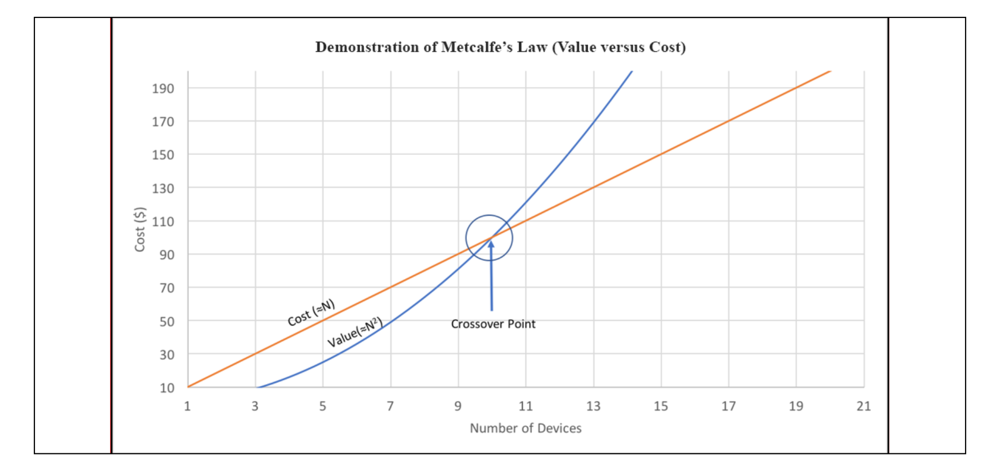
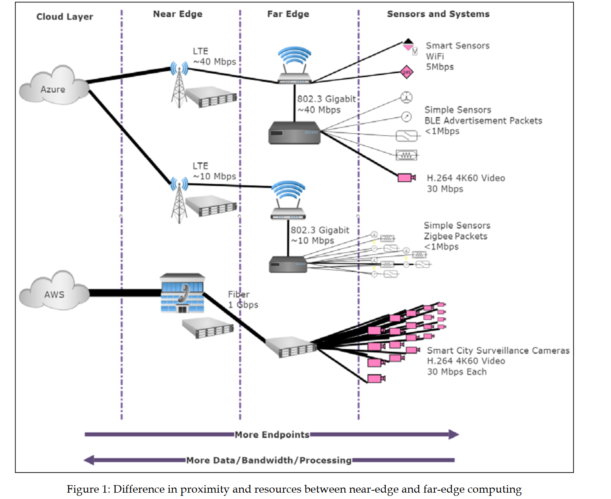

# IoT Engineering


## 1. MQTT

**Charateristic of MQTT**
- Simple implement
- Quality data
- Light weight and bandwitdh
- Data agnostic: sensor data coming a variety.
- Continuous session aware: need to know when device is alive

**Data transfer using pub-sub model**

 

**MQTT versioning:**
- v3.1.1 using TCP/IP
- stable v.5.0
- MQTT for sensor network: MQTT/SN using UDP instead of TCP.

**MQTT principles**:
- MQTT model follow pub-sub architecture instead of client server architect.
- Why we use pub sub model for IoT application, because client server architect cause complexity of for IoT application.
- Difference with **AMQP**:
  - Light weight: < 1MB suitable for sensor device
  - No websocket support
  
**MQTT Spec**:
- MQTT methods:
  - Conenct
  - Disconnect
  - Publish
  - Subcribe
  - Unsubcribe

- **MQTT features:**
  - **Wildcard**: allow consumer to subcribe to multiple topic by patterns
  - **Delivery sematic**:
    - At least one
    - At most one
    - Exact one
  - **Persistence session**: consumer subcribe and request MQTT broker keep the session alive, and save all info relate to topic, ... The clientId that the client provides when it establishes connection to the broker identifies the session. 
    - What is save in persitence session:
      - Client info about subcription
      - Message that not ack yet, these msg is deleted when client comeback online and consume it. 
  - **Retain message**: broker store few message per topic so that, when subcriber subcribe they receive the latest message. In other words, a retained message on a topic is the last known good value.
  - **Last Will and Testament**: when publisher shutdown ungracefully, broker send a default message to all consumers.
  - **Keep alive and client take-over**
  
- **Why use MQTT:**
  - HTTP: Client server pattern do not suitable for large amount of device and it does not have sematic delivery.
  - AMQP: not suitable for constraint device
  
- **Topic filtering:**
  - Wildcard subcribing:
    - "/" for sub level
    - "$" for system topic
    - "+" for get all in single level
    - "#" for get all in lower level


## 2. IoT Architecting

### 2.1 Architect of iot system
  - Edge device layer
  - Near-edge PAN-LAN layer
  - Cloud layer

 

- Cloud services, edge services:
  - Cloud services
    - Data ingestion and management for multiple edge patients and
systems
    - Almost unlimited storage capacity
    - A controlled software deployment and updates to edge
  - Edge services:
    - PAN connect to sensor
    - Upfront cost

- Azure IoT architect:
 

- IoT versus machine-to-machine versus SCADA:
  - M2M: data transfer between device, maybe non-IP based.
  - IoT: data aggregate at edge router or gateway, using IP-based protocols
  - SCALA: machine connect to a PLCs via ModBus, Profibus protocols.

- Number of node vs cost and value:



### 2.2 Sensors, Endpoints, and Power Systems
- Non-ip based WPAN:
  - Bluetooth
  - Zigbee
  - Z-wave

- IP-based WPAN:
  - TCP/IP: 
    - TCP vs UDP:
      - They are both IP based network protocols
      - UDP is simpler but not resilient
      - TCP provides flow control using sliding window and congestion avoidance algorithms. 
      - UDP provides a lightweight, high-speed method to broadcast data to various devices that may or may not be present or reliable.

### 2.3 Edge computing



- Edge agent comprise of:
  - OS
  - Container runtime
  - Ram and disk
  - Network protocol for sending upstream data to MQTT

### 2.4 Edge routing and network

- Routing table:

```sh
Routing tables

Internet:

Destination        Gateway            Flags           Netif Expire
default            192.168.70.1       UGScg             en0
127                127.0.0.1          UCS               lo0
127.0.0.1          127.0.0.1          UH                lo0
169.254            link#11            UCS               en0      !
192.168.70         link#11            UCS               en0      !
192.168.70.1/32    link#11            UCS               en0      !
192.168.70.1       14:49:bc:36:f1:c0  UHLWIir           en0   1154
192.168.70.29      22:a4:bd:b6:cd:a7  UHLWI             en0    353
192.168.70.41      5e:2c:27:46:61:6d  UHLWI             en0   1133
192.168.70.42      ae:4a:5e:65:34:98  UHLWI             en0      !
```
 
 ### 2.5 Edge to cloud protocols
- MQTT:
  - IP-based transport protocol are to:
    - Be simple to implement
    - Provide a form of quality of service
    - Be very lightweight and bandwidth efficient
    - Be data agnostic
    - Have continuous session awareness
    - Address security issues


- Message queues by nature store messages while MQTT does not. In MQTT, if no one is subscribing (or listening) to a topic, it is simply ignored and lost. Message queues also maintain a client-server topology where one consumer is paired with one producer.

- MQTT subscription group: similar to consumer group in Kafka, message is round robin between consumer.