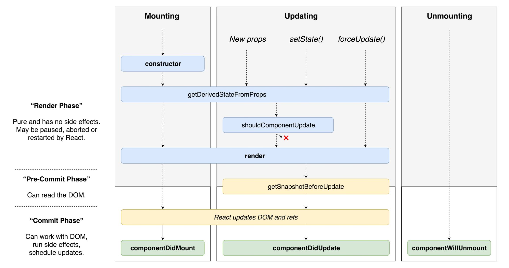

# Front End take note

- **How microfront end works ?**
	- Each page develop by each team, container app will contain multiple iframe for each micro-app
	- Inter communicate: using DOM event or redux store

# React 
## React strict mode:
	- "Strict Mode": 
    	- Detect pure vs impure function
    	- Detect var 
  
## How to useEffect with Array
- Stupid way: using stringtify 
- Smart way: using timeStamp or counter.

## useEffect vs useCallback vs useMemo
- useEffect: for rendering 
- useCallback: for execute without rerendering
- useMemo: execute but cache

## React life cycle
